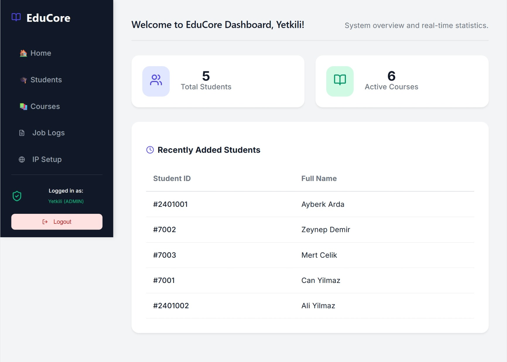
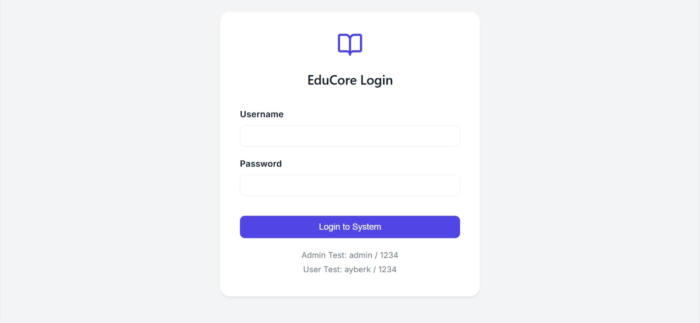

# EduCore - Educational Management System

Bu proje, arka planda **Spring Boot** (Java, Spring Data JPA, Spring Security) ve ön planda **React** (Vite) kullanılarak geliştirilmiş, güvenli ve ölçeklenebilir bir eğitim yönetim sistemidir. Uygulama, **JWT (JSON Web Token)** tabanlı kimlik doğrulama mimarisiyle korunmakta olup, rol tabanlı erişim kontrolü (ADMIN/USER) ile kurs ve öğrenci yönetim süreçlerini organize eder.

# 🛠️ Mimari ve Teknolojiler


### 🌓 Ana Sayfa ve Giriş Sayfası
|:-------------------------:|:------------------------:|
|  |  |

## ✨ CRUD & Güvenlik Özellikleri

Uygulama; Kullanıcı (Account), Kurs (Course) ve Kayıt (Enrollment) mekanizmaları üzerinde şu kabiliyetleri sunar:

* **Kimlik Doğrulama & Yetkilendirme:** `AuthController` ve `JwtService` entegrasyonu ile JWT tabanlı güvenli giriş (`/Login.jsx`) ve rol atama altyapısı.
* **GET:** Kurs kataloglarını filtreleme, rol seviyelerini listeleme ve akademik öğrenci profillerini görüntüleme.
* **POST:** Yeni kurs tanımlama, sisteme kullanıcı kaydetme ve dinamik kurs kayıt istekleri (EnrollmentRequest) oluşturma.
* **PUT/DELETE:** Sistem rollerinin (ADMIN/USER) güncellenmesi ve kurs yapılarının yönetimi.

---
## 🧪 API & Frontend Testing
Sistem REST mimarisi `ApiController` ve `AuthController` üzerinden test edilmiş; JWT filtreleme mekanizmaları (`JwtAuthenticationFilter`) ve `GlobalExceptionHandler` sınıfları ile hata/güvenlik süreçleri uçtan uca doğrulanmıştır. Ön yüz asenkron çağrıları ve geciktirme (`useDebounce`) mekanizmalarıyla optimize edilmiştir.
---
## 📂 Dizin Yapısı ve Önemli Konumlar

* **`controller/`**: Güvenlik ve veri akışını yöneten `AuthController` ve `ApiController` sınıfları.
* **`security/`**: JWT yetkilendirmesini ve CORS konfigürasyonlarını içeren `SecurityConfig` ve servis katmanları.
* **`entity/` & `dto/`**: Veritabanı şemaları (`Account`, `Course`, `Enrollment`) ve veri transfer nesneleri (DTO).
* **`frontend/src/`**: Login ekranı, kurs yönetim paneli ve öğrenci profillerini barındıran modern React arayüz bileşenleri.
---

## 🛠️ Kurulum & Çalıştırma (Local Development)

### 1. Gereksinimler
* Java Development Kit (JDK)
* Node.js & npm
* Maven
* Veritabanı Konfigürasyonu (`application.properties` bağlantı bilgileri)

Projeyi klonlayın ve kök dizine gidin:
```bash
git clone <repo-url>
```
```bash
# 2. Maven kullanarak projeyi çalıştırın:
./mvnw spring-boot:run
````
```bash
# 3. Ön Yüzü (Frontend) Çalıştırma:
Ayrı bir terminal penceresinde frontend dizinine geçiş yapın, bağımlılıkları yükleyin ve geliştirici sunucusunu ayağa kaldırın
cd frontend
npm install
npm run dev
````

👨‍💻 Geliştirici İletişim
Ayberk Arda

Software Developer | Computer Programming, Istanbul Kültür University (İKÜ)
