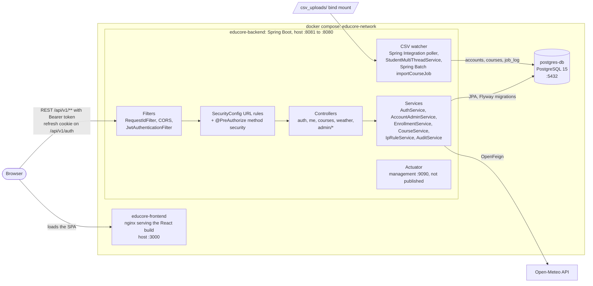
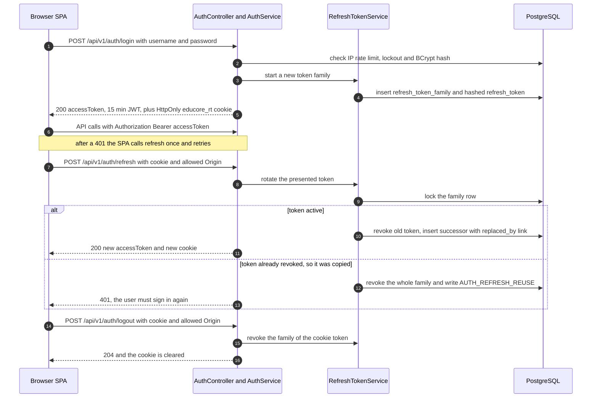
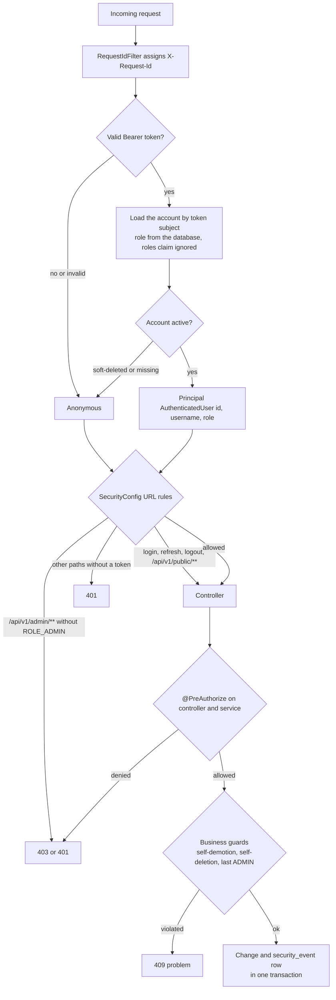
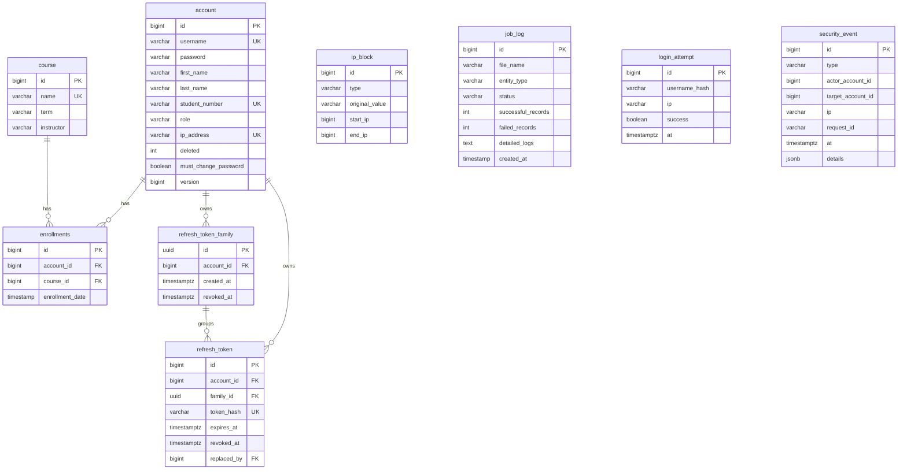

# EduCore

**English** | [Türkçe](./README.tr.md)

EduCore is an educational management system with a **Spring Boot** API and a **React (Vite)** frontend. It keeps accounts, courses and enrollments in PostgreSQL, imports students and courses from CSV files dropped into a watched folder, records every import as a job log, and lets administrators define IPv4 ranges from which student accounts may be given an address.

> **Project status:** a staged hardening program is in progress. Secrets, authentication and authorization have been reworked; input validation, edge hardening and the later phases are still open. Read [Security status](#security-status) before running EduCore anywhere other than a local machine.

## Screenshots

| | |
| --- | --- |
| <br>Login | <br>Dashboard |
| <br>Students | <br>Courses |
| <br>Job logs | |

## Features

Every item below maps to code in this repository.

- **Session authentication** (`auth`): username/password login returns a 15-minute JWT access token and sets a rotating 14-day refresh token in an `HttpOnly` cookie. Refresh-token reuse revokes the whole token family. Login is throttled per IP and accounts lock after repeated failures. See [Authentication](#authentication).
- **Role-based access control** (`security`): roles `ADMIN` and `USER`, enforced by URL rules and method security, with guards against self-demotion, self-deletion and removing the last active administrator. See [Authorization](#authorization).
- **Audit trail** (`security.audit`): authentication events and every administrator mutation are written to `security_event`; administrators can page through them at `GET /api/v1/admin/security-events`.
- **Student and account management** (`account`): paged, searchable admin listings of students and of all accounts (active or soft-deleted), student creation with a one-time 24-character temporary password, updates, role changes and **soft delete**. Usernames, student numbers and assigned IP addresses are unique.
- **Own profile** (`/api/v1/me`): every signed-in user can read their profile, change their first and last name and change their password.
- **Courses and enrollments** (`course`, `enrollment`): a course catalog for every signed-in user, course create/update/delete for administrators, self-service enrollment under `/api/v1/me/enrollments` and administrator enrollment for any account.
- **Student IP allocation rules** (`ipaccess`): administrators define allowed IPv4 ranges as a single address (`STATIC`), a range (`RANGE`, e.g. `192.168.1.1-192.168.1.10`) or a subnet (`CIDR`, e.g. `192.168.1.0/24`). An address assigned to a student must be a valid IPv4 address inside one of these rules. **This validates account data only; EduCore does not block or filter network traffic by IP.**
- **CSV ingestion** (`FileIntegrationConfig`): a Spring Integration poller routes CSV files by name to a multi-threaded student importer or a Spring Batch course job. See [CSV ingestion](#csv-ingestion).
- **Job logs** (`ingestion`): each import stores file name, entity type, status, success/failure counts and per-row messages; administrators can list and bulk-delete them.
- **Weather widget**: `GET /api/v1/weather` fetches current weather for İstanbul, Ankara and İzmir from the Open-Meteo API through an OpenFeign client; it requires a signed-in user.
- **Environment-first configuration**: shared `application.yml` plus `dev`, `test` and `prod` profiles; `prod` refuses to start and names every missing variable (`ProdStartupGuard`).
- **Database migrations**: Flyway owns the schema (`src/main/resources/db/migration`); Hibernate only validates it. A synthetic demo seed is applied in `dev` and `test` only.
- **Administrator bootstrap**: `AdminBootstrap` creates the first ADMIN from environment variables when no ADMIN exists; that account must change its password.
- **Health and metrics**: Spring Boot Actuator with a Prometheus registry on management port 9090, which Docker Compose does not publish.
- **Frontend**: React single-page app with a dashboard, students, users, courses, own profile, job logs and IP rules screens; admin-only screens are hidden from and redirected away for `USER` accounts. Light and dark themes follow the [brand identity](docs/brand/BRAND_IDENTITY.md).

## Tech stack

| Layer | Technology | Version (source) |
|---|---|---|
| Language | Java | 21 (`pom.xml`, `Dockerfile`) |
| Backend framework | Spring Boot: Web, Data JPA, Security, Validation, Batch, Integration with `spring-integration-file`, Actuator | 3.5.16 (`pom.xml` parent) |
| Persistence | Hibernate ORM, Spring Batch | 6.6.53, 5.2.6 (Spring Boot BOM) |
| Cloud | Spring Cloud OpenFeign | 2025.0.3 BOM (OpenFeign 4.3.3) |
| Tokens | jjwt (`jjwt-api`, `jjwt-impl`, `jjwt-jackson`) | 0.12.7 |
| Login throttling | Bucket4j (`bucket4j_jdk17-core`) with a Caffeine cache | 8.20.0; Caffeine from the Spring Boot BOM |
| Metrics | Micrometer Prometheus registry | Spring Boot BOM |
| Boilerplate | Lombok | 1.18.40 |
| Database | PostgreSQL | `postgres:15` image |
| Migrations | Flyway Core + `flyway-database-postgresql` | 11.7.2 (Spring Boot BOM) |
| Test database | Testcontainers (JUnit Jupiter, PostgreSQL) | 1.21.4 (Spring Boot BOM) |
| Coverage | JaCoCo Maven plugin | 0.8.15 |
| Build | Maven Wrapper | Maven 3.9.16 (`.mvn/wrapper/maven-wrapper.properties`) |
| Frontend | React, React DOM | ^19.2.7 |
| Routing | react-router-dom | ^7.18.1 |
| HTTP | axios | ^1.18.1 |
| UI helpers | lucide-react ^1.23.0, react-hot-toast ^2.6.0, `@fontsource/ibm-plex-sans` and `@fontsource/ibm-plex-mono` ^5.0.0 | `frontend/package.json` |
| Frontend build | Vite ^8.1.1, `@vitejs/plugin-react` ^6.0.3, ESLint ^10.6.0 | `frontend/package.json` |
| Containers | `maven:3.9.6-eclipse-temurin-21` build, `eclipse-temurin:21-jre-jammy` runtime; `node:22-alpine` build, `nginx:alpine` runtime | `Dockerfile`, `frontend/Dockerfile` |

## Architecture

### Components


```mermaid
flowchart LR
    user(["Browser"])

    subgraph compose["docker compose: educore-network"]
        fe["educore-frontend<br/>nginx serving the React build<br/>host :3000"]
        subgraph be["educore-backend: Spring Boot, host :8081 to :8080"]
            filters["Filters<br/>RequestIdFilter, CORS,<br/>JwtAuthenticationFilter"]
            rules["SecurityConfig URL rules<br/>+ @PreAuthorize method security"]
            ctrl["Controllers<br/>auth, me, courses, weather,<br/>admin/*"]
            svc["Services<br/>AuthService, AccountAdminService,<br/>EnrollmentService, CourseService,<br/>IpRuleService, AuditService"]
            ingest["CSV watcher<br/>Spring Integration poller,<br/>StudentMultiThreadService,<br/>Spring Batch importCourseJob"]
            mgmt["Actuator<br/>management :9090, not published"]
        end
        db[("postgres-db<br/>PostgreSQL 15<br/>:5432")]
    end

    csv[/"csv_uploads/ bind mount"/]
    meteo["Open-Meteo API"]

    user -->|"loads the SPA"| fe
    user -->|"REST /api/v1/** with Bearer token<br/>refresh cookie on /api/v1/auth"| filters
    filters --> rules --> ctrl --> svc
    svc -->|"JPA, Flyway migrations"| db
    svc -->|"OpenFeign"| meteo
    csv --> ingest
    ingest -->|"accounts, courses, job_log"| db
```

The React app runs in the browser and calls the API directly at `http://localhost:8081` (override at build time with `VITE_API_BASE_URL`, see `frontend/src/api.js`). nginx only serves static files with an `index.html` fallback for client-side routing; it does not proxy API calls. The backend allows the browser origins listed in `EDUCORE_CORS_ALLOWED_ORIGINS`.

### Authentication sequence


```mermaid
sequenceDiagram
    autonumber
    participant B as Browser SPA
    participant A as AuthController and AuthService
    participant R as RefreshTokenService
    participant D as PostgreSQL

    B->>A: POST /api/v1/auth/login with username and password
    A->>D: check IP rate limit, lockout and BCrypt hash
    A->>R: start a new token family
    R->>D: insert refresh_token_family and hashed refresh_token
    A-->>B: 200 accessToken, 15 min JWT, plus HttpOnly educore_rt cookie
    B->>A: API calls with Authorization Bearer accessToken
    Note over B,A: after a 401 the SPA calls refresh once and retries
    B->>A: POST /api/v1/auth/refresh with cookie and allowed Origin
    A->>R: rotate the presented token
    R->>D: lock the family row
    alt token active
        R->>D: revoke old token, insert successor with replaced_by link
        A-->>B: 200 new accessToken and new cookie
    else token already revoked, so it was copied
        R->>D: revoke the whole family and write AUTH_REFRESH_REUSE
        A-->>B: 401, the user must sign in again
    end
    B->>A: POST /api/v1/auth/logout with cookie and allowed Origin
    A->>R: revoke the family of the cookie token
    A-->>B: 204 and the cookie is cleared
```

### Request authorization path


```mermaid
flowchart TD
    req["Incoming request"] --> rid["RequestIdFilter assigns X-Request-Id"]
    rid --> jwt{"Valid Bearer token?"}
    jwt -->|"yes"| load["Load the account by token subject<br/>role from the database, roles claim ignored"]
    jwt -->|"no or invalid"| anon["Anonymous"]
    load --> active{"Account active?"}
    active -->|"soft-deleted or missing"| anon
    active -->|"yes"| principal["Principal AuthenticatedUser id, username, role"]
    anon --> url{"SecurityConfig URL rules"}
    principal --> url
    url -->|"login, refresh, logout, /api/v1/public/**"| ctrl["Controller"]
    url -->|"/api/v1/admin/** without ROLE_ADMIN"| deny403["403 or 401"]
    url -->|"other paths without a token"| deny401["401"]
    url -->|"allowed"| ctrl
    ctrl --> pre{"@PreAuthorize on controller and service"}
    pre -->|"denied"| deny403
    pre -->|"allowed"| guard{"Business guards<br/>self-demotion, self-deletion, last ADMIN"}
    guard -->|"violated"| c409["409 problem"]
    guard -->|"ok"| tx["Change and security_event row<br/>in one transaction"]
```

### Main tables


```mermaid
erDiagram
    account ||--o{ enrollments : "has"
    course ||--o{ enrollments : "has"
    account ||--o{ refresh_token_family : "owns"
    account ||--o{ refresh_token : "owns"
    refresh_token_family ||--o{ refresh_token : "groups"
    account {
        bigint id PK
        varchar username UK
        varchar password
        varchar first_name
        varchar last_name
        varchar student_number UK
        varchar role
        varchar ip_address UK
        int deleted
        boolean must_change_password
        bigint version
    }
    course {
        bigint id PK
        varchar name UK
        varchar term
        varchar instructor
    }
    enrollments {
        bigint id PK
        bigint account_id FK
        bigint course_id FK
        timestamp enrollment_date
    }
    ip_block {
        bigint id PK
        varchar type
        varchar original_value
        bigint start_ip
        bigint end_ip
    }
    job_log {
        bigint id PK
        varchar file_name
        varchar entity_type
        varchar status
        int successful_records
        int failed_records
        text detailed_logs
        timestamp created_at
    }
    refresh_token_family {
        uuid id PK
        bigint account_id FK
        timestamptz created_at
        timestamptz revoked_at
    }
    refresh_token {
        bigint id PK
        bigint account_id FK
        uuid family_id FK
        varchar token_hash UK
        timestamptz expires_at
        timestamptz revoked_at
        bigint replaced_by FK
    }
    login_attempt {
        bigint id PK
        varchar username_hash
        varchar ip
        boolean success
        timestamptz at
    }
    security_event {
        bigint id PK
        varchar type
        bigint actor_account_id
        bigint target_account_id
        varchar ip
        varchar request_id
        timestamptz at
        jsonb details
    }
```

Spring Batch metadata tables are created by `V2__spring_batch_schema.sql` and are not shown.

### Source layout

Backend code under `src/main/java/com/educore` is organized by feature, with shared packages alongside:

| Package or path | Contents |
|---|---|
| `account` | Admin account/student controller and service, own-profile controller (`/api/v1/me`), request and response records |
| `auth` | `AuthController`, `AuthService`, password policy, login rate limiter and lockout, refresh tokens and families, refresh cookie |
| `course`, `enrollment` | Course catalog and admin controllers, enrollment controller and service |
| `ipaccess` | IP rule admin controller and service, `IpAllocationPolicy` |
| `ingestion` | Job log admin controller and service |
| `security` | `SecurityConfig`, `JwtService`, `JwtAuthenticationFilter`, `AuthenticatedUser`, `ClientIpResolver`, `OriginVerifier`, `RequestIdFilter` |
| `security.audit` | `AuditService`, `SecurityEvent`, `SecurityEventType`, security-event admin controller |
| `common.web` | `ApiExceptionHandler`, Problem Details exceptions, paging helpers |
| `config` | `BatchConfig`, `FileIntegrationConfig`, `JobTracker`, `EduCoreProperties`, `ProdStartupGuard`, `AdminBootstrap` |
| `service` | CSV importers (`StudentMultiThreadService`, `CsvJobService`), `WeatherService`, `AccountCredentialService` |
| `controller`, `WeatherClient` | `WeatherController` and the OpenFeign client |
| `entity`, `repository`, `dto`, `util`, `exception` | JPA entities, repositories, CSV and weather DTOs, `IpAddressUtil`, legacy `GlobalExceptionHandler` |
| `src/main/resources` | `application.yml`, `application-{dev,test,prod}.yml`, `db/migration` (Flyway), `db/seed/dev` (demo seed), `security/common-passwords.txt` |
| `frontend/src` | React screens (`Login`, `Home`, `StudentList`, `StudentDetail`, `UserManagement`, `StudentProfile`, `CourseManagement`, `JobLogs`, `IpManagement`, `WeatherWidget`), `api.js`, `styles/` |
| `frontend/public/brand` | Logo and favicon SVG files |
| `csv_uploads/` | Watched CSV folder; `csv_uploads/sample/` holds example files |

## Authentication

`AuthController` provides the session endpoints:

| Method and path | Purpose |
|---|---|
| `POST /api/v1/auth/login` | Sign in with username and password; returns `{accessToken, expiresIn, user}` and sets the refresh cookie. |
| `POST /api/v1/auth/refresh` | Rotates the refresh token in the cookie and returns a new access token. |
| `POST /api/v1/auth/logout` | Revokes the refresh-token family and clears the cookie. |
| `GET /api/v1/auth/me` | Returns the signed-in user. |
| `POST /api/v1/auth/password` | Changes the signed-in user's password, revokes every refresh session and starts a new one. |

- **Access token:** HS256 JWT valid for 15 minutes with issuer `educore` and audience `educore-api`; its subject is the account id and a `kid` header names the signing key. The signing key comes from `EDUCORE_JWT_SECRET` (base64, at least 32 decoded bytes, otherwise startup fails); `EDUCORE_JWT_SECRET_PREVIOUS` keeps tokens valid during a [key rotation](docs/security/KEY_ROTATION.md).
- **Refresh token:** an opaque random value stored only as a SHA-256 hash in `refresh_token`, sent in the `educore_rt` cookie (`HttpOnly`, `SameSite=Strict`, `Path=/api/v1/auth`, 14 days). `Secure` is set in every profile except `dev`. Refresh and logout also require an allowed `Origin` (`OriginVerifier`).
- **Rotation and reuse detection:** every refresh revokes the presented token and issues its successor in the same family. Presenting an already revoked token revokes the whole family and records `AUTH_REFRESH_REUSE`.
- **Throttling and lockout:** 10 login attempts per minute per client IP (HTTP 429 with `Retry-After`); 5 failed passwords within 15 minutes lock the account for 15 minutes (HTTP 423). Usernames in `login_attempt` are stored as HMAC-SHA-256 with `EDUCORE_LOGIN_PEPPER`. `X-Forwarded-For` is honoured only from proxies listed in `educore.ipaccess.trusted-proxies`.
- **Passwords:** BCrypt (strength 12). New passwords must be 12–128 characters, at most 72 bytes in UTF-8 and not on the common-password deny list. Students created by an administrator get a random temporary password that is shown once; CSV-imported students get one that is stored only as a hash. Both are flagged `mustChangePassword`; the frontend currently shows a notice rather than a change-password screen.
- **Events:** `AUTH_LOGIN_SUCCESS`, `AUTH_LOGIN_FAILURE`, `AUTH_LOCKED`, `AUTH_REFRESH_REUSE` and `PASSWORD_CHANGED` are written to `security_event`.

## Authorization

Roles are `ADMIN` and `USER`. The [RBAC matrix](docs/security/RBAC_MATRIX.md) is the source of truth; `AuthorizationMatrixIT` executes every cell from `src/test/resources/rbac-matrix.csv`.

- **Anonymous:** only `POST /api/v1/auth/login`, `/refresh`, `/logout` and the reserved `/api/v1/public/**` prefix (no endpoint yet).
- **USER:** own profile and enrollments under `/api/v1/me`, the course catalog, weather and the session endpoints. Account and student listings are ADMIN-only.
- **ADMIN:** everything under `/api/v1/admin/**`.

Enforcement layers:

1. URL rules in `SecurityConfig`: `/api/v1/admin/**` requires `ROLE_ADMIN`, every other non-public path requires authentication.
2. Method security: admin controllers and services carry `@PreAuthorize("hasRole('ADMIN')")`; enrollment service methods check `#accountId == principal.id or hasRole('ADMIN')`. The principal is the typed `AuthenticatedUser(id, username, role)`; the role is reloaded from the database on every request and a soft-deleted account is treated as anonymous.
3. Business guards (409 problems): an ADMIN cannot change their own role or delete their own account, and the last active ADMIN cannot be demoted or deleted. Active ADMIN rows are locked with `SELECT ... FOR UPDATE` during the check.
4. DTO boundary: request records have no `id`, `role`, `deleted`, `password` or `mustChangePassword` fields (except `ChangeRoleRequest.role`); responses never contain password hashes or entity graphs. Self-service routes take the account from the principal, which prevents IDOR.
5. Concurrency: `account.version` (optimistic locking) rejects stale writes with 409 `request/concurrent-modification`; `PUT /api/v1/me` writes only the name columns.

**Audit events.** Each administrator mutation writes one `security_event` row in the same transaction as the change: `ACCOUNT_CREATED`, `ACCOUNT_UPDATED`, `ACCOUNT_DELETED`, `ROLE_CHANGED`, `ENROLLMENT_CHANGED`, `COURSE_CHANGED`, `IP_RULE_CHANGED` and `JOB_LOGS_DELETED`. Rows carry actor, target, client IP and request id; `details` holds ids, enum values and field names only. No-op requests write no event, and if the audit insert fails the change is rolled back.

## API overview

The versioned API has four route groups:

- `/api/v1/auth`: login, refresh, logout, current user and password change.
- `/api/v1/me`: the caller's profile (`GET`/`PUT`) and enrollments (`GET`, `POST`, `DELETE /{courseId}`).
- `/api/v1/courses` and `/api/v1/weather`: the course catalog and the weather widget, for any signed-in user.
- `/api/v1/admin/...`: ADMIN-only `accounts`, `accounts/students`, account roles and enrollments, `courses`, `ip-rules`, `job-logs` and `security-events`.

Paged routes return `{content, page, size, totalElements, totalPages}`; `size` is clamped to 1–100. Feature routes report errors as `application/problem+json`. The [API route contract](docs/api/ROUTES.md) lists every method, payload, status code and the mapping from the removed pre-P3 routes.

## CSV ingestion

The current behaviour (`FileIntegrationConfig`, `StudentMultiThreadService`, `CsvJobService`, `BatchConfig`):

- **Watched folder:** `educore.ingestion.base-dir`, default `csv_uploads` relative to the backend's working directory. Docker Compose mounts the host folder `./csv_uploads` at `/app/csv_uploads`. Only files directly in that folder are scanned; the subfolders `sample/`, `inbox/`, `processing/`, `done/` and `failed/` are not read by the current watcher.
- **Polling:** every 5 seconds, files matching `*.csv`; each file is accepted once per application run.
- **Routing by file name (case-insensitive):**
  - contains `ogrenci` or `student` → **student import**. Columns `FirstName,LastName,StudentNumber`, header row skipped. A pool of 5 threads processes rows in groups of 5 coordinated with a `CyclicBarrier`, with a simulated 1–3 second delay per row. The student number becomes the username, the role is `USER` and a random temporary password is stored only as a hash. Duplicate student numbers are logged as failures. The file is then renamed to `<name>.csv.done`, even when rows failed.
  - contains `course` or `ders` → **Spring Batch `importCourseJob`**. Columns `name,term,instructor`, header row skipped, chunk size 10; existing course names are skipped and logged. The file is renamed to `<name>.csv.done` when every row was written, otherwise `<name>.csv.fail`.
  - anything else → logged as unmatched and left in place.
- **Results:** each processed file creates a `job_log` row (status `SUCCESS` or `FAILED`), visible on the Job logs page and at `GET /api/v1/admin/job-logs`.

To try it, copy a sample file into the watched folder:

```bash
cp csv_uploads/sample/courses.sample.csv csv_uploads/
cp csv_uploads/sample/students.sample.csv csv_uploads/
```

The student import has no administrator-facing password reset yet ([BACKLOG](docs/BACKLOG.md) B-016), so imported students cannot sign in until one exists. The inbox/processing/done/failed lifecycle is planned for P6.

## Quick start

Requirements: Docker with the Compose plugin, and `openssl` for generating secrets.

1. Create your environment file from the template:

   ```bash
   cp .env.example .env
   ```

2. Generate secrets and put them into `.env`:

   ```bash
   openssl rand -base64 48   # EDUCORE_JWT_SECRET
   openssl rand -base64 48   # EDUCORE_LOGIN_PEPPER
   openssl rand -base64 24   # EDUCORE_DB_PASSWORD
   ```

   Replace every sample value. `.env` is ignored by Git and must never be committed.

3. Build and start the stack:

   ```bash
   docker compose up --build
   ```

   Compose refuses to start when `EDUCORE_DB_USERNAME`, `EDUCORE_DB_PASSWORD`, `EDUCORE_DB_NAME`, `EDUCORE_JWT_SECRET` or `EDUCORE_LOGIN_PEPPER` is missing. On first start Flyway creates the schema. In the default `dev` profile the synthetic demo seed adds four courses and the accounts `admin` (ADMIN), `ayberk` and `ali`. With `SPRING_PROFILES_ACTIVE=prod` no seed is loaded and the first ADMIN is created from `EDUCORE_BOOTSTRAP_ADMIN_USERNAME` and `EDUCORE_BOOTSTRAP_ADMIN_PASSWORD`.

4. Open the app:

   | Service | URL |
   |---|---|
   | Frontend | http://localhost:3000 |
   | Backend API | http://localhost:8081/api/v1 |
   | PostgreSQL | `localhost:5432` |
   | Actuator | port `9090` inside the backend container only |

   To check health from the host:

   ```bash
   docker compose exec educore-backend bash -c 'exec 3<>/dev/tcp/localhost/9090 && printf "GET /actuator/health HTTP/1.0\r\n\r\n" >&3 && cat <&3'
   ```

## Local development

The frontend calls `http://localhost:8081` by default (`frontend/src/api.js`), and the `dev` profile allows the browser origin `http://localhost:3000`, so run the backend on 8081 and Vite on 3000.

1. Start only the database:

   ```bash
   docker compose up -d postgres-db
   ```

2. Export the backend variables in your shell (the backend reads the process environment, not `.env`):

   ```bash
   export SPRING_PROFILES_ACTIVE=dev
   export EDUCORE_DB_URL=jdbc:postgresql://localhost:5432/educore_db
   export EDUCORE_DB_USERNAME=educore_user
   export EDUCORE_DB_PASSWORD='value from your .env'
   export EDUCORE_JWT_SECRET='value from your .env'
   ```

   `EDUCORE_LOGIN_PEPPER` is optional in `dev`; without it a random per-process value is used and lockout counters reset on restart.

3. Run the backend on port 8081 (Java 21):

   ```bash
   ./mvnw spring-boot:run -Dspring-boot.run.arguments=--server.port=8081
   ```

   On Windows use `mvnw.cmd` with the same arguments. Actuator is then at `http://localhost:9090/actuator/health`.

4. Run the frontend on port 3000 (Node 22):

   ```bash
   cd frontend
   npm install
   npm run dev -- --port 3000
   ```

   Vite's own default port is 5173; that origin is not allowed by the backend CORS default.

## Configuration

- **Profiles:** `application.yml` holds shared settings; `application-dev.yml`, `application-test.yml` and `application-prod.yml` override them. Without `SPRING_PROFILES_ACTIVE` the `dev` profile is used.
  - `dev`: demo seed applied, refresh cookie without `Secure`, CORS default `http://localhost:3000`.
  - `test`: automated tests only; PostgreSQL comes from Testcontainers and the CSV poller watches `target/test-csv-uploads`.
  - `prod`: no seed, no default for any secret, empty CORS list (same origin behind a reverse proxy). `ProdStartupGuard` checks `EDUCORE_DB_URL`, `EDUCORE_DB_USERNAME`, `EDUCORE_DB_PASSWORD`, `EDUCORE_JWT_SECRET`, `EDUCORE_LOGIN_PEPPER` and both bootstrap-admin variables before any bean is created.
- **Database:** Flyway runs on startup with `baseline-on-migrate` for databases created before Flyway; `ddl-auto` is `validate`.
- **Management port:** Actuator listens on `management.server.port=9090` and exposes `health`, `info`, `metrics` and `prometheus`. `/actuator/health` is open; the others require an ADMIN bearer token. `docker-compose.yml` does not publish this port.
- **Error output:** messages, stack traces and binding errors are never included in error responses.
- **Other settings:** defaults for `educore.*` properties (ingestion folder, trusted proxies, token lifetimes, login limits) live in `EduCoreProperties` and `application.yml`.

## Environment variables

These match `.env.example`.

| Variable | Required | Description |
|---|---|---|
| `SPRING_PROFILES_ACTIVE` | No (default `dev`) | `dev` applies the synthetic demo seed; `prod` loads no seed and fails at startup naming each missing secret; `test` is for automated tests only. |
| `EDUCORE_DB_URL` | Local runs; `prod` | JDBC URL when the backend runs outside Docker, e.g. `jdbc:postgresql://localhost:5432/educore_db`. Inside Compose it is derived from `EDUCORE_DB_NAME` and the `postgres-db` host. |
| `EDUCORE_DB_NAME` | Yes (Compose) | Database created by the PostgreSQL container and used by the backend container. |
| `EDUCORE_DB_USERNAME` | Yes | Database role created by the PostgreSQL container and used by the backend. |
| `EDUCORE_DB_PASSWORD` | Yes | Password for `EDUCORE_DB_USERNAME`; a long random value, e.g. `openssl rand -base64 24`. |
| `EDUCORE_JWT_SECRET` | Yes | Base64 HMAC signing secret, at least 32 bytes after decoding; generate with `openssl rand -base64 48`. |
| `EDUCORE_JWT_SECRET_PREVIOUS` | No | Previous signing secret, set only during a key rotation; see [KEY_ROTATION.md](docs/security/KEY_ROTATION.md). |
| `EDUCORE_LOGIN_PEPPER` | Yes in `prod` and Compose | Pepper for HMAC-SHA-256 of usernames in `login_attempt`, at least 32 characters; generate with `openssl rand -base64 48`. Optional for a local `dev` run. |
| `EDUCORE_CORS_ALLOWED_ORIGINS` | No | Comma-separated browser origins allowed to call the API. Default `http://localhost:3000` in `dev` and Compose, empty in `prod`. |
| `EDUCORE_BOOTSTRAP_ADMIN_USERNAME` | Yes in `prod` | Username of the first ADMIN, created only when no ADMIN exists. Set together with the password or not at all. |
| `EDUCORE_BOOTSTRAP_ADMIN_PASSWORD` | Yes in `prod` | Initial password of that ADMIN, at least 12 characters; stored as a BCrypt hash and must be changed on first use. |

## Tests

The backend has unit tests (`*Test`, Surefire) and integration tests (`*IT`, Failsafe) that run against a throwaway PostgreSQL started by Testcontainers. Docker must be available.

```bash
./mvnw verify
```

On Windows run `mvnw.cmd verify`. The merged JaCoCo report is written to `target/site/jacoco/index.html`.

The latest verification report (P3) records 60 unit tests and 248 integration tests, **308 in total, with no failures, errors or skips**. Integration tests cover login, refresh rotation and reuse detection, lockout, forwarded-for throttling, the full authorization matrix (122 cases), privilege escalation, mass assignment, IDOR, last-admin guard, audit atomicity, concurrent account updates, path-variant bypass attempts, management endpoint security, Flyway migrations and production startup checks. The frontend has no automated tests yet.

## Brand and design

The visual identity (name usage, Ledger Mark logo, colours, typography and interface rules) is defined in [BRAND_IDENTITY.md](docs/brand/BRAND_IDENTITY.md); implementation tokens are in [tokens.css](docs/brand/tokens.css) and logo files in [frontend/public/brand](frontend/public/brand).

## Security status

The hardening program follows the [2026-09-25 baseline audit](docs/audit/2026-09-25-baseline.md).

Fixed so far:

- **Secrets:** database password, JWT key and seed passwords moved out of the code into environment variables; the Config Server was removed. Rotating the leaked values and purging Git history are documented in [SECRET_ROTATION_AND_HISTORY_PURGE.md](docs/security/SECRET_ROTATION_AND_HISTORY_PURGE.md) and require the owner's explicit approval.
- **Authentication:** short-lived JWTs with key rotation, rotating refresh cookies with reuse detection, login throttling and lockout, password policy and temporary passwords.
- **Authorization:** RBAC with URL rules and method security, DTO boundaries, last-admin guard, optimistic locking and transactional audit events.
- **SOAP removal:** the `/ws/**` endpoint, which created accounts with a plaintext default password, was removed.

Open, in planned order:

- **P4:** Bean Validation on every input, RFC 9457 Problem Details for every error and sanitised logging (some routes still return the legacy `{"error"}` body).
- **P5:** edge hardening (security headers, HTTPS behind nginx, CORS), request-level IP blocking and rate limiting beyond login. The student IP rules do not block traffic today.
- **P6:** ingestion pipeline (inbox/processing/done/failed folders, idempotency, size and row limits, strict parsing) and signed webhooks.
- **P7:** data lifecycle and backups (account deletion and export, retention of `login_attempt` and `security_event`, dependency scanning).
- **P8:** frontend platform; the SPA still keeps the access token in `localStorage` and has no change-password screen.
- **P9:** public surface and SEO.
- **P10:** attack test suite, CI/CD and release.

## Documentation

| Document | Contents |
|---|---|
| [docs/api/ROUTES.md](docs/api/ROUTES.md) | API route contract, payload shapes, error codes, old-to-new route map |
| [docs/security/RBAC_MATRIX.md](docs/security/RBAC_MATRIX.md) | Authorization matrix, enforcement layers, audit events |
| [docs/security/KEY_ROTATION.md](docs/security/KEY_ROTATION.md) | JWT signing key rotation |
| [docs/security/SECRET_ROTATION_AND_HISTORY_PURGE.md](docs/security/SECRET_ROTATION_AND_HISTORY_PURGE.md) | Credential rotation and Git history purge plan |
| [docs/audit/2026-09-25-baseline.md](docs/audit/2026-09-25-baseline.md) | Baseline security audit findings |
| [docs/DECISIONS_TAKEN.md](docs/DECISIONS_TAKEN.md) | Recorded decisions and how to revert them |
| [docs/BACKLOG.md](docs/BACKLOG.md) | Findings scheduled for later phases |
| [docs/brand/BRAND_IDENTITY.md](docs/brand/BRAND_IDENTITY.md) | Brand identity and interface guidelines |
| [docs/brand/tokens.css](docs/brand/tokens.css) | Design tokens |

## Author

**Ayberk Arda** – Software Developer, Computer Programming, Istanbul Kültür University (İKÜ)
