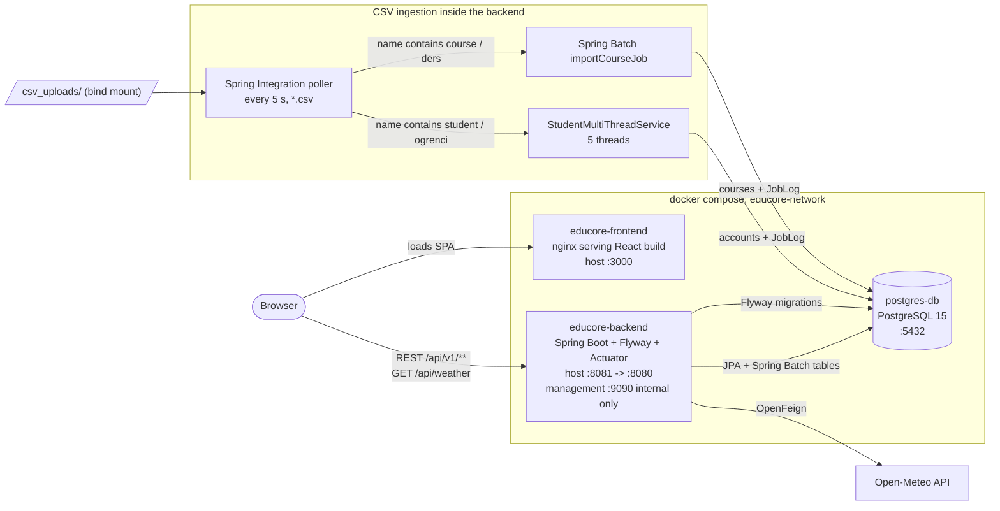

# EduCore

**English** | [Türkçe](./README.tr.md)

EduCore is an educational management system built with a **Spring Boot** backend and a **React (Vite)** frontend. It manages students, courses and enrollments, imports CSV files from a watched folder, and lets administrators define IPv4 ranges that may be assigned to student accounts.

> **Project status:** a hardening and upgrade program is in progress. Configuration has already moved to environment variables; further security phases are ongoing. See [Security status](#security-status) before deploying anywhere other than a local machine.

## Screenshots

| Login | Dashboard |
|:-------------------------:|:------------------------:|
|  |  |

| Students | Courses |
|:-------------------------:|:------------------------:|
|  |  |

| Job Logs | |
|:-------------------------:|:------------------------:|
|  | |

## Features

## Authentication

`AuthController` provides these endpoints:

| Method and path | Purpose |
|---|---|
| `POST /api/v1/auth/login` | Sign in with username and password; returns an access token and sets the refresh cookie. |
| `POST /api/v1/auth/refresh` | Rotates the refresh token in the cookie and returns a new access token. |
| `POST /api/v1/auth/logout` | Revokes the refresh-token family and clears the cookie. |
| `GET /api/v1/auth/me` | Returns the signed-in user. |
| `POST /api/v1/auth/password` | Changes the signed-in user's password and revokes refresh sessions. |

Access JWTs last 15 minutes. The rotating refresh token is stored only as a hash in the database and travels in a 14-day `HttpOnly` cookie; reuse detection revokes its token family. The cookie uses `SameSite=Strict`; `Secure` is enabled outside the dev profile. Login is throttled to 10 attempts per minute per IP; 5 failed password attempts within 15 minutes lock the account for 15 minutes.

New passwords must be 12–128 characters, stay within bcrypt's 72-byte UTF-8 limit, and not appear on the common-password deny list. API-created and CSV-imported students receive a random temporary password; only its hash is stored and `mustChangePassword` is set. The frontend currently shows a notice instead of a password-change screen. See [JWT key rotation](docs/security/KEY_ROTATION.md) for key rotation steps.


Every item below maps to code in this repository.

- **Authentication** – `/api/v1/auth` endpoints issue 15-minute JWT access tokens and rotating 14-day `HttpOnly` refresh cookies. See [Authentication](#authentication) for details.
- **Fail-fast JWT secret** – the signing key comes from `EDUCORE_JWT_SECRET`; startup fails if it is missing, not valid base64, or shorter than 32 decoded bytes.
- **Roles** – accounts are `ADMIN` or `USER` (`Role`). The frontend shows the Job Logs and IP Setup menu items only to admins. On the server, enroll/drop requests are restricted to the account owner or an admin; the other `/api/v1/**` endpoints currently require authentication only (see [Security status](#security-status)).
- **Student management** – paginated, searchable and sortable student list, create, edit and **soft delete** (`deleted` flag) with a view of deleted records. A student number can never be reused, even after deletion.
- **Courses and enrollments** – create, edit, delete and list courses (name, term, instructor); enroll a student in a course or drop it from the student detail page.
- **Student IP allow-list (`IpBlock`)** – admins define allowed IPv4 ranges as a single address (`STATIC`), a range (`RANGE`, e.g. `192.168.1.1-192.168.1.10`) or a subnet (`CIDR`, e.g. `10.0.0.0/24`) on the IP Setup page. When a student's IP address is set via `PUT /api/v1/accounts/{id}`, it must be a valid IPv4 address inside one of these ranges, and each IP can belong to only one student. **This is data validation only: EduCore does not block or filter incoming network traffic by IP.**
- **CSV ingestion** – a Spring Integration poller picks up CSV files and routes them by file name to a multi-threaded student importer or to a Spring Batch course job (details in [CSV ingestion](#csv-ingestion)).
- **Job logs** – each import is stored as a `JobLog` (file name, entity type, success/failure counts, per-row messages, timestamp). Admins can view and bulk-delete logs on the Job Logs page.
- **Weather widget** – `GET /api/weather` fetches current weather for Istanbul, Ankara and Izmir from the Open-Meteo API through an OpenFeign client and is shown in the top-right corner of the app.
- **Environment-first configuration** — `application.yml` provides shared settings and `application-dev.yml`, `application-test.yml`, and `application-prod.yml` define profile settings. `dev` is the default; `prod` requires its database, JWT, and bootstrap-admin environment variables.
- **Database migrations and seed** — Flyway manages the PostgreSQL schema in `src/main/resources/db/migration`; the synthetic demo seed in `src/main/resources/db/seed/dev` is included only by `dev` and `test` profiles.
- **Admin bootstrap** — `AdminBootstrap` creates the first administrator from configured credentials when no ADMIN exists; production startup checks required environment variables before creating beans (`ProdStartupGuard`).
- **Health and metrics** — Spring Boot Actuator runs on management port 9090, which Compose does not publish. `/actuator/health` is open; other exposed management endpoints require an ADMIN bearer token.

## Tech stack

| Layer | Technology | Version (source) |
|---|---|---|
| Language | Java | 21 (`pom.xml`, backend Dockerfile) |
| Backend framework | Spring Boot (Web, Data JPA, Security, Validation, Batch, Integration + `spring-integration-file`, Actuator) | 3.5.16 (`pom.xml` parent) |
| Cloud | Spring Cloud (OpenFeign) | 2025.0.3 BOM |
| Tokens | jjwt (`jjwt-api`, `jjwt-impl`, `jjwt-jackson`) | 0.12.7 |
| Boilerplate | Lombok | 1.18.40 |
| Database | PostgreSQL | `postgres:15` image |
| Database migrations | Flyway Core + PostgreSQL support | 11.7.2 (Spring Boot BOM) |
| Test database | Testcontainers (JUnit Jupiter + PostgreSQL) | 1.21.4 (Spring Boot BOM) |
| Coverage | JaCoCo Maven plugin | 0.8.15 |
| Build | Maven Wrapper | Maven 3.9.16 |
| Frontend | React / React DOM | ^19.2.7 |
| Routing | react-router-dom | ^7.18.1 |
| HTTP | axios | ^1.18.1 |
| UI helpers | lucide-react ^1.23.0, react-hot-toast ^2.6.0 | |
| Frontend build | Vite ^8.1.1 with `@vitejs/plugin-react` ^6.0.3, ESLint ^10.6.0 | |
| Frontend runtime | Node 22 (build stage), nginx (alpine) serving the static bundle | `frontend/Dockerfile` |

## Architecture


```mermaid
flowchart LR
    user([Browser])

    subgraph compose[docker compose: educore-network]
        fe["educore-frontend<br/>nginx serving React build<br/>host :3000"]
        be["educore-backend<br/>Spring Boot + Flyway + Actuator<br/>host :8081 -> :8080<br/>management :9090 internal only"]
        db[("postgres-db<br/>PostgreSQL 15<br/>:5432")]
    end

    csv[/"csv_uploads/ (bind mount)"/]
    meteo["Open-Meteo API"]

    user -->|"loads SPA"| fe
    user -->|"REST /api/v1/**<br/>GET /api/weather"| be
    be -->|"JPA + Spring Batch tables"| db
    be -->|"OpenFeign"| meteo
    be -->|"Flyway migrations"| db

    subgraph ingest[CSV ingestion inside the backend]
        poll["Spring Integration poller<br/>every 5 s, *.csv"]
        stu["StudentMultiThreadService<br/>5 threads"]
        crs["Spring Batch importCourseJob"]
    end

    csv --> poll
    poll -->|"name contains student / ogrenci"| stu
    poll -->|"name contains course / ders"| crs
    stu -->|"accounts + JobLog"| db
    crs -->|"courses + JobLog"| db
```

The React app runs entirely in the browser and calls the backend directly at `http://localhost:8081`; nginx only serves static files (with an `index.html` fallback for client-side routing) and does not proxy API calls. Backend CORS allows the origin `http://localhost:3000`.

### Source layout

| Path | Contents |
|---|---|
| `src/main/java/com/educore/auth` | `AuthController`, `AuthService`, password policy, login throttling/lockout, refresh token and cookie components |
| `src/main/java/com/educore/controller` | `ApiController` (REST `/api/v1`), `WeatherController` |
| `src/main/java/com/educore/security` | `SecurityConfig`, `JwtService`, `JwtAuthenticationFilter`, `AccessTokenAuthentication`, `ClientIpResolver`, `OriginVerifier`, `RequestIdFilter` |
| `src/main/java/com/educore/config` | `BatchConfig`, `FileIntegrationConfig`, `JobTracker`, `ProdStartupGuard`, `AdminBootstrap`, `EduCoreProperties` |
| `src/main/java/com/educore/service` | `AccountCredentialService` (temporary password assignment), `CsvJobService`, `StudentMultiThreadService`, `StudentService`, `WeatherService` |
| `src/main/java/com/educore/entity` | `Account`, `Course`, `Enrollment`, `IpBlock`, `JobLog`, `Role` |
| `src/main/java/com/educore/util` | `IpAddressUtil` (IPv4 validation and conversion) |
| `src/main/resources` | `application.yml` (shared) and `application-{dev,test,prod}.yml`; `src/main/resources/db/migration` (Flyway schema), `src/main/resources/db/seed/dev` (development/test seed) |
| `frontend/src` | React pages: `Login`, `Home`, `StudentList`, `StudentDetail`, `CourseManagement`, `JobLogs`, `IpManagement`, `WeatherWidget` |
| `csv_uploads/` | Watched CSV folder; `csv_uploads/sample/` holds example files |

## Quick start (Docker Compose)

### Configuration and profiles

Shared settings live in `src/main/resources/application.yml`; profile overrides are in `application-dev.yml`, `application-test.yml`, and `application-prod.yml`. Without `SPRING_PROFILES_ACTIVE`, Spring uses `dev`. The `prod` profile requires database connection variables, `EDUCORE_JWT_SECRET`, and both bootstrap-admin variables; `ProdStartupGuard` reports missing values before startup proceeds. Actuator listens on management port 9090, which `docker-compose.yml` does not publish. `/actuator/health` is open; other exposed Actuator endpoints require an ADMIN bearer token.

Requirements: Docker with the Compose plugin, and `openssl` for generating secrets.

1. Create your environment file from the template:

   ```bash
   cp .env.example .env
   ```

2. Generate a JWT signing secret and a database password, and put them into `.env`:

   ```bash
   openssl rand -base64 48   # value for EDUCORE_JWT_SECRET
   openssl rand -base64 24   # value for EDUCORE_DB_PASSWORD
   ```

   Replace every value in `.env`; the sample values are illustrative only. `.env` is ignored by version control and must never be committed.

3. Build and start the stack:

   ```bash
   docker compose up --build
   ```

   Compose refuses to start if `EDUCORE_DB_USERNAME`, `EDUCORE_DB_PASSWORD`, `EDUCORE_DB_NAME` or `EDUCORE_JWT_SECRET` is missing.

   The backend runs with the `dev` profile unless `SPRING_PROFILES_ACTIVE` says otherwise. On first start Flyway creates the schema and, in `dev`, loads the synthetic demo data (four courses and the demo accounts `admin`, `ayberk`, `ali`). With `SPRING_PROFILES_ACTIVE=prod` no demo data is loaded, `EDUCORE_BOOTSTRAP_ADMIN_USERNAME` and `EDUCORE_BOOTSTRAP_ADMIN_PASSWORD` must be set, and the backend refuses to start, naming each missing variable, otherwise.

4. Open the app:

   | Service | URL |
   |---|---|
   | Frontend | http://localhost:3000 |
   | Backend REST API | http://localhost:8081/api/v1 |
   | PostgreSQL | `localhost:5432` |
   | Actuator (management port) | `9090` inside the backend container only; not published to the host |

   `/actuator/health` on the management port is open; `/actuator/info`, `/actuator/metrics` and `/actuator/prometheus` require an ADMIN bearer token. To check health from the host: `docker compose exec educore-backend bash -c 'exec 3<>/dev/tcp/localhost/9090 && printf "GET /actuator/health HTTP/1.0\r\n\r\n" >&3 && cat <&3'`.

## Local development

The frontend expects the backend at `http://localhost:8081`, and in the `dev` profile backend CORS accepts `http://localhost:3000` (override with `EDUCORE_CORS_ALLOWED_ORIGINS`), so use those ports locally.

1. Start the database in Docker:

   ```bash
   docker compose up -d postgres-db
   ```

2. Export the backend variables in your shell (the backend reads the process environment; it does not load `.env` by itself). Use the same values as in `.env`:

   ```bash
   export EDUCORE_DB_URL=jdbc:postgresql://localhost:5432/educore_db
   export EDUCORE_DB_USERNAME=educore_user
   export EDUCORE_DB_PASSWORD='<value from .env>'
   export EDUCORE_JWT_SECRET='<value from .env>'
   export SPRING_PROFILES_ACTIVE=dev   # optional: dev is the default
   ```

3. Run the backend on port 8081 (Java 21 required):

   ```bash
   ./mvnw spring-boot:run -Dspring-boot.run.arguments=--server.port=8081
   ```

   On Windows use `mvnw.cmd` with the same arguments. Flyway migrates the database on startup and, in `dev`, adds the demo seed. Actuator listens on port `9090` (`http://localhost:9090/actuator/health`).

   Databases created by an earlier version (schema built by Hibernate, before Flyway) are adopted automatically: `spring.flyway.baseline-on-migrate=true` records them at baseline version 2 and only later migrations run.

4. Run the frontend on port 3000 (Node 22 recommended):

   ```bash
   cd frontend
   npm install
   npm run dev -- --port 3000
   ```

5. Run the backend tests (Docker required; Testcontainers starts a throwaway PostgreSQL on a random port):

   ```bash
   ./mvnw verify
   ```

   Unit tests (`*Test`) run with Surefire, integration tests (`*IT`) with Failsafe; the JaCoCo coverage report is written to `target/site/jacoco/index.html`.

## Environment variables

These match `.env.example`.

| Variable | Required | Used by | Description |
|---|---|---|---|
| `EDUCORE_DB_URL` | Local runs | Backend | JDBC URL when the backend runs outside Docker, e.g. `jdbc:postgresql://localhost:5432/educore_db`. Inside Compose it is derived from `EDUCORE_DB_NAME` and the `postgres-db` host. |
| `EDUCORE_DB_NAME` | Yes (Compose) | Postgres, backend | Database created by the Postgres container and used by the backend container. |
| `EDUCORE_DB_USERNAME` | Yes | Postgres, backend | Database role created by the Postgres container and used by the backend to connect. |
| `EDUCORE_DB_PASSWORD` | Yes | Postgres, backend | Password for `EDUCORE_DB_USERNAME`. Use a long random value, e.g. `openssl rand -base64 24`. |
| `EDUCORE_JWT_SECRET` | Yes | Backend | Base64-encoded HMAC signing secret, at least 32 bytes after decoding; generate with `openssl rand -base64 48`. Startup fails otherwise. |
| `EDUCORE_JWT_SECRET_PREVIOUS` | No | Backend | Previous JWT signing key during rotation; used for verification only. See `docs/security/KEY_ROTATION.md`. |
| `EDUCORE_LOGIN_PEPPER` | Yes in `prod` | Backend | HMAC-SHA-256 pepper for usernames in `login_attempt` (at least 32 characters); in `dev`, an unset value is random per process. |
| `SPRING_PROFILES_ACTIVE` | No (default `dev`) | Backend | `dev`: synthetic demo seed, CORS default `http://localhost:3000`. `prod`: no seed; `EDUCORE_DB_*`, `EDUCORE_JWT_SECRET` and `EDUCORE_BOOTSTRAP_ADMIN_*` are mandatory and startup fails naming each missing variable. `test` is reserved for automated tests. |
| `EDUCORE_CORS_ALLOWED_ORIGINS` | No | Backend | Comma-separated origins allowed to call the API from a browser. Default `http://localhost:3000` in `dev` and in Compose; empty (same-origin only) in `prod`. |
| `EDUCORE_BOOTSTRAP_ADMIN_USERNAME` | Yes in `prod` | Backend | Username of the first ADMIN, created at startup only when no ADMIN exists. Set together with the password or not at all. |
| `EDUCORE_BOOTSTRAP_ADMIN_PASSWORD` | Yes in `prod` | Backend | Initial password of that ADMIN, at least 12 characters; stored as a BCrypt hash and flagged for change on first use. The creation is logged as `ADMIN_BOOTSTRAPPED` without the password. |

The Actuator management port (`management.server.port=9090`) is not configured through an environment variable and is not published by Compose; only `/actuator/health` is reachable without an ADMIN token.

## CSV ingestion

How the watcher currently behaves (`FileIntegrationConfig`, `StudentMultiThreadService`, `CsvJobService`, `BatchConfig`):

- **Watched folder:** `csv_uploads/` relative to the backend's working directory. In Compose, the host folder `./csv_uploads` is mounted to `/app/csv_uploads`. Only files directly in that folder are scanned; subfolders (including `sample/`, `inbox/`, `processing/`, `done/` and `failed/`) are not read by the current watcher.
- **Polling:** every 5 seconds, files matching `*.csv`. Each file is accepted once per application run.
- **Routing by file name (case-insensitive):**
  - contains `ogrenci` or `student` → **student import**. Expected columns: `FirstName,LastName,StudentNumber` (header row skipped). Rows are processed by a pool of 5 threads in groups of 5 coordinated with a `CyclicBarrier`; each row includes a simulated 1–3 second delay. The student number becomes the username and a random temporary password is generated; only its hash is stored and `mustChangePassword` is set. Duplicate student numbers are logged as failures. When processing finishes, the file is renamed to `<name>.csv.done`, even if some rows failed.
  - contains `course` or `ders` → **Spring Batch `importCourseJob`**. Expected columns: `name,term,instructor` (header row skipped), chunk size 10, existing course names are skipped and logged. The file is renamed to `<name>.csv.done` if every row was written, otherwise `<name>.csv.fail`.
  - anything else → logged as unmatched and left in place.
- **Results:** each processed file creates a `JobLog` record visible on the Job Logs page.

To try it, copy a sample file into the watched folder:

```bash
cp csv_uploads/sample/courses.sample.csv csv_uploads/
cp csv_uploads/sample/students.sample.csv csv_uploads/
```

Some sample student numbers overlap the seeded demo accounts, so the student import shows both successful and failed rows in the job log.

## Security status

P2 has completed moving secrets to environment variables, hardening authentication, and removing the legacy web service. Server-side authorization/RBAC is only partly enforced; input validation, rate limiting at the network edge, and IP blocking remain open. See the [2026-09-25 baseline audit](docs/audit/2026-09-25-baseline.md) for findings.

- The student IP allow-list validates addresses assigned to student accounts; it does not filter API traffic.

Further reading:

- [JWT key rotation](docs/security/KEY_ROTATION.md): key rotation steps.
- [Baseline audit, 2026-09-25](docs/audit/2026-09-25-baseline.md): open security findings.
## Author

**Ayberk Arda** – Software Developer, Computer Programming, Istanbul Kültür University (İKÜ)
