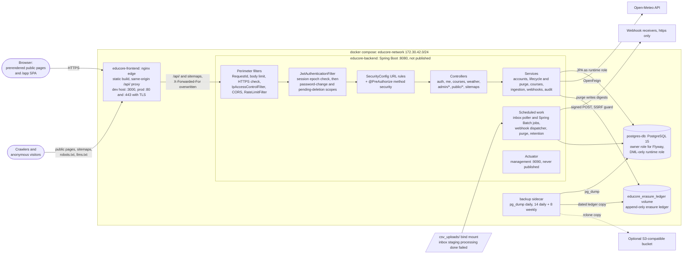
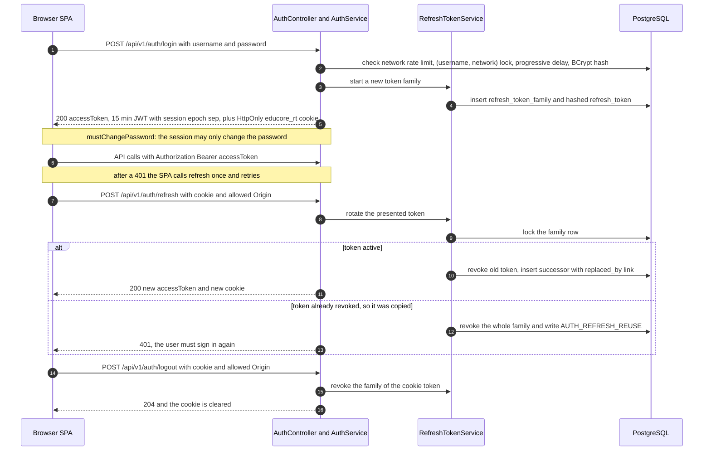
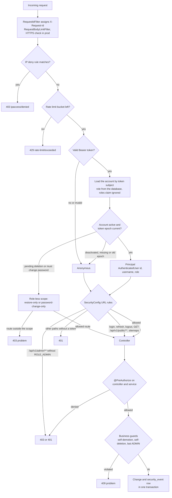
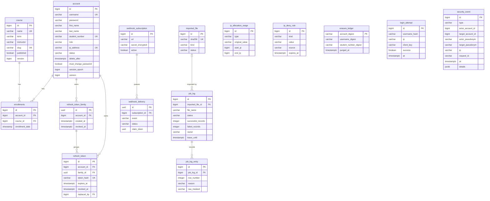
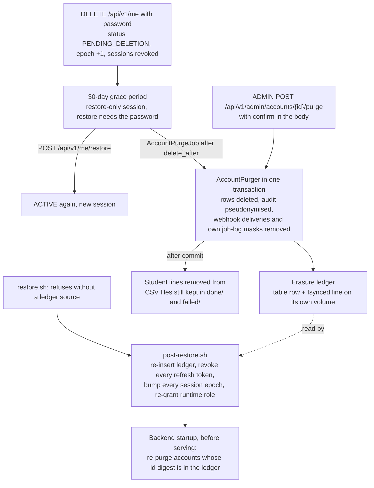

# EduCore

**English** | [Türkçe](./README.tr.md)

EduCore is a course and student management system for one institution, with a **Spring Boot 3.5** API, a **React Router 7** frontend and **PostgreSQL**. It keeps accounts, courses and enrollments, imports students and courses from CSV files with row-level reports, sends signed webhooks, publishes a prerendered public course catalog, and covers the account lifecycle from creation to erasure, including backups that never bring an erased person back.

> **Project status:** release 1.0.0 (2026-10-02, [CHANGELOG](CHANGELOG.md)). The hardening program P0–P10 is complete. The release was checked with a threat model, a static audit and attack tests; the findings, their fixes and the remaining risks are listed in [Security status](#security-status). Read it before running EduCore anywhere other than a local machine.

## Screenshots

| | |
| --- | --- |
| <br>Login | <br>Dashboard |
| <br>Students | <br>Courses |
| <br>Job logs | |

## Features

Every item below maps to code in this repository.

- **Session authentication** (`auth`): username/password login returns a 15-minute JWT access token and sets a rotating 14-day refresh token in an `HttpOnly`, `Secure`, `SameSite=Strict` cookie. Refresh-token reuse revokes the whole token family; a per-account session epoch ends every token at once on lifecycle changes. Login is throttled per client network, locks only the (username, network) pair that keeps failing, and slows distributed guessing with a progressive delay. Temporary and bootstrap passwords give a session that can only change the password. See [Authentication](#authentication).
- **Role-based access control** (`security`): roles `ADMIN` and `USER`, enforced by URL rules and method security from a machine-readable [RBAC matrix](docs/security/RBAC_MATRIX.md), with guards against self-demotion, self-deletion and removing the last active administrator, and optimistic locking on accounts. See [Authorization](#authorization).
- **Audit trail** (`security.audit`): authentication events and every administrator mutation are written to `security_event` in the same transaction as the change; administrators page through them at `GET /api/v1/admin/security-events`.
- **Student and account management** (`account`): paged, searchable, sortable admin listings, student creation with a one-time 24-character temporary password, updates, role changes, soft delete, restore, immediate purge and unlocking of sign-in. Usernames, student numbers and assigned IP addresses are unique.
- **Courses and enrollments** (`course`, `enrollment`): a member catalog for every signed-in user, course administration with publish state and stable slugs, self-service enrollment under `/api/v1/me/enrollments` and administrator enrollment for any account.
- **CSV ingestion** (`ingestion`): files dropped into `inbox/` or uploaded by an ADMIN are copied into a private snapshot, validated, made idempotent by SHA-256, and imported by multi-threaded Spring Batch jobs with row-level skip reports (masked). Runs are leased and fenced, and processed files are deleted by default. See [CSV ingestion](#csv-ingestion).
- **Signed webhooks** (`webhook`): HMAC-SHA256 signed HTTPS callbacks for import, course and account events, with retries, fenced delivery claims, a bounded queue and an SSRF guard. See [Webhooks](#webhooks).
- **IP deny rules and IP allocations** (`ipaccess`): request-level IPv4 deny rules (MANUAL rules refuse every request; AUTO rules, created after repeated failed logins, refuse only the login), separate from the student IP allocation ranges (`STATIC`, `RANGE`, `CIDR`) that limit which address an ADMIN may assign to an account.
- **Rate limiting** (`ratelimit`): 300 requests per minute per signed-in account, 60 per minute per anonymous client, 120 per minute on the public API, 10 login attempts per minute per client network, and named limits for data export and webhook test events. Buckets live in a bounded in-memory store that admits new keys instead of evicting old ones.
- **Account lifecycle and data export** (`lifecycle`): states `ACTIVE`, `DEACTIVATED`, `PENDING_DELETION` and `DELETED`; a self-service deletion request starts a 30-day grace period with a restore-only session, then a nightly purge erases the account, pseudonymises it in the audit trail and writes the erasure ledger. Users download their own data as JSON at `GET /api/v1/me/export`. Audit and login records have bounded retention.
- **Public site with SEO and GEO** (`publicapi`, `frontend/app/public-site`): an anonymous catalog API for published courses with ETags, sitemaps and `X-Robots-Tag` on the API; prerendered Turkish and English pages with canonical, hreflang, Open Graph and JSON-LD metadata, `robots.txt`, `llms.txt` and `llms-full.txt`, checked by Lighthouse budgets ([docs/seo](docs/seo/BUILD.md)).
- **Backups and restore with an erasure ledger** (`infra/backup`, `scripts/backup`): a sidecar takes a daily `pg_dump` (14 daily and 8 weekly copies, optional S3 upload). Restores replay the erasure ledger, revoke every session and re-purge erased accounts before the backend serves traffic. See [Operations](#operations).
- **Edge and transport** (`frontend/nginx.conf`, `infra/nginx`): nginx is the only published service and proxies `/api/` on the same origin. In production it terminates TLS 1.2/1.3 with HSTS and a strict CSP, using certificates from a host directory or a certbot sidecar.
- **Supply-chain gates** (`.github`): pinned image digests and action SHAs, Trivy dependency and image scans, `npm audit`, CycloneDX SBOMs, gitleaks, Dependabot, a JaCoCo coverage gate, the attacker-mode test suite and a nightly OWASP ZAP baseline scan.
- **Weather widget** (`weather`): `GET /api/v1/weather` returns current weather for İstanbul, Ankara and İzmir from Open-Meteo through an OpenFeign client, with a 5-minute cache and a per-account limit; it requires a signed-in user.
- **Configuration and migrations** (`config`): environment-first configuration with `dev`, `test` and `prod` profiles; `prod` refuses to start when a required variable is missing or unsafe (`ProdStartupGuard`, `DevSeedAccountGuard`). Flyway owns the schema (`V1`–`V42`) and migrates as the owner role, while the application uses a least-privilege runtime role.
- **Health and metrics**: Spring Boot Actuator with a Prometheus registry on management port 9090, which is never published.
- **Frontend** (`frontend/app`): React Router 7 framework mode with TypeScript. The admin screens cover students, users, courses, enrollments, imports, job logs, security events, IP deny rules, IP allocations and webhooks; users get their profile, enrollments, password change, data export and account deletion. Access tokens are kept in memory only. Light and dark themes follow the [brand identity](docs/brand/BRAND_IDENTITY.md).

## Tech stack

| Layer | Technology | Version (source) |
|---|---|---|
| Language | Java | 21 (`pom.xml`, `Dockerfile`) |
| Backend framework | Spring Boot: Web, Data JPA, Security, Validation, Batch, Integration (`spring-integration-file`, `spring-integration-jdbc`), Actuator | 3.5.16 (`pom.xml` parent) |
| Persistence | Hibernate ORM, Spring Batch | 6.6.53, 5.2.6 (Spring Boot BOM) |
| Cloud | Spring Cloud OpenFeign | 2025.0.3 BOM (OpenFeign 4.3.3) |
| Tokens | jjwt (`jjwt-api`, `jjwt-impl`, `jjwt-jackson`) | 0.12.7 |
| Rate limiting | Bucket4j (`bucket4j_jdk17-core`) with Caffeine | 8.20.0; Caffeine from the Spring Boot BOM |
| Webhook transport | Apache HttpClient 5 / HttpCore 5 | 5.6.4 / 5.4.3 (`pom.xml` overrides) |
| API document | springdoc-openapi (Swagger UI in `dev` only) | 2.8.17 |
| Security overrides | Tomcat, Jackson BOM, PostgreSQL JDBC, Bouncy Castle | 10.1.60, 2.21.7, 42.7.12, 1.85 (`pom.xml` properties) |
| Metrics | Micrometer Prometheus registry | Spring Boot BOM |
| Boilerplate | Lombok | 1.18.40 |
| Database | PostgreSQL | `postgres:15`, pinned by digest |
| Migrations | Flyway Core + `flyway-database-postgresql` | 11.7.2 (Spring Boot BOM) |
| Tests | JUnit 5, Testcontainers (PostgreSQL), Spring Batch Test, Spring Security Test, ArchUnit | Testcontainers 1.21.4 (Spring Boot BOM), ArchUnit 1.4.1 |
| Coverage and SBOM | JaCoCo Maven plugin, CycloneDX Maven plugin | 0.8.15, 2.9.3 |
| Build | Maven Wrapper | Maven 3.9.16 (`.mvn/wrapper/maven-wrapper.properties`) |
| Frontend | React, React DOM; React Router (framework mode, `@react-router/dev` and `@react-router/node`) | ^19.2.7; ^7.18.4 |
| Frontend data and forms | `@tanstack/react-query` ^5.104.0, axios ^1.20.0, react-hook-form ^7.89.0, zod ^4.6.5 | `frontend/package.json` |
| UI helpers | lucide-react ^1.23.0, `@fontsource/ibm-plex-sans` and `@fontsource/ibm-plex-mono` ^5.0.0 | `frontend/package.json` |
| Frontend build and tests | TypeScript ~5.9.3, Vite ^8.1.1, ESLint ^10.6.0, Vitest ^5.0.3, Testing Library, MSW ^3.0.1, Lighthouse CI ^0.15.1 | `frontend/package.json` (Node 22 or newer) |
| Containers | `maven:3.9-eclipse-temurin-21` build, `eclipse-temurin:21-jre-alpine` runtime (uid 10001); `node:22-alpine` build, `nginxinc/nginx-unprivileged:1.30-alpine` runtime; all pinned by digest | `Dockerfile`, `frontend/Dockerfile` |
| Edge and operations | nginx (TLS edge), certbot v5.8.0, backup sidecar with `pg_dump`, supercronic and rclone | `docker-compose.prod.yml`, `infra/` |

## Architecture

### Components


```mermaid
flowchart LR
    user(["Browser:<br/>prerendered public pages<br/>and /app SPA"])
    crawler(["Crawlers and<br/>anonymous visitors"])

    subgraph compose["docker compose: educore-network 172.30.42.0/24"]
        fe["educore-frontend: nginx edge<br/>static build, same-origin /api/ proxy<br/>dev host :3000, prod :80 and :443 with TLS"]
        subgraph be["educore-backend: Spring Boot :8080, not published"]
            edge["Perimeter filters<br/>RequestId, body limit, HTTPS check,<br/>IpAccessControlFilter, CORS, RateLimitFilter"]
            authn["JwtAuthenticationFilter<br/>session epoch check, then<br/>password-change and pending-deletion scopes"]
            rules["SecurityConfig URL rules<br/>+ @PreAuthorize method security"]
            ctrl["Controllers<br/>auth, me, courses, weather,<br/>admin/*, public/*, sitemaps"]
            svc["Services<br/>accounts, lifecycle and purge, courses,<br/>ingestion, webhooks, audit"]
            jobs["Scheduled work<br/>inbox poller and Spring Batch jobs,<br/>webhook dispatcher, purge, retention"]
            mgmt["Actuator<br/>management :9090, never published"]
        end
        db[("postgres-db: PostgreSQL 15<br/>owner role for Flyway,<br/>DML-only runtime role")]
        backup["backup sidecar<br/>pg_dump daily, 14 daily + 8 weekly"]
        ledger[("educore_erasure_ledger volume<br/>append-only erasure ledger")]
    end

    csv[/"csv_uploads/ bind mount<br/>inbox staging processing done failed"/]
    meteo["Open-Meteo API"]
    hooks["Webhook receivers, https only"]
    s3["Optional S3-compatible bucket"]

    user -->|"HTTPS"| fe
    crawler -->|"public pages, sitemaps,<br/>robots.txt, llms.txt"| fe
    fe -->|"/api/ and sitemaps,<br/>X-Forwarded-For overwritten"| edge
    edge --> authn --> rules --> ctrl --> svc
    svc -->|"JPA as runtime role"| db
    svc -->|"OpenFeign"| meteo
    jobs -->|"signed POST, SSRF guard"| hooks
    csv --> jobs
    jobs --> db
    svc -->|"purge writes digests"| ledger
    backup -->|"pg_dump"| db
    backup -->|"dated ledger copy"| ledger
    backup -.->|"rclone copy"| s3
```

The browser talks to one origin. nginx serves the prerendered public pages and the SPA, and proxies `/api/` (and in production the sitemaps) to the backend, so no CORS is needed. The SPA resolves its API paths against `VITE_API_BASE_URL`, default `/api` (`frontend/app/lib/api.ts`). Only nginx publishes a port: 3000 in development and 80/443 in production. PostgreSQL, the backend and the management port stay inside the compose network. The backend trusts `X-Forwarded-For` only from nginx's fixed address, `172.30.42.10`. A detailed description, with the data model, the request filter order, the ingestion pipeline and the deployment, is in [docs/ARCHITECTURE.md](docs/ARCHITECTURE.md).

### Authentication sequence


```mermaid
sequenceDiagram
    autonumber
    participant B as Browser SPA
    participant A as AuthController and AuthService
    participant R as RefreshTokenService
    participant D as PostgreSQL

    B->>A: POST /api/v1/auth/login with username and password
    A->>D: check network rate limit, (username, network) lock, progressive delay, BCrypt hash
    A->>R: start a new token family
    R->>D: insert refresh_token_family and hashed refresh_token
    A-->>B: 200 accessToken, 15 min JWT with session epoch sep, plus HttpOnly educore_rt cookie
    Note over B,A: mustChangePassword: the session may only change the password
    B->>A: API calls with Authorization Bearer accessToken
    Note over B,A: after a 401 the SPA calls refresh once and retries
    B->>A: POST /api/v1/auth/refresh with cookie and allowed Origin
    A->>R: rotate the presented token
    R->>D: lock the family row
    alt token active
        R->>D: revoke old token, insert successor with replaced_by link
        A-->>B: 200 new accessToken and new cookie
    else token already revoked, so it was copied
        R->>D: revoke the whole family and write AUTH_REFRESH_REUSE
        A-->>B: 401, the user must sign in again
    end
    B->>A: POST /api/v1/auth/logout with cookie and allowed Origin
    A->>R: revoke the family of the cookie token
    A-->>B: 204 and the cookie is cleared
```

### Request authorization path


```mermaid
flowchart TD
    req["Incoming request"] --> rid["RequestIdFilter assigns X-Request-Id<br/>RequestBodyLimitFilter, HTTPS check in prod"]
    rid --> ipf{"IP deny rule matches?"}
    ipf -->|"yes"| ip403["403 ipaccess/denied"]
    ipf -->|"no"| rl{"Rate limit bucket left?"}
    rl -->|"no"| r429["429 rate-limit/exceeded"]
    rl -->|"yes"| jwt{"Valid Bearer token?"}
    jwt -->|"yes"| load["Load the account by token subject<br/>role from the database, roles claim ignored"]
    jwt -->|"no or invalid"| anon["Anonymous"]
    load --> active{"Account active and<br/>token epoch current?"}
    active -->|"deactivated, missing or old epoch"| anon
    active -->|"pending deletion or must change password"| scope["Role-less scope:<br/>restore-only or password-change-only"]
    scope -->|"route outside the scope"| s403["403 problem"]
    scope -->|"allowed route"| ctrl
    active -->|"yes"| principal["Principal AuthenticatedUser id, username, role"]
    anon --> url{"SecurityConfig URL rules"}
    principal --> url
    url -->|"login, refresh, logout, GET /api/v1/public/**, sitemaps"| ctrl["Controller"]
    url -->|"/api/v1/admin/** without ROLE_ADMIN"| deny403["403 or 401"]
    url -->|"other paths without a token"| deny401["401"]
    url -->|"allowed"| ctrl
    ctrl --> pre{"@PreAuthorize on controller and service"}
    pre -->|"denied"| deny403
    pre -->|"allowed"| guard{"Business guards<br/>self-demotion, self-deletion, last ADMIN"}
    guard -->|"violated"| c409["409 problem"]
    guard -->|"ok"| tx["Change and security_event row<br/>in one transaction"]
```

### Main tables


```mermaid
erDiagram
    account ||--o{ enrollments : "has"
    course ||--o{ enrollments : "has"
    account ||--o{ refresh_token_family : "owns"
    account ||--o{ refresh_token : "owns"
    refresh_token_family ||--o{ refresh_token : "groups"
    imported_file |o--o{ job_log : "imported by"
    job_log ||--o{ job_log_entry : "records"
    webhook_subscription ||--o{ webhook_delivery : "queues"
    account {
        bigint id PK
        varchar username UK
        varchar password
        varchar first_name
        varchar last_name
        varchar student_number UK
        varchar role
        varchar ip_address UK
        varchar status
        timestamptz delete_after
        boolean must_change_password
        bigint session_epoch
        bigint version
    }
    course {
        bigint id PK
        varchar name UK
        varchar term
        varchar instructor
        varchar slug UK
        boolean published
        bigint version
    }
    enrollments {
        bigint id PK
        bigint account_id FK
        bigint course_id FK
        timestamp enrollment_date
    }
    ip_allocation_range {
        bigint id PK
        varchar type
        varchar original_value
        bigint start_ip
        bigint end_ip
    }
    ip_deny_rule {
        bigint id PK
        varchar kind
        varchar value
        varchar source
        timestamptz expires_at
    }
    imported_file {
        bigint id PK
        varchar sha256 UK
        varchar kind
        varchar status
    }
    job_log {
        bigint id PK
        bigint imported_file_id FK
        varchar file_name
        varchar status
        integer successful_records
        integer failed_records
        varchar owner
        timestamptz lease_until
    }
    job_log_entry {
        bigint id PK
        bigint job_log_id FK
        integer row_number
        varchar reason
        varchar raw_masked
    }
    webhook_subscription {
        bigint id PK
        varchar url
        varchar secret_encrypted
        boolean active
    }
    webhook_delivery {
        uuid id PK
        bigint subscription_id FK
        varchar event
        varchar status
        uuid claim_token
    }
    erasure_ledger {
        varchar account_digest PK
        varchar username_digest
        varchar student_number_digest
        timestamptz purged_at
    }
    refresh_token_family {
        uuid id PK
        bigint account_id FK
        timestamptz created_at
        timestamptz revoked_at
    }
    refresh_token {
        bigint id PK
        bigint account_id FK
        uuid family_id FK
        varchar token_hash UK
        timestamptz expires_at
        timestamptz revoked_at
        bigint replaced_by FK
    }
    login_attempt {
        bigint id PK
        varchar username_hash
        varchar ip
        varchar client_key
        boolean success
        timestamptz at
    }
    security_event {
        bigint id PK
        varchar type
        bigint actor_account_id
        bigint target_account_id
        varchar actor_pseudonym
        varchar target_pseudonym
        varchar ip
        varchar request_id
        timestamptz at
        jsonb details
    }
```

Not shown: `catalog_revision`, `upload_staging`, `restore_replay`, the Spring Batch metadata tables (`V2`) and `INT_METADATA_STORE` (`V30`). The full model is in [docs/ARCHITECTURE.md](docs/ARCHITECTURE.md#3-data-model).

### Erasure and restore


```mermaid
flowchart TD
    req["DELETE /api/v1/me with password<br/>status PENDING_DELETION, epoch +1, sessions revoked"] --> grace["30-day grace period<br/>restore-only session, restore needs the password"]
    grace -->|"POST /api/v1/me/restore"| active["ACTIVE again, new session"]
    grace -->|"AccountPurgeJob after delete_after"| purge
    admin["ADMIN POST /api/v1/admin/accounts/{id}/purge<br/>with confirm in the body"] --> purge
    purge["AccountPurger in one transaction<br/>rows deleted, audit pseudonymised,<br/>webhook deliveries and own job-log masks removed"] --> ledger["Erasure ledger<br/>table row + fsynced line on its own volume"]
    purge -->|"after commit"| files["Student lines removed from<br/>CSV files still kept in done/ and failed/"]
    restore["restore.sh: refuses without a ledger source"] --> post["post-restore.sh<br/>re-insert ledger, revoke every refresh token,<br/>bump every session epoch, re-grant runtime role"]
    ledger -.->|"read by"| post
    post --> replay["Backend startup, before serving:<br/>re-purge accounts whose id digest is in the ledger"]
```

### Source layout

Backend code under `src/main/java/com/educore` is organized by feature, with shared packages alongside:

| Package or path | Contents |
|---|---|
| `account` | Admin account/student controller and service, own-profile controller (`/api/v1/me`), request and response records |
| `auth` | `AuthController`, `AuthService`, password policy, login rate limiter, lockout and progressive delay (`LoginAttemptService`), refresh tokens and families, refresh cookie |
| `lifecycle` | Deletion grace period and restore, `AccountPurger`, `AccountPurgeJob`, `Pseudonyms`, `RetentionJob`, `DataExportService`, `ErasureLedger` and `ErasureLedgerReplay` |
| `course`, `enrollment` | Course catalog and admin controllers, catalog revision, enrollment controller and service |
| `publicapi` | Anonymous catalog API (`PublicCatalogService`), site facts, `SitemapController`, `RobotsTagFilter` |
| `ipaccess` | IP deny rules (`IpAccessControlFilter`, `IpDenyRuleCache`, `IpAutoDenyService`), student IP allocation ranges, `ClientAddress` keys |
| `ratelimit` | `RateLimitFilter`, `CaffeineRateLimitStore`, `NamedRateLimits` |
| `ingestion`, `ingestion.batch` | Inbox poller (`IngestionFlowConfig`), `IngestionService`, pre-launch validation, folder protocol, leases and `IngestionFence`, upload staging, `IngestionRetention`, Spring Batch jobs (`ImportJobConfig`), job logs and entries |
| `webhook` | Subscriptions, encrypted secrets (`SecretCipher`), `WebhookDispatcher`, signing, SSRF guard (`WebhookAddressPolicy`, `GuardedDnsResolver`) |
| `weather` | `WeatherController`, `WeatherService` (5-minute cache, fallback), OpenFeign `WeatherClient` |
| `security` | `SecurityConfig`, `JwtService`, `JwtAuthenticationFilter`, `PasswordChangeRequiredScopeFilter`, `PendingDeletionScopeFilter`, `ClientIpResolver`, `OriginVerifier`, `RequestIdFilter`, security headers |
| `security.audit` | `AuditService`, `SecurityEvent`, `SecurityEventType`, security-event admin controller |
| `common` | Problem Details (`common.web`), input patterns, log masking (`common.logging`), LIKE escaping, CSV and output encoding |
| `config` | `EduCoreProperties`, `ProdStartupGuard`, `DevSeedAccountGuard`, `MigrationRoleFlywayConfig`, `ForwardedHeadersConfig`, `AdminBootstrap` |
| `entity`, `repository`, `service` | Shared JPA entities, repositories and `AccountCredentialService` |
| `src/main/resources` | `application.yml`, `application-{dev,test,prod}.yml`, `db/migration` (Flyway `V1`–`V42`), `db/seed/dev` (demo seed), `security/common-passwords.txt` |
| `frontend/app` | React Router 7 app: `routes/`, `features/` (one folder per screen group), `components/`, `lib/api.ts` (single API client with refresh handling), `public-site/`, `seo/`, `styles/` |
| `frontend/scripts`, `frontend/tests` | Prerender post-processing, SEO file generation and checks; Vitest tests |
| `infra/` | Production nginx (`infra/nginx`), PostgreSQL role scripts (`infra/postgres`), backup sidecar (`infra/backup`), budget alerts (`infra/cloud`), Prometheus alert examples (`infra/monitoring`) |
| `scripts/` | `backup/` (restore, post-restore, verification, drill), `preflight.sh`, `check-env-docs.sh`, `scan-secrets.sh`, `zap-local.sh` |
| `csv_uploads/` | Ingestion folders (`inbox/`, `staging/`, `processing/`, `done/`, `failed/`); `csv_uploads/sample/` holds example files |

## Authentication

`AuthController` provides the session endpoints:

| Method and path | Purpose |
|---|---|
| `POST /api/v1/auth/login` | Sign in with username and password; returns `{accessToken, expiresIn, user}` and sets the refresh cookie. |
| `POST /api/v1/auth/refresh` | Rotates the refresh token in the cookie and returns a new access token. |
| `POST /api/v1/auth/logout` | Revokes the refresh-token family and clears the cookie. |
| `GET /api/v1/auth/me` | Returns the signed-in user. |
| `POST /api/v1/auth/password` | Changes the signed-in user's password, revokes every refresh session and starts a new one. |

- **Access token:** HS256 JWT valid for 15 minutes with issuer `educore` and audience `educore-api`; its subject is the account id, a `kid` header names the signing key and the `sep` claim carries the account's session epoch. The signing key comes from `EDUCORE_JWT_SECRET` (base64, at least 32 decoded bytes, otherwise startup fails); `EDUCORE_JWT_SECRET_PREVIOUS` keeps tokens valid during a [key rotation](docs/security/KEY_ROTATION.md). The account, its role and its epoch are read from the database on every request; the `roles` claim is ignored.
- **Session epoch:** a deletion request, an ADMIN soft delete and both restore paths increment `account.session_epoch` and revoke every refresh family, so every earlier token of the account stops working at once. Logout and password change revoke the refresh families; access tokens issued before them keep a documented residual of at most 15 minutes ([BACKLOG](docs/BACKLOG.md) B-084).
- **Refresh token:** an opaque random value stored only as a SHA-256 hash in `refresh_token`, sent in the `educore_rt` cookie (`HttpOnly`, `SameSite=Strict`, `Path=/api/v1/auth`, 14 days). `Secure` is set in every profile except `dev`. Refresh and logout also require an allowed `Origin` (`OriginVerifier`).
- **Rotation and reuse detection:** every refresh revokes the presented token and issues its successor in the same family. Presenting an already revoked token revokes the whole family and records `AUTH_REFRESH_REUSE`.
- **Throttling and lockout:** 10 login attempts per minute per client key (HTTP 429 with `Retry-After`). The client key is the IPv4 address, or the /64 network for IPv6. Five failed passwords within 15 minutes lock only that (username, client key) pair, for 15 minutes (HTTP 423). Above five failures for a username from any network, a progressive delay of 1 s, doubling up to 30 s, answers 429 `auth/too-many-attempts`. Networks with a successful sign-in to that account in the last 30 days are exempt. An ADMIN clears the failed attempts of an account with `POST /api/v1/admin/accounts/{id}/unlock-login`; the break-glass procedure is in [RUNBOOK_ADMIN_RECOVERY.md](docs/ops/RUNBOOK_ADMIN_RECOVERY.md). Usernames in `login_attempt` are stored as HMAC-SHA-256 with `EDUCORE_LOGIN_PEPPER`. `X-Forwarded-For` is honoured only from proxies listed in `educore.ipaccess.trusted-proxies`.
- **Passwords:** BCrypt (strength 12) through a delegating encoder that upgrades older hashes on login. New passwords must be 12–128 characters, at most 72 bytes in UTF-8 and not on the common-password deny list. Students created by an administrator get a random temporary password that is shown once; CSV-imported students get one that is stored only as a hash.
- **Forced password change:** an account flagged `mustChangePassword` (temporary passwords and the bootstrap ADMIN) gets a role-less session. `PasswordChangeRequiredScopeFilter` allows only `GET /api/v1/auth/me`, `POST /api/v1/auth/password`, `/auth/refresh` and `/auth/logout`; every other route answers 403 `account/password-change-required`. The frontend shows only the change-password screen.
- **Events:** `AUTH_LOGIN_SUCCESS`, `AUTH_LOGIN_FAILURE`, `AUTH_LOCKED`, `AUTH_REFRESH_REUSE`, `PASSWORD_CHANGED` and `ACCOUNT_LOGIN_UNLOCKED` are written to `security_event`.

## Authorization

Roles are `ADMIN` and `USER`. The [RBAC matrix](docs/security/RBAC_MATRIX.md) is the source of truth; `AuthorizationMatrixIT` executes every cell from `src/test/resources/rbac-matrix.csv`.

- **Anonymous:** `POST /api/v1/auth/login`, `/refresh` and `/logout`; `GET`/`HEAD` of `/api/v1/public/**`, `/sitemap.xml` and `/sitemap-courses-{n}.xml`.
- **USER:** own profile, enrollments, data export, deletion request and restore under `/api/v1/me`, the member course catalog, weather and the session endpoints. Account and student listings are ADMIN-only.
- **ADMIN:** everything under `/api/v1/admin/**`: accounts and students, soft delete, restore, purge, unlock-login, roles, enrollments, courses, IP deny rules, IP allocations, imports, job logs, webhooks and security events.
- **Restricted sessions:** a `PENDING_DELETION` account inside its grace period may sign in, but only `GET /api/v1/me`, `POST /api/v1/me/restore` and `POST /api/v1/auth/logout` are allowed. Restore requires the current password and answers a new session. An account with `mustChangePassword` may only change its password (see [Authentication](#authentication)). Both scopes use an authority without any role, so a route added later is closed by default.

Enforcement layers:

1. URL rules in `SecurityConfig`: `/api/v1/admin/**` requires `ROLE_ADMIN`, every other non-public path requires authentication.
2. Method security: admin controllers and services carry `@PreAuthorize("hasRole('ADMIN')")`; enrollment service methods check `#accountId == principal.id or hasRole('ADMIN')`. The principal is the typed `AuthenticatedUser(id, username, role)`; the role is reloaded from the database on every request, and an account that is not `ACTIVE` or presents an old session epoch is treated as anonymous.
3. Business guards (409 problems): an ADMIN cannot change their own role or delete their own account, and the last active ADMIN cannot be demoted, deleted or purged. Active ADMIN rows are locked with `SELECT ... FOR UPDATE` during the check.
4. Destructive actions: an immediate purge is `POST /api/v1/admin/accounts/{id}/purge` with `{"confirm": "<username>"}` in the body, so the username never appears in a request line or proxy log. `DELETE /api/v1/admin/accounts/{id}` accepts only `mode=soft`.
5. DTO boundary: request records have no `id`, `role`, `status`, `password` or `mustChangePassword` fields (except `ChangeRoleRequest.role`); strict JSON binding rejects type coercion; responses never contain password hashes or entity graphs. Self-service routes take the account from the principal, which prevents IDOR.
6. Concurrency: `account.version` (optimistic locking) rejects stale writes with 409 `request/concurrent-modification`; `PUT /api/v1/me` writes only the name columns.

**Audit events.** Each administrator mutation writes one `security_event` row in the same transaction as the change, among them `ACCOUNT_CREATED`, `ACCOUNT_UPDATED`, `ACCOUNT_DELETED`, `ACCOUNT_RESTORED`, `ACCOUNT_PURGED`, `ACCOUNT_LOGIN_UNLOCKED`, `ROLE_CHANGED`, `ENROLLMENT_CHANGED`, `COURSE_CHANGED`, `IP_RULE_CHANGED`, `IP_ALLOCATION_CHANGED`, `IMPORT_UPLOADED`, `WEBHOOK_CHANGED` and `JOB_LOGS_DELETED`. Self-service events are `ACCOUNT_DELETION_REQUESTED`, `ACCOUNT_RESTORED` and `DATA_EXPORTED`. Rows carry actor, target, client IP and request id; `details` holds ids, enum values and field names only. No-op requests write no event, and if the audit insert fails the change is rolled back. After a purge the account is referenced only by a keyed pseudonym.

## API overview

The versioned API has five route groups:

- `/api/v1/auth`: login, refresh, logout, current user and password change.
- `/api/v1/me`: the caller's profile (`GET`/`PUT`), enrollments (`GET`, `POST`, `DELETE /{courseId}`), deletion request (`DELETE /api/v1/me` with the current password), restore (`POST /api/v1/me/restore` with the current password) and data export (`GET /api/v1/me/export`).
- `/api/v1/courses` and `/api/v1/weather`: the member course catalog and the weather widget, for any signed-in user.
- `/api/v1/public/...`: the anonymous catalog of published courses (`courses`, `courses/{slug}`, `site-facts`), plus `/sitemap.xml` and `/sitemap-courses-{n}.xml`.
- `/api/v1/admin/...`: ADMIN-only `accounts` (including `/{id}/restore`, `/{id}/purge`, `/{id}/unlock-login`, `/{id}/role`, `/{id}/enrollments`), `accounts/students`, `courses`, `ip-rules` (deny rules), `ip-allocations`, `imports`, `job-logs`, `webhooks` and `security-events`.

Paged routes return `{content, page, size, totalElements, totalPages}`; `page` and `size` outside their range (1–100 for `size`) are rejected with 400, and `sort` keys come from a whitelist. Every error, on every path and status, is an RFC 9457 `application/problem+json` body with a stable `code` and no exception text. The [API route contract](docs/api/ROUTES.md) lists every method, payload, status code and the mapping from the removed pre-P3 routes; the OpenAPI document is [docs/api/openapi.yaml](docs/api/openapi.yaml) (Swagger UI in `dev` only).

## CSV ingestion

Package `ingestion` (Spring Integration + Spring Batch, since P6):

- **Folders** under `educore.ingestion.base-dir` (default `csv_uploads`; Compose mounts `./csv_uploads` at `/app/csv_uploads`): drop files into `inbox/`. A file is never imported in place: links are rejected and its bytes are copied (size-capped) into a private snapshot `processing/<uuid>_<name>`, which alone is validated, hashed and imported. All folders must be on one file system (checked at startup) and every later move is an atomic rename. `sample/` is never read.
- **Retention of files:** a SUCCEEDED or PARTIAL snapshot is **deleted right after the import** (`educore.ingestion.retain-processed-days`, default 0; a larger value keeps it in `done/` for that many days). FAILED and rejected files stay in `failed/` with a `<name>.report.json` sidecar of masked row entries for at most `educore.ingestion.retain-failed-days` (7), then the hourly `IngestionRetention` deletes them. When an account is purged, its student's lines are removed from any file still kept. The database keeps the hash, counts and masked row entries.
- **Pick-up:** every `educore.ingestion.poll-interval` (5 s), files matching `*.csv` that have not changed for `educore.ingestion.stable-after` (2 s). Which files were seen is stored in the database (`INT_METADATA_STORE`), so a restart does not re-read them; re-dropping a file with the same name and the same modification time is ignored (rename or touch it). Write large files under another name and rename them into `inbox/` when complete.
- **Before the job starts** the file must be at most `educore.ingestion.max-bytes` (20 MB) and `max-rows` (50 000) data rows, strict UTF-8 (a BOM is allowed), text only, lines ending in LF or CR LF (a bare CR is rejected), at most `max-record-length` (10 000) characters per line, and its header must be exactly `FirstName,LastName,StudentNumber` (students) or `name,term,instructor` (courses); the header decides the job. File names are reduced to `[A-Za-z0-9._-]`. A file whose SHA-256 was already imported is rejected as `DUPLICATE` (unless that import FAILED).
- **Jobs** (`importStudentJob`, `importCourseJob`): strict CSV parsing with quoted fields, Bean Validation of every row (same rules as the admin API), duplicates within the file and against the database are skipped, rows are written in chunks by `educore.ingestion.threads` (4) threads. Parse errors, invalid rows, duplicates and constraint violations are skipped and recorded per row (line number, reason, masked raw line); more than `educore.ingestion.skip-limit` (1 000) skips fail the job. Imported students get the student number as username, role `USER` and a random temporary password stored only as a hash (`mustChangePassword`).
- **Outcome:** `SUCCEEDED` (all rows written), `PARTIAL` (some rows skipped), `FAILED` (file rejected, job failed or nothing written). Job logs and their row entries: `GET /api/v1/admin/job-logs` and `GET /api/v1/admin/job-logs/{id}/entries`. Each outcome is also sent as the webhook event `import.completed` or `import.failed`.
- **Upload:** ADMINs can upload a CSV with `POST /api/v1/admin/imports` (multipart part `file`, at most 5 MB); it is checked the same way, registered in `upload_staging` with an owner and a lease, staged in `staging/` and moved into `inbox/` only after the request's transaction committed. Recovery takes over only uploads whose lease expired.
- **Restart safety and fencing:** each run is owned by its instance and leased (`educore.ingestion.lease`, 2 min, renewed every 30 s). At startup and every minute, runs whose lease expired are closed as `INTERRUPTED` and their snapshots move to `failed/`; live runs of other instances are left alone. Every chunk write takes a shared advisory lock and checks that the run is still open, owned and leased (`IngestionFence`), so a closed run can no longer write rows. At startup, files still in `inbox/` are released for pick-up again and committed staged uploads are published.

To try it, copy a sample file into the inbox:

```bash
cp csv_uploads/sample/courses.sample.csv csv_uploads/inbox/
cp csv_uploads/sample/students.sample.csv csv_uploads/inbox/
```

The student import has no administrator-facing password reset yet ([BACKLOG](docs/BACKLOG.md) B-016), so imported students cannot sign in until one exists.

## Webhooks

ADMINs register https endpoints under `/api/v1/admin/webhooks` for `import.completed`, `import.failed`, `course.updated` and `account.deleted` (at most 20 subscriptions). Requests are signed (`X-EduCore-Signature: v1=<HMAC-SHA256 over timestamp.body>`, plus `X-EduCore-Timestamp`, `X-EduCore-Event` and `X-EduCore-Delivery`) and retried with exponential backoff for at most 5 retries. Payloads carry ids and counts, never personal data. The signing secret is shown once and stored AES-256-GCM encrypted with `EDUCORE_ENCRYPTION_KEY`. The SSRF guard allows https only and follows no redirects. It refuses private, loopback, link-local, metadata, NAT64 and mapped addresses both before the request and at connect time, and both DNS lookups run inside the 10-second request deadline. Details and verification code: [docs/integrations/WEBHOOKS.md](docs/integrations/WEBHOOKS.md).

## Quick start

Requirements: Docker with the Compose plugin, and `openssl` for generating secrets.

1. Create your environment file from the template:

   ```bash
   cp .env.example .env
   ```

2. Generate secrets and put them into `.env`:

   ```bash
   openssl rand -base64 48   # EDUCORE_JWT_SECRET
   openssl rand -base64 48   # EDUCORE_LOGIN_PEPPER
   openssl rand -base64 32   # EDUCORE_ENCRYPTION_KEY
   openssl rand -base64 24   # EDUCORE_DB_PASSWORD (owner, used by Flyway)
   openssl rand -base64 24   # EDUCORE_DB_APP_PASSWORD (runtime role, used by the backend)
   ```

   Also choose `EDUCORE_DB_APP_USERNAME`, a role name different from `EDUCORE_DB_USERNAME`. Replace every sample value. `.env` is ignored by Git and must never be committed.

3. Build and start the stack:

   ```bash
   docker compose up --build
   ```

   Compose refuses to start when `EDUCORE_DB_USERNAME`, `EDUCORE_DB_PASSWORD`, `EDUCORE_DB_NAME`, `EDUCORE_DB_APP_USERNAME`, `EDUCORE_DB_APP_PASSWORD`, `EDUCORE_JWT_SECRET`, `EDUCORE_LOGIN_PEPPER` or `EDUCORE_ENCRYPTION_KEY` is missing. On the first start of an empty database, `infra/postgres/init/01-roles.sh` creates the DML-only runtime role and Flyway creates the schema as the owner. In the default `dev` profile the synthetic demo seed adds four courses and the accounts `admin` (ADMIN), `ayberk` and `ali`. With `SPRING_PROFILES_ACTIVE=prod` no seed is loaded, the first ADMIN is created from `EDUCORE_BOOTSTRAP_ADMIN_USERNAME` and `EDUCORE_BOOTSTRAP_ADMIN_PASSWORD`, and a database that still holds the demo accounts is refused.

4. Open the app. Everything goes through the nginx edge on port 3000:

   | Service | Address |
   |---|---|
   | Public site | http://localhost:3000 |
   | Application (SPA) | http://localhost:3000/app |
   | API | http://localhost:3000/api/v1 (same origin, proxied by nginx) |
   | Backend port 8080, PostgreSQL 5432 | not published; inside `educore-network` only |
   | Actuator | port `9090` inside the backend container only |

   To check health from the host:

   ```bash
   docker compose exec educore-backend wget -q -O - http://127.0.0.1:9090/actuator/health
   ```

   For database tools or a backend started from the IDE, the development override publishes PostgreSQL and the backend on the loopback interface only (`127.0.0.1:5432` and `127.0.0.1:8081`). Never use it on a shared or internet-facing host:

   ```bash
   docker compose -f docker-compose.yml -f docker-compose.dev.yml up -d
   ```

5. Production uses the TLS edge on ports 80 and 443, the `prod` profile and the backup sidecar:

   ```bash
   docker compose -f docker-compose.yml -f infra/backup/docker-compose.backup.yml -f docker-compose.prod.yml up -d
   ```

   Add `--profile certbot` for Let's Encrypt certificates. Read [docs/ops/TLS.md](docs/ops/TLS.md) first: the first installation needs a bootstrap step, because the public pages are prerendered from the running API. `scripts/preflight.sh` checks a production `.env` before the start.

## Local development

The Vite dev server runs on port 3000 (the origin the `dev` profile allows for CORS and for the refresh/logout `Origin` check) and forwards `/api` to the backend, so the browser talks to one origin.

1. Start only the database, published on `127.0.0.1:5432` by the development override:

   ```bash
   docker compose -f docker-compose.yml -f docker-compose.dev.yml up -d postgres-db
   ```

2. Export the backend variables in your shell (the backend reads the process environment, not `.env`):

   ```bash
   export SPRING_PROFILES_ACTIVE=dev
   export EDUCORE_DB_URL=jdbc:postgresql://localhost:5432/educore_db
   export EDUCORE_DB_APP_USERNAME='runtime role from your .env'
   export EDUCORE_DB_APP_PASSWORD='value from your .env'
   export EDUCORE_DB_MIGRATION_USERNAME='owner role from your .env (EDUCORE_DB_USERNAME)'
   export EDUCORE_DB_MIGRATION_PASSWORD='value from your .env (EDUCORE_DB_PASSWORD)'
   export EDUCORE_JWT_SECRET='value from your .env'
   ```

   With a single local database user, export `EDUCORE_DB_USERNAME` and `EDUCORE_DB_PASSWORD` instead of the four role variables: the pool falls back to them and Flyway then uses the pool's role (only `prod` insists on two different roles). `EDUCORE_LOGIN_PEPPER`, `EDUCORE_ENCRYPTION_KEY` and `EDUCORE_ERASURE_LEDGER_FILE` are optional in `dev`: without the first two a random per-process value is used (lockout counters reset and stored webhook secrets become unreadable on restart), and without the third no ledger file is written.

3. Run the backend (Java 21). It listens on port 8080 and Actuator on 9090:

   ```bash
   ./mvnw spring-boot:run
   ```

   On Windows use `mvnw.cmd spring-boot:run`. Actuator is then at `http://localhost:9090/actuator/health`.

4. Run the frontend (Node 22 or newer):

   ```bash
   cd frontend
   npm ci
   npm run dev
   ```

   `vite.config.ts` forwards `/api` to `EDUCORE_DEV_PROXY_TARGET` (default `http://localhost:8080`; use `http://localhost:8081` for the compose backend published by `docker-compose.dev.yml`). Frontend commands, the build output and the prerender steps are described in [frontend/README.md](frontend/README.md).

## Configuration

- **Profiles:** `application.yml` holds shared settings; `application-dev.yml`, `application-test.yml` and `application-prod.yml` override them. Without `SPRING_PROFILES_ACTIVE` the `dev` profile is used.
  - `dev`: demo seed applied, refresh cookie without `Secure`, CORS default `http://localhost:3000`, Swagger UI enabled.
  - `test`: automated tests only; PostgreSQL comes from Testcontainers and each application context uses a fresh ingestion folder under the system temp directory, with the CSV poller and the webhook dispatcher off except in the ingestion and webhook tests.
  - `prod`: no seed, no default for any secret, empty CORS list (same origin behind the edge), HTTPS required (plain HTTP is 403 `request/https-required`), ECS JSON logs. Before any bean is created, `ProdStartupGuard` names every missing variable: the database URL, the runtime and migration roles (which must differ), the JWT secret, the login pepper, the encryption key, the erasure ledger file, both bootstrap-admin variables, and `EDUCORE_SEO_BASE_URL`, which must be an https origin that is not localhost. `DevSeedAccountGuard` refuses a database that still holds the dev seed accounts (remedy in [UPGRADE.md](docs/ops/UPGRADE.md)).
- **Database roles:** the owner role (`EDUCORE_DB_USERNAME`, the PostgreSQL superuser of the compose image) is used only by Flyway (`EDUCORE_DB_MIGRATION_*`, `MigrationRoleFlywayConfig`) and by the backup sidecar. The backend's connection pool uses the runtime role `EDUCORE_DB_APP_USERNAME`, which has DML and sequence rights only: no DDL, no extensions, no `COPY ... PROGRAM` (`infra/postgres/app-role.sql`, verified by `DatabaseRolesIT`). An existing database gets the role once by hand ([UPGRADE.md](docs/ops/UPGRADE.md)).
- **Migrations:** Flyway runs on startup with `baseline-on-migrate` for databases created before Flyway; `ddl-auto` is `validate`. Databases migrated before P5 need one start with `SPRING_FLYWAY_OUT_OF_ORDER=true` for V12, V13, V21–V23, V33 and V34 ([UPGRADE.md](docs/ops/UPGRADE.md)).
- **Management port:** Actuator listens on `management.server.port=9090` and exposes `health`, `info`, `metrics` and `prometheus`. `/actuator/health` is open; the others require an ADMIN bearer token. `docker-compose.yml` does not publish this port.
- **Error output:** messages, stack traces and binding errors are never included in error responses.
- **Other settings:** defaults for `educore.*` properties (ingestion folder, trusted proxies, token lifetimes, login limits) live in `EduCoreProperties` and `application.yml`.

## Environment variables

This table lists every key of `.env.example` (41 keys), in the same order. `scripts/check-env-docs.sh` checks that every variable read by Compose or Spring is in `.env.example`, that every key there is read somewhere and has a comment, and reports keys missing from this README.

| Variable | Required | Description |
|---|---|---|
| `SPRING_PROFILES_ACTIVE` | No (default `dev`) | `dev` applies the synthetic demo seed; `prod` loads no seed and fails at startup naming each missing variable; `test` is for automated tests only. |
| `EDUCORE_DB_URL` | Local runs; `prod` | JDBC URL when the backend runs outside Docker, e.g. `jdbc:postgresql://localhost:5432/educore_db`. Inside Compose it is derived from `EDUCORE_DB_NAME` and the `postgres-db` host. |
| `EDUCORE_DB_NAME` | Yes (Compose) | Database created by the PostgreSQL container and used by the backend container. |
| `EDUCORE_DB_USERNAME` | Yes (Compose) | Database owner, created as the superuser of the PostgreSQL container. Flyway migrates as it and the backup sidecar dumps as it; the backend's pool never uses it inside Compose. |
| `EDUCORE_DB_PASSWORD` | Yes (Compose) | Password of `EDUCORE_DB_USERNAME`; a long random value, e.g. `openssl rand -base64 24`. |
| `EDUCORE_DB_APP_USERNAME` | Yes (Compose, `prod`) | Least-privilege runtime role of the backend (DML only). Created by `infra/postgres/init/01-roles.sh` on the first start of an empty database; must differ from `EDUCORE_DB_USERNAME`. |
| `EDUCORE_DB_APP_PASSWORD` | Yes (Compose, `prod`) | Password of `EDUCORE_DB_APP_USERNAME`; a different long random value. |
| `EDUCORE_DB_MIGRATION_USERNAME` | Yes in `prod` | Role Flyway migrates with (the owner). Compose sets it from `EDUCORE_DB_USERNAME`; set it only for a run outside Docker that separates the roles. Empty: Flyway uses the pool's role. |
| `EDUCORE_DB_MIGRATION_PASSWORD` | Yes in `prod` | Password of the migration role; set together with the username or not at all. |
| `EDUCORE_JWT_SECRET` | Yes | Base64 HMAC signing secret, at least 32 bytes after decoding; generate with `openssl rand -base64 48`. |
| `EDUCORE_JWT_SECRET_PREVIOUS` | No | Previous signing secret, set only during a key rotation; see [KEY_ROTATION.md](docs/security/KEY_ROTATION.md). |
| `EDUCORE_LOGIN_PEPPER` | Yes in `prod` and Compose | Pepper for HMAC-SHA-256 of usernames in `login_attempt`, and the root of the derived keys for audit pseudonyms and the erasure ledger; at least 32 characters, generate with `openssl rand -base64 48`. Optional for a local `dev` run. |
| `EDUCORE_ENCRYPTION_KEY` | Yes in `prod` and Compose | AES-256 key (base64 of exactly 32 bytes) encrypting webhook signing secrets at rest; generate with `openssl rand -base64 32`. Optional for a local `dev` run (a random per-process key is used, so stored webhook secrets do not survive a restart). |
| `EDUCORE_CORS_ALLOWED_ORIGINS` | No | Comma-separated browser origins allowed to call the API cross-origin. Default `http://localhost:3000` in `dev` and Compose, empty in `prod`. |
| `EDUCORE_IPACCESS_TRUSTED_PROXIES` | Yes in `prod` | IPv4 addresses or CIDR blocks whose `X-Forwarded-For` / `X-Forwarded-Proto` are trusted. Compose sets nginx's fixed address `172.30.42.10`. Blocks broader than /8 fail startup. |
| `EDUCORE_ERASURE_LEDGER_FILE` | Yes in `prod` | Append-only erasure ledger file. Compose sets `/var/lib/educore/erasure-ledger.log` on the `educore_erasure_ledger` volume, outside the database dump. Empty in `dev`: no file. |
| `EDUCORE_BOOTSTRAP_ADMIN_USERNAME` | Yes in `prod` | Username of the first ADMIN, created only when no ADMIN exists. Set together with the password or not at all. |
| `EDUCORE_BOOTSTRAP_ADMIN_PASSWORD` | Yes in `prod` | Initial password of that ADMIN, at least 12 characters; stored as a BCrypt hash. The session can only change the password until it is changed. |
| `BACKUP_SCHEDULE` | No | Five-field cron expression of the daily `pg_dump` (default 02:00), evaluated in `BACKUP_TZ`. |
| `BACKUP_TZ` | No | Time zone of `BACKUP_SCHEDULE`; file names always carry UTC timestamps. |
| `BACKUP_RUN_ON_START` | No | `true` runs one backup when the sidecar starts. |
| `BACKUP_KEEP_DAILY` | No | Days with a daily dump to keep locally (default 14); the ledger copies follow it. |
| `BACKUP_KEEP_WEEKLY` | No | ISO weeks with a weekly dump to keep locally (default 8). |
| `BACKUP_KEEP_CSV` | No | Days of `csv_uploads/done` archives to keep (default 14; archives exist only with `BACKUP_ARCHIVE_CSV=true`). |
| `BACKUP_MAX_AGE_HOURS` | No | The sidecar turns unhealthy when the last complete backup is older than this. |
| `BACKUP_ARCHIVE_CSV` | No | `true` also archives `csv_uploads/done` nightly. Off by default, because an archive would keep an erased student's data outside the purge. |
| `BACKUP_S3_BUCKET` | No | Off-site bucket for `rclone copy`; empty disables the upload. Enable versioning and Object Lock and use a key without delete permission. |
| `BACKUP_S3_ENDPOINT` | With a bucket | S3 API endpoint, e.g. an AWS, R2, MinIO or Wasabi URL. |
| `BACKUP_S3_REGION` | No | Region, when the provider needs one. |
| `BACKUP_S3_PREFIX` | No | Key prefix inside the bucket (default `educore`). |
| `BACKUP_S3_PROVIDER` | No | rclone S3 provider name (`AWS`, `Cloudflare`, `Minio`, `Wasabi`, ... or `Other`). |
| `BACKUP_S3_ACCESS_KEY_ID` | With a bucket | Access key that may only write to that bucket and prefix. |
| `BACKUP_S3_SECRET_ACCESS_KEY` | With a bucket | Secret of that access key. |
| `EDUCORE_SEO_BASE_URL` | Yes in `prod` | Public origin `https://host[:port]`: prefixes sitemap URLs and is the allowed `Origin` of refresh and logout. `prod` refuses an unset, `http` or localhost value. Development default `http://localhost:3000`. |
| `EDUCORE_PUBLIC_API_URL` | No | Origin the production edge build fetches the public catalog from for prerendering; empty means `EDUCORE_SEO_BASE_URL`. |
| `EDUCORE_HTTP_PORT` | No | Host port of the edge for the ACME challenge and the HTTPS redirect (default 80). |
| `EDUCORE_HTTPS_PORT` | No | Host port of the edge for the site (default 443). |
| `EDUCORE_TLS_SOURCE` | No | Certificate source: a host directory with `fullchain.pem` and `privkey.pem`, or the `educore_tls` volume filled by certbot (default). |
| `EDUCORE_TLS_DOMAINS` | With certbot | Comma-separated host names of the certificate. |
| `EDUCORE_ACME_EMAIL` | With certbot | ACME account e-mail for expiry notices. |
| `EDUCORE_ACME_STAGING` | No | `true` uses the Let's Encrypt staging CA for a dry run. |

## Tests

The backend has unit tests (`*Test`, Surefire) and integration tests (`*IT`, Failsafe) that run against a throwaway PostgreSQL started by Testcontainers. Docker must be available.

```bash
./mvnw verify
```

On Windows run `mvnw.cmd verify`. The merged JaCoCo report is written to `target/site/jacoco/index.html`, and the build fails below the coverage gate described in [docs/ops/CI.md](docs/ops/CI.md).

| Suite | Command | Latest result (2026-10-02) |
|---|---|---|
| Backend unit tests (`*Test`, Surefire) | `./mvnw verify` | 590 passed |
| Backend integration tests (`*IT`, Failsafe, Testcontainers) | `./mvnw verify` | 554 passed |
| Backend total | | **1 144 tests, no failures, errors or skips** |
| Attacker-mode suite (JUnit tag `attack`, excluded from the default build) | `./mvnw verify -Dgroups=attack -DexcludedGroups= -Djacoco.skip=true` | 19 passed (`JwtTamperingIT` 13, `PrivilegeEscalationIT` 6): every attack was refused |
| Frontend (Vitest, Testing Library, MSW) | `cd frontend && npm run test` | 168 passed |

What the backend tests cover:
- authentication: login, refresh rotation and reuse detection, lockout per (username, network), progressive delay, IPv6 /64 throttling and the forced password change;
- authorization: the full matrix from `rbac-matrix.csv`, privilege escalation, mass assignment, IDOR and path-variant bypass attempts;
- input and errors: strict validation, problem details on every path, request size limits;
- perimeter: forwarded headers and trusted proxies, IP deny rules and rate limits;
- data lifecycle: deletion, restore and purge, the erasure ledger replay after a real `pg_dump`/`pg_restore`, data export;
- ingestion and webhooks: fencing, leases, retention, SSRF guard and the DNS deadline;
- database and startup: Flyway upgrade paths, the least-privilege role, production startup guards, and an ArchUnit rule against runtime-built queries.

The attack tests and the regression tests that use adversarial inputs are summarised in [ATTACK_RESULTS.md](docs/security/ATTACK_RESULTS.md).

## Brand and design

The visual identity (name usage, Ledger Mark logo, colours, typography and interface rules) is defined in [BRAND_IDENTITY.md](docs/brand/BRAND_IDENTITY.md); implementation tokens are in [tokens.css](docs/brand/tokens.css) and logo files in [frontend/public/brand](frontend/public/brand).

## Security status

The hardening program started from the [2026-09-25 baseline audit](docs/audit/2026-09-25-baseline.md) (27 findings) and ran in eleven phases, P0 to P10 ([CHANGELOG](CHANGELOG.md)). The [final audit](docs/audit/2026-10-02-final.md) re-checks every baseline finding and every later one against the 1.0.0 tree.

**How the release was assessed.** Three complementary methods were used:
- **Threat model:** STRIDE per component with a risk register ([THREAT_MODEL.md](docs/security/THREAT_MODEL.md)), multi-step attack chains ([ATTACK_CHAINS.md](docs/security/ATTACK_CHAINS.md)) and abuse cases per actor ([ABUSE_CASES.md](docs/security/ABUSE_CASES.md)).
- **Static audit:** the code was read against the baseline findings ([final audit](docs/audit/2026-10-02-final.md)).
- **Attack tests:** the attacker-mode suite, the regression tests that use adversarial inputs, and an OWASP ZAP baseline scan of the production-shaped stack ([ATTACK_RESULTS.md](docs/security/ATTACK_RESULTS.md), [ZAP_RESULTS.md](docs/security/ZAP_RESULTS.md)).

Two fix waves closed the findings rated Critical, High or Medium that had a code fix:
- **Login lockout:** per (username, network) pair with a progressive delay, an unlock endpoint and a break-glass runbook (R-01).
- **Production startup:** the dev seed is refused in production (R-02), and `EDUCORE_SEO_BASE_URL` is bound explicitly and must be https (R-19).
- **Sessions:** the forced password change is enforced by the server (R-03); session epochs and password-protected restore (R-16, R-20).
- **IPv6:** keyed by /64 for login throttling and auto-deny (R-04).
- **Erasure:** processed CSV files are erased (R-05); an erasure ledger is replayed after every restore (R-06).
- **Audit and logs:** domain-separated pseudonym keys (R-21); the purge confirmation moved into the request body (R-22); edge access logs carry no query strings.
- **Database:** a least-privilege runtime role (R-23).
- **Ingestion and webhooks:** lease fencing for uploads and import chunks (R-24, R-11); webhook DNS lookups inside the request deadline (R-25).

The ZAP baseline found 0 High alerts and 0 FAIL-rule alerts. Its one Medium alert is a documented false positive.

**Known limitations** (each is tracked in [docs/BACKLOG.md](docs/BACKLOG.md)):
- **Single instance:** rate-limit buckets, auto-deny counters and IPv6 login denials live in memory per backend instance (B-051, B-085). Ingestion and webhook claims are safe across instances.
- **IPv6:** deny rules and IP allocations are IPv4 only (B-050). Native IPv6 passes by default (`educore.ipaccess.ipv6-policy=ALLOW`) and is rate-limited per /64. Many /64 keys from one /48 can fill the rate-limit store and push newcomers into the shared overflow bucket (R-13, B-082).
- **Deployment shape:** nginx must be the first hop. A load balancer or CDN in front of it that is not configured as a trusted proxy collapses every client into one address (R-10, B-081).
- **Single administrator:** one compromised ADMIN can still lock out the others with complementary deny rules and purges; there is no second-approval step yet. Recovery is the break-glass runbook (R-09, B-080).
- **Residual token lifetime:** access tokens survive logout and password change for at most 15 minutes (B-084). Webhook events can be lost in a crash between commit and enqueue (B-030). The backup sidecar still dumps as the owner role (B-091).
- **Scope of the dynamic testing:** 19 attack tests, the ZAP baseline (passive rules plus spider) and 1 144 regression tests. No external penetration test has been carried out.
- **Secret history:** values committed before P0 must be treated as compromised; rotating them and purging the Git history follow [SECRET_ROTATION_AND_HISTORY_PURGE.md](docs/security/SECRET_ROTATION_AND_HISTORY_PURGE.md).

Vulnerabilities are reported as described in [SECURITY.md](SECURITY.md).

## Operations

- **Backup and restore:** the sidecar `infra/backup/docker-compose.backup.yml` dumps the database daily and checks every dump (SHA-256, `gzip -t`, archive table of contents). It keeps 14 daily and 8 weekly copies plus dated copies of the erasure ledger, and can copy them to an S3-compatible bucket. `scripts/backup/verify-latest.sh` checks the newest dump (checksum, `gzip -t`, `pg_restore --exit-on-error`, required tables and rows, recovery point age). `scripts/backup/restore.sh` refuses to run without an erasure ledger source and finishes with `post-restore.sh`. `scripts/backup/tests/restore-drill.sh` is the quarterly drill. See [BACKUP_RESTORE.md](docs/ops/BACKUP_RESTORE.md) and [DATA_RETENTION.md](docs/ops/DATA_RETENTION.md).
- **TLS:** production nginx serves TLS 1.2/1.3 with HSTS and the SPA content security policy. Certificates come from a host directory or from the certbot sidecar (HTTP-01). See [TLS.md](docs/ops/TLS.md) and [HEADERS.md](docs/security/HEADERS.md).
- **Upgrades:** one-time out-of-order Flyway start for older databases, the least-privilege role, the erasure ledger volume and the promotion of a dev database. See [UPGRADE.md](docs/ops/UPGRADE.md).
- **Administrator recovery:** unlocking sign-in, lifting deny rules, reactivating or re-creating an administrator with SQL. See [RUNBOOK_ADMIN_RECOVERY.md](docs/ops/RUNBOOK_ADMIN_RECOVERY.md).
- **Key rotation:** JWT signing keys without downtime ([KEY_ROTATION.md](docs/security/KEY_ROTATION.md)).
- **CI:** `ci.yml` runs these jobs:
  - the backend with the coverage gate and the OpenAPI drift check;
  - the attack suite;
  - the frontend: lint, type check, tests, mock build and Lighthouse budgets;
  - the security job (`supply-chain.yml`): gitleaks, Trivy file-system and image gates, `npm audit` and CycloneDX SBOMs;
  - a compose start-up check: its Playwright step is skipped until a `test:e2e` script exists;
  - image builds.

  `zap.yml` runs the ZAP baseline nightly, and `backup-verify.yml` takes and verifies a backup of a throwaway stack nightly. Actions are pinned by SHA, and the backend image is pushed to GHCR only on `v*` tags. See [CI.md](docs/ops/CI.md).
- **Cost and resources:** CPU and memory limits, log rotation, budget alerts and Prometheus alert examples ([COST_GUARDRAILS.md](docs/ops/COST_GUARDRAILS.md)).

## Documentation

| Document | Contents |
|---|---|
| [CHANGELOG.md](CHANGELOG.md) | Release notes (1.0.0) |
| [SECURITY.md](SECURITY.md) | Vulnerability disclosure policy |
| [docs/ARCHITECTURE.md](docs/ARCHITECTURE.md) | Components, request path, data model, ingestion, webhooks, lifecycle, deployment |
| [docs/adr/README.md](docs/adr/README.md) | Architecture Decision Records (index) |
| [docs/DECISIONS_TAKEN.md](docs/DECISIONS_TAKEN.md) | Index from decision ids to ADRs |
| [docs/BACKLOG.md](docs/BACKLOG.md) | Open findings and follow-ups |
| [docs/api/ROUTES.md](docs/api/ROUTES.md) | API route contract, payload shapes, error codes, old-to-new route map |
| [docs/api/openapi.yaml](docs/api/openapi.yaml) | OpenAPI document |
| [docs/integrations/WEBHOOKS.md](docs/integrations/WEBHOOKS.md) | Webhook events, signatures, retries, receiver verification |
| [docs/security/THREAT_MODEL.md](docs/security/THREAT_MODEL.md) | STRIDE threat model and risk register |
| [docs/security/ATTACK_CHAINS.md](docs/security/ATTACK_CHAINS.md) | Multi-step attack chains and their status |
| [docs/security/ABUSE_CASES.md](docs/security/ABUSE_CASES.md) | Abuse cases per actor with the tests that cover them |
| [docs/security/ATTACK_RESULTS.md](docs/security/ATTACK_RESULTS.md) | Attack tests, adversarial regression tests, findings and residual risks |
| [docs/security/ZAP_RESULTS.md](docs/security/ZAP_RESULTS.md) | OWASP ZAP baseline scan results |
| [docs/security/RBAC_MATRIX.md](docs/security/RBAC_MATRIX.md) | Authorization matrix, enforcement layers, audit events |
| [docs/security/HEADERS.md](docs/security/HEADERS.md) | Security headers, CORS and HTTPS |
| [docs/security/IP_ACCESS.md](docs/security/IP_ACCESS.md) | IP deny rules, allocations, trusted proxies and rate limiting |
| [docs/security/LOGGING.md](docs/security/LOGGING.md) | Structured logging and PII masking |
| [docs/security/KEY_ROTATION.md](docs/security/KEY_ROTATION.md) | JWT signing key rotation |
| [docs/security/SECRET_ROTATION_AND_HISTORY_PURGE.md](docs/security/SECRET_ROTATION_AND_HISTORY_PURGE.md) | Credential rotation and Git history purge plan |
| [docs/audit/2026-09-25-baseline.md](docs/audit/2026-09-25-baseline.md) | Baseline security audit findings |
| [docs/audit/2026-10-02-final.md](docs/audit/2026-10-02-final.md) | Final audit: status of every finding at release 1.0.0 |
| [docs/ops/BACKUP_RESTORE.md](docs/ops/BACKUP_RESTORE.md) | Backups, restore, erasure ledger, drills |
| [docs/ops/DATA_RETENTION.md](docs/ops/DATA_RETENTION.md) | Retention periods, erasure and pseudonymisation |
| [docs/ops/TLS.md](docs/ops/TLS.md) | Production edge, certificates, first installation |
| [docs/ops/UPGRADE.md](docs/ops/UPGRADE.md) | Upgrade notes for existing databases |
| [docs/ops/RUNBOOK_ADMIN_RECOVERY.md](docs/ops/RUNBOOK_ADMIN_RECOVERY.md) | Break-glass administrator recovery |
| [docs/ops/CI.md](docs/ops/CI.md) | CI workflows, supply chain, release checks |
| [docs/ops/COST_GUARDRAILS.md](docs/ops/COST_GUARDRAILS.md) | Resource limits, log rotation, budget alerts |
| [docs/seo/BUILD.md](docs/seo/BUILD.md) | Public site build; also [CRAWLERS](docs/seo/CRAWLERS.md), [I18N](docs/seo/I18N.md), [META](docs/seo/META.md), [PERFORMANCE](docs/seo/PERFORMANCE.md), [REBUILD_ON_CHANGE](docs/seo/REBUILD_ON_CHANGE.md), [SITEMAP](docs/seo/SITEMAP.md), [STRUCTURED_DATA](docs/seo/STRUCTURED_DATA.md) |
| [frontend/README.md](frontend/README.md) | Frontend commands, API base URL, build output |
| [docs/brand/BRAND_IDENTITY.md](docs/brand/BRAND_IDENTITY.md) | Brand identity and interface guidelines |
| [docs/brand/tokens.css](docs/brand/tokens.css) | Design tokens |

## Author

**Ayberk Arda** – Software Developer, Computer Programming, Istanbul Kültür University (İKÜ)
