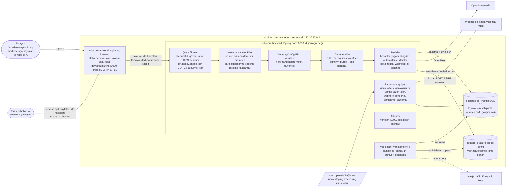
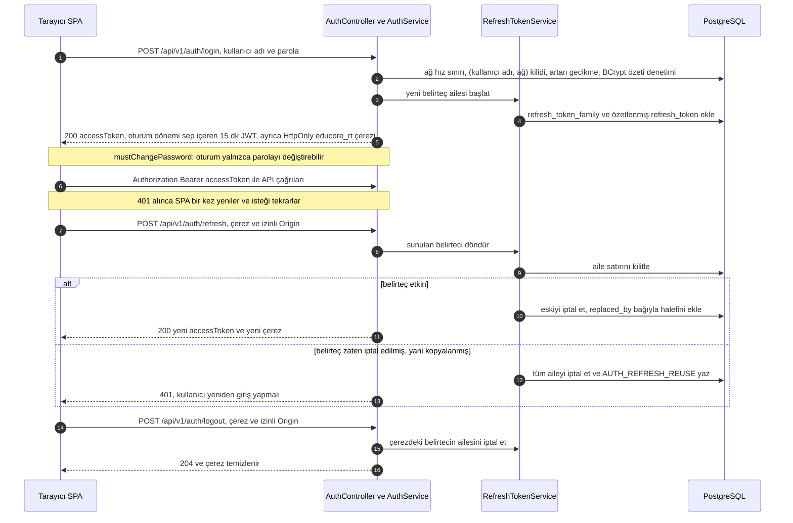
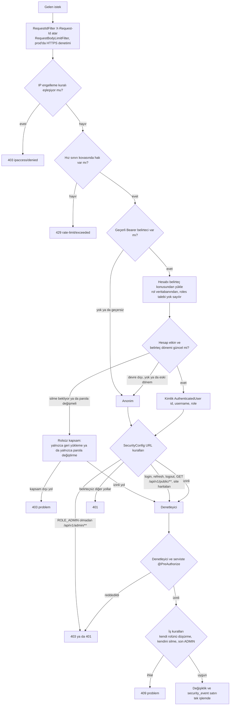
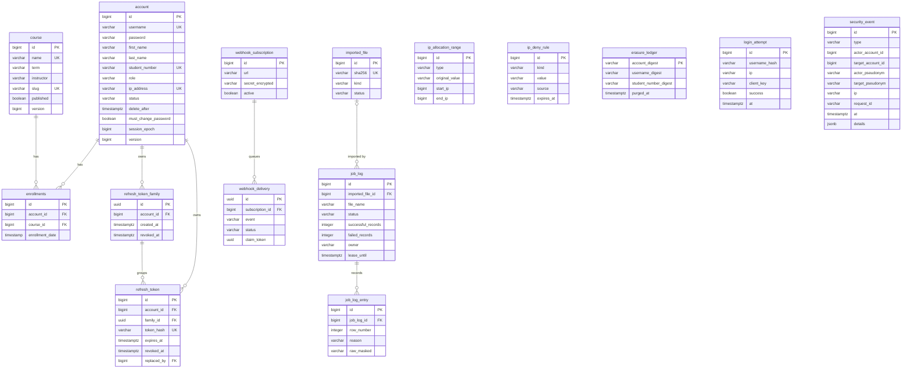
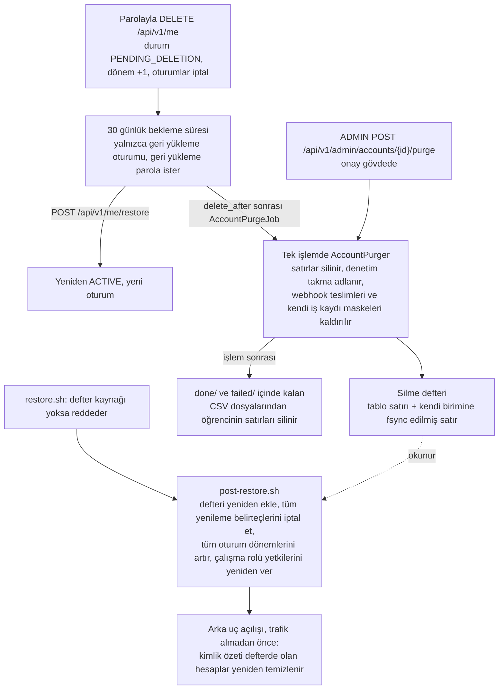

# EduCore

[English](./README.md) | **Türkçe**

EduCore, tek bir kurum için geliştirilmiş bir ders ve öğrenci yönetim sistemidir: **Spring Boot 3.5** API'si, **React Router 7** arayüzü ve **PostgreSQL**. Hesapları, dersleri ve ders kayıtlarını tutar; öğrenci ve dersleri satır düzeyinde raporlu CSV dosyalarından içe aktarır, imzalı webhook'lar gönderir, önceden oluşturulmuş (prerender) herkese açık bir ders kataloğu yayımlar ve hesabın oluşturulmasından silinmesine kadar tüm yaşam döngüsünü yönetir; silinmiş bir kişiyi hiçbir zaman geri getirmeyen yedekler de buna dahildir.

> **Proje durumu:** 1.0.0 sürümü (2026-10-02, [CHANGELOG](CHANGELOG.md)). P0–P10 güçlendirme programı tamamlandı. Sürüm bir tehdit modeli, statik bir denetim ve saldırı testleriyle değerlendirildi; bulgular, düzeltmeleri ve kalan riskler [Güvenlik durumu](#güvenlik-durumu) bölümündedir. EduCore'u yerel makine dışında bir yerde çalıştırmadan önce bu bölümü okuyun.

## Ekran görüntüleri

| | |
| --- | --- |
| <br>Giriş | <br>Panel |
| <br>Öğrenciler | <br>Dersler |
| <br>İş kayıtları | |

## Özellikler

Aşağıdaki her madde bu depodaki koda dayanır.

- **Oturum kimlik doğrulaması** (`auth`): kullanıcı adı ve parolayla giriş, 15 dakikalık bir JWT erişim belirteci döndürür ve 14 günlük, dönüşümlü bir yenileme belirtecini `HttpOnly`, `Secure`, `SameSite=Strict` çereze yazar. Yenileme belirtecinin yeniden kullanılması tüm belirteç ailesini iptal eder; hesap başına bir oturum dönemi (session epoch), yaşam döngüsü değişikliklerinde tüm belirteçleri anında geçersiz kılar. Girişler istemci ağı başına sınırlanır. Kilit yalnızca sürekli hata yapan (kullanıcı adı, ağ) çiftine uygulanır; dağıtık tahmin denemeleri artan bir gecikmeyle yavaşlatılır. Geçici parolalar ve ilk yönetici parolası, yalnızca parola değiştirebilen bir oturum verir. Ayrıntılar: [Kimlik doğrulama](#kimlik-doğrulama).
- **Rol tabanlı erişim denetimi** (`security`): `ADMIN` ve `USER` rolleri, makine tarafından okunabilir bir [RBAC matrisine](docs/security/RBAC_MATRIX.md) göre URL kuralları ve metot güvenliğiyle uygulanır. Yöneticinin kendi rolünü düşürmesi, kendi hesabını silmesi ve son etkin yöneticinin kaldırılması engellenir; hesaplarda iyimser kilitleme vardır. Ayrıntılar: [Yetkilendirme](#yetkilendirme).
- **Denetim kaydı** (`security.audit`): kimlik doğrulama olayları ve yöneticilerin yaptığı her değişiklik, değişiklikle aynı işlemde `security_event` tablosuna yazılır; yöneticiler bunları `GET /api/v1/admin/security-events` üzerinden sayfa sayfa görür.
- **Öğrenci ve hesap yönetimi** (`account`): sayfalı, aranabilir ve sıralanabilir yönetici listeleri; tek seferlik 24 karakterli geçici parolayla öğrenci oluşturma, güncelleme, rol değiştirme, yumuşak silme, geri yükleme, anında kalıcı silme (purge) ve giriş kilidini kaldırma. Kullanıcı adı, öğrenci numarası ve atanmış IP adresi benzersizdir.
- **Dersler ve ders kayıtları** (`course`, `enrollment`): oturum açmış her kullanıcı için üye kataloğu; yayın durumu ve kalıcı slug'larıyla ders yönetimi; `/api/v1/me/enrollments` altında kullanıcının kendi ders kaydı ve yöneticinin herhangi bir hesap adına kayıt işlemleri.
- **CSV içe aktarma** (`ingestion`): `inbox/` klasörüne bırakılan ya da ADMIN tarafından yüklenen dosyalar özel bir anlık kopyaya (snapshot) alınır, doğrulanır, SHA-256 ile idempotent hâle getirilir ve satır düzeyinde (maskelenmiş) atlama raporlarıyla çok iş parçacıklı Spring Batch işleriyle içe aktarılır. Çalıştırmalar kiralanır (lease) ve çitlenir (fencing); işlenen dosyalar varsayılan olarak silinir. Ayrıntılar: [CSV içe aktarma](#csv-içe-aktarma).
- **İmzalı webhook'lar** (`webhook`): içe aktarma, ders ve hesap olayları için HMAC-SHA256 imzalı HTTPS çağrıları; yeniden deneme, çitlenmiş teslim alma, sınırlı kuyruk ve SSRF koruması. Ayrıntılar: [Webhook'lar](#webhooklar).
- **IP engelleme kuralları ve IP atamaları** (`ipaccess`): istek düzeyinde IPv4 engelleme kuralları (MANUAL kurallar her isteği reddeder; art arda başarısız girişlerden sonra oluşan AUTO kurallar yalnızca girişi reddeder). Bunlar, bir ADMIN'in hesaplara atayabileceği adresleri sınırlayan öğrenci IP atama aralıklarından (`STATIC`, `RANGE`, `CIDR`) ayrıdır.
- **Hız sınırlama** (`ratelimit`): oturum açmış hesap başına dakikada 300, anonim istemci başına dakikada 60, herkese açık API'de dakikada 120 istek; istemci ağı başına dakikada 10 giriş denemesi; veri dışa aktarma ve webhook test olayları için adlandırılmış sınırlar. Kovalar, eski anahtarları atmak yerine yeni anahtarları kabul eden sınırlı bir bellek içi depoda tutulur.
- **Hesap yaşam döngüsü ve veri dışa aktarma** (`lifecycle`): `ACTIVE`, `DEACTIVATED`, `PENDING_DELETION` ve `DELETED` durumları. Kullanıcının kendi silme isteği, yalnızca geri yükleme yapılabilen bir oturumla 30 günlük bir bekleme süresi başlatır. Ardından gece çalışan temizleme işi hesabı siler, denetim kaydında takma adla (pseudonym) değiştirir ve silme defterine (erasure ledger) yazar. Kullanıcılar kendi verilerini `GET /api/v1/me/export` ile JSON olarak indirir. Denetim ve giriş kayıtlarının saklama süresi sınırlıdır.
- **SEO ve GEO uyumlu herkese açık site** (`publicapi`, `frontend/app/public-site`): yayımlanmış dersler için ETag'li anonim katalog API'si, site haritaları ve API'de `X-Robots-Tag`; canonical, hreflang, Open Graph ve JSON-LD üst verili, önceden oluşturulmuş Türkçe ve İngilizce sayfalar, `robots.txt`, `llms.txt` ve `llms-full.txt`; Lighthouse bütçeleriyle denetlenir ([docs/seo](docs/seo/BUILD.md)).
- **Silme defterli yedekleme ve geri yükleme** (`infra/backup`, `scripts/backup`): yan konteyner her gün `pg_dump` alır (14 günlük ve 8 haftalık kopya, isteğe bağlı S3 yüklemesi). Geri yükleme, arka uç trafik almadan önce silme defterini yeniden uygular, tüm oturumları iptal eder ve silinmiş hesapları yeniden temizler. Ayrıntılar: [Operasyon](#operasyon).
- **Uç katman ve taşıma** (`frontend/nginx.conf`, `infra/nginx`): dışarı açılan tek servis nginx'tir ve `/api/` yolunu aynı kökende vekil olarak iletir. Üretimde, sertifikaları bir ana makine klasöründen ya da certbot yan konteynerinden alarak TLS 1.2/1.3, HSTS ve katı bir CSP ile sonlandırır.
- **Tedarik zinciri kapıları** (`.github`): özetle (digest) sabitlenmiş imajlar ve SHA ile sabitlenmiş action'lar, Trivy bağımlılık ve imaj taramaları, `npm audit`, CycloneDX SBOM'ları, gitleaks, Dependabot, JaCoCo kapsam kapısı, saldırgan kipi test paketi ve gece çalışan OWASP ZAP temel taraması.
- **Hava durumu bileşeni** (`weather`): `GET /api/v1/weather`, İstanbul, Ankara ve İzmir için güncel hava durumunu OpenFeign istemcisiyle Open-Meteo'dan alır; 5 dakikalık önbellek ve hesap başına sınır vardır; oturum açmış kullanıcı gerektirir.
- **Yapılandırma ve göçler** (`config`): `dev`, `test` ve `prod` profilleriyle ortam değişkeni öncelikli yapılandırma; zorunlu bir değişken eksik ya da güvensizse `prod` başlamayı reddeder (`ProdStartupGuard`, `DevSeedAccountGuard`). Şemayı Flyway yönetir (`V1`–`V42`) ve sahip rolüyle göç ettirir; uygulama en az yetkili bir çalışma rolü kullanır.
- **Sağlık ve metrikler**: Prometheus kayıt defteriyle Spring Boot Actuator, hiçbir zaman dışarı açılmayan 9090 yönetim portunda çalışır.
- **Arayüz** (`frontend/app`): TypeScript ile React Router 7 framework kipi. Yönetici ekranları öğrencileri, kullanıcıları, dersleri, ders kayıtlarını, içe aktarmaları, iş kayıtlarını, güvenlik olaylarını, IP engelleme kurallarını, IP atamalarını ve webhook'ları kapsar. Kullanıcılar profillerini, ders kayıtlarını, parola değiştirmeyi, veri dışa aktarmayı ve hesap silmeyi kullanır. Erişim belirteçleri yalnızca bellekte tutulur. Açık ve koyu tema [marka kimliğini](docs/brand/BRAND_IDENTITY.md) izler.

## Teknoloji yığını

| Katman | Teknoloji | Sürüm (kaynak) |
|---|---|---|
| Dil | Java | 21 (`pom.xml`, `Dockerfile`) |
| Arka uç çatısı | Spring Boot: Web, Data JPA, Security, Validation, Batch, Integration (`spring-integration-file`, `spring-integration-jdbc`), Actuator | 3.5.16 (`pom.xml` parent) |
| Kalıcılık | Hibernate ORM, Spring Batch | 6.6.53, 5.2.6 (Spring Boot BOM) |
| Cloud | Spring Cloud OpenFeign | 2025.0.3 BOM (OpenFeign 4.3.3) |
| Belirteçler | jjwt (`jjwt-api`, `jjwt-impl`, `jjwt-jackson`) | 0.12.7 |
| Hız sınırlama | Bucket4j (`bucket4j_jdk17-core`) ve Caffeine | 8.20.0; Caffeine Spring Boot BOM'dan |
| Webhook taşıma | Apache HttpClient 5 / HttpCore 5 | 5.6.4 / 5.4.3 (`pom.xml` geçersiz kılmaları) |
| API belgesi | springdoc-openapi (Swagger UI yalnızca `dev`) | 2.8.17 |
| Güvenlik geçersiz kılmaları | Tomcat, Jackson BOM, PostgreSQL JDBC, Bouncy Castle | 10.1.60, 2.21.7, 42.7.12, 1.85 (`pom.xml` özellikleri) |
| Metrikler | Micrometer Prometheus kayıt defteri | Spring Boot BOM |
| Kalıp kod | Lombok | 1.18.40 |
| Veritabanı | PostgreSQL | `postgres:15`, özetle (digest) sabitlenmiş |
| Göçler | Flyway Core + `flyway-database-postgresql` | 11.7.2 (Spring Boot BOM) |
| Testler | JUnit 5, Testcontainers (PostgreSQL), Spring Batch Test, Spring Security Test, ArchUnit | Testcontainers 1.21.4 (Spring Boot BOM), ArchUnit 1.4.1 |
| Kapsam ve SBOM | JaCoCo Maven eklentisi, CycloneDX Maven eklentisi | 0.8.15, 2.9.3 |
| Derleme | Maven Wrapper | Maven 3.9.16 (`.mvn/wrapper/maven-wrapper.properties`) |
| Ön yüz | React, React DOM; React Router (framework kipi, `@react-router/dev` ve `@react-router/node`) | ^19.2.7; ^7.18.4 |
| Ön yüz veri ve formlar | `@tanstack/react-query` ^5.104.0, axios ^1.20.0, react-hook-form ^7.89.0, zod ^4.6.5 | `frontend/package.json` |
| Arayüz yardımcıları | lucide-react ^1.23.0, `@fontsource/ibm-plex-sans` ve `@fontsource/ibm-plex-mono` ^5.0.0 | `frontend/package.json` |
| Ön yüz derleme ve test | TypeScript ~5.9.3, Vite ^8.1.1, ESLint ^10.6.0, Vitest ^5.0.3, Testing Library, MSW ^3.0.1, Lighthouse CI ^0.15.1 | `frontend/package.json` (Node 22 ya da üstü) |
| Konteynerler | Derleme `maven:3.9-eclipse-temurin-21`, çalışma `eclipse-temurin:21-jre-alpine` (uid 10001); derleme `node:22-alpine`, çalışma `nginxinc/nginx-unprivileged:1.30-alpine`; hepsi özetle sabitlenmiş | `Dockerfile`, `frontend/Dockerfile` |
| Uç katman ve operasyon | nginx (TLS uç katmanı), certbot v5.8.0, `pg_dump`, supercronic ve rclone içeren yedekleme yan konteyneri | `docker-compose.prod.yml`, `infra/` |

## Mimari

### Bileşenler



Tarayıcı tek bir kökenle konuşur. nginx herkese açık sayfaları ve SPA'yı sunar; `/api/` yolunu (üretimde site haritalarını da) arka uca vekil olarak iletir, bu yüzden CORS gerekmez. SPA, API yollarını varsayılanı `/api` olan `VITE_API_BASE_URL` üzerinden çözer (`frontend/app/lib/api.ts`). Port açan tek servis nginx'tir: geliştirmede 3000, üretimde 80/443. PostgreSQL, arka uç ve yönetim portu compose ağının içinde kalır. Arka uç `X-Forwarded-For` başlığına yalnızca nginx'in sabit adresinden (`172.30.42.10`) güvenir. Veri modeli, filtre sırası, içe aktarma hattı ve dağıtımla birlikte ayrıntılı açıklama [docs/ARCHITECTURE.md](docs/ARCHITECTURE.md) içindedir.

### Kimlik doğrulama akışı



### İstek yetkilendirme yolu



### Ana tablolar



Diyagramda gösterilmeyenler: `catalog_revision`, `upload_staging`, `restore_replay`, Spring Batch meta veri tabloları (`V2`) ve `INT_METADATA_STORE` (`V30`). Modelin tamamı [docs/ARCHITECTURE.md](docs/ARCHITECTURE.md#3-data-model) içindedir.

### Silme ve geri yükleme



### Kaynak düzeni

`src/main/java/com/educore` altındaki arka uç kodu özelliğe göre düzenlenmiştir; ortak paketler bunların yanındadır:

| Paket ya da yol | İçerik |
|---|---|
| `account` | Yönetici hesap/öğrenci denetleyicisi ve servisi, kendi profil denetleyicisi (`/api/v1/me`), istek ve yanıt kayıtları |
| `auth` | `AuthController`, `AuthService`, parola politikası, giriş sınırlayıcı, kilit ve artan gecikme (`LoginAttemptService`), yenileme belirteçleri ve aileleri, yenileme çerezi |
| `lifecycle` | Silme bekleme süresi ve geri yükleme, `AccountPurger`, `AccountPurgeJob`, `Pseudonyms`, `RetentionJob`, `DataExportService`, `ErasureLedger` ve `ErasureLedgerReplay` |
| `course`, `enrollment` | Ders kataloğu ve yönetici denetleyicileri, katalog revizyonu, ders kaydı denetleyicisi ve servisi |
| `publicapi` | Anonim katalog API'si (`PublicCatalogService`), site bilgileri, `SitemapController`, `RobotsTagFilter` |
| `ipaccess` | IP engelleme kuralları (`IpAccessControlFilter`, `IpDenyRuleCache`, `IpAutoDenyService`), öğrenci IP atama aralıkları, `ClientAddress` anahtarları |
| `ratelimit` | `RateLimitFilter`, `CaffeineRateLimitStore`, `NamedRateLimits` |
| `ingestion`, `ingestion.batch` | Gelen kutusu yoklayıcısı (`IngestionFlowConfig`), `IngestionService`, ön doğrulama, klasör protokolü, kiralar ve `IngestionFence`, yükleme hazırlığı, `IngestionRetention`, Spring Batch işleri (`ImportJobConfig`), iş kayıtları ve satırları |
| `webhook` | Abonelikler, şifreli gizli anahtarlar (`SecretCipher`), `WebhookDispatcher`, imzalama, SSRF koruması (`WebhookAddressPolicy`, `GuardedDnsResolver`) |
| `weather` | `WeatherController`, `WeatherService` (5 dakikalık önbellek, yedek yanıt), OpenFeign `WeatherClient` |
| `security` | `SecurityConfig`, `JwtService`, `JwtAuthenticationFilter`, `PasswordChangeRequiredScopeFilter`, `PendingDeletionScopeFilter`, `ClientIpResolver`, `OriginVerifier`, `RequestIdFilter`, güvenlik başlıkları |
| `security.audit` | `AuditService`, `SecurityEvent`, `SecurityEventType`, güvenlik olayı yönetici denetleyicisi |
| `common` | Problem Details (`common.web`), girdi kalıpları, günlük maskeleme (`common.logging`), LIKE kaçışı, CSV ve çıktı kodlama |
| `config` | `EduCoreProperties`, `ProdStartupGuard`, `DevSeedAccountGuard`, `MigrationRoleFlywayConfig`, `ForwardedHeadersConfig`, `AdminBootstrap` |
| `entity`, `repository`, `service` | Ortak JPA varlıkları, depolar ve `AccountCredentialService` |
| `src/main/resources` | `application.yml`, `application-{dev,test,prod}.yml`, `db/migration` (Flyway `V1`–`V42`), `db/seed/dev` (demo verisi), `security/common-passwords.txt` |
| `frontend/app` | React Router 7 uygulaması: `routes/`, `features/` (her ekran grubu için bir klasör), `components/`, `lib/api.ts` (yenilemeyi yöneten tek API istemcisi), `public-site/`, `seo/`, `styles/` |
| `frontend/scripts`, `frontend/tests` | Prerender sonrası işlemler, SEO dosyası üretimi ve denetimleri; Vitest testleri |
| `infra/` | Üretim nginx'i (`infra/nginx`), PostgreSQL rol betikleri (`infra/postgres`), yedekleme yan konteyneri (`infra/backup`), bütçe uyarıları (`infra/cloud`), Prometheus uyarı örnekleri (`infra/monitoring`) |
| `scripts/` | `backup/` (geri yükleme, geri yükleme sonrası, doğrulama, tatbikat), `preflight.sh`, `check-env-docs.sh`, `scan-secrets.sh`, `zap-local.sh` |
| `csv_uploads/` | İçe aktarma klasörleri (`inbox/`, `staging/`, `processing/`, `done/`, `failed/`); `csv_uploads/sample/` örnek dosyaları içerir |

## Kimlik doğrulama

`AuthController` oturum uç noktalarını sağlar:

| Metot ve yol | Amaç |
|---|---|
| `POST /api/v1/auth/login` | Kullanıcı adı ve parolayla giriş; `{accessToken, expiresIn, user}` döndürür ve yenileme çerezini ayarlar. |
| `POST /api/v1/auth/refresh` | Çerezdeki yenileme belirtecini döndürür ve yeni bir erişim belirteci verir. |
| `POST /api/v1/auth/logout` | Yenileme belirteci ailesini iptal eder ve çerezi temizler. |
| `GET /api/v1/auth/me` | Oturum açmış kullanıcıyı döndürür. |
| `POST /api/v1/auth/password` | Oturum açmış kullanıcının parolasını değiştirir, tüm yenileme oturumlarını iptal eder ve yeni bir oturum başlatır. |

- **Erişim belirteci:** 15 dakika geçerli, `educore` yayımcılı ve `educore-api` hedef kitleli HS256 JWT; konusu hesap kimliğidir, `kid` başlığı imzalama anahtarını belirtir ve `sep` talebi hesabın oturum dönemini taşır. İmzalama anahtarı `EDUCORE_JWT_SECRET` değişkeninden gelir (base64, çözüldüğünde en az 32 bayt; aksi hâlde uygulama başlamaz). `EDUCORE_JWT_SECRET_PREVIOUS`, [anahtar değişimi](docs/security/KEY_ROTATION.md) sırasında eski belirteçleri geçerli tutar. Hesap, rolü ve dönemi her istekte veritabanından okunur; `roles` talebi yok sayılır.
- **Oturum dönemi:** silme isteği, ADMIN'in yumuşak silmesi ve her iki geri yükleme yolu `account.session_epoch` değerini artırır ve tüm yenileme ailelerini iptal eder; böylece hesabın önceki tüm belirteçleri anında geçersiz olur. Çıkış ve parola değiştirme yenileme ailelerini iptal eder; bunlardan önce verilmiş erişim belirteçleri belgelenmiş olarak en fazla 15 dakika daha geçerli kalır ([BACKLOG](docs/BACKLOG.md) B-084).
- **Yenileme belirteci:** veritabanında `refresh_token` tablosunda yalnızca SHA-256 özeti tutulan opak, rastgele bir değerdir; `educore_rt` çereziyle gönderilir (`HttpOnly`, `SameSite=Strict`, `Path=/api/v1/auth`, 14 gün). `Secure` bayrağı `dev` dışındaki tüm profillerde açıktır. Yenileme ve çıkış ayrıca izinli bir `Origin` ister (`OriginVerifier`).
- **Döndürme ve yeniden kullanım tespiti:** her yenileme sunulan belirteci iptal eder ve aynı ailede halefini üretir. Zaten iptal edilmiş bir belirteç sunulursa tüm aile iptal edilir ve `AUTH_REFRESH_REUSE` kaydedilir.
- **Sınırlama ve kilit:** istemci anahtarı başına dakikada 10 giriş denemesi yapılabilir (`Retry-After` ile HTTP 429). İstemci anahtarı IPv4 adresi, IPv6'da ise /64 ağıdır. 15 dakika içinde 5 hatalı parola yalnızca o (kullanıcı adı, istemci anahtarı) çiftini 15 dakika kilitler (HTTP 423). Bir kullanıcı adı herhangi bir ağdan beşten fazla hata aldığında, 1 sn'den başlayıp 30 sn'ye kadar ikiye katlanan bir gecikme 429 `auth/too-many-attempts` döndürür. Son 30 günde o hesaba başarıyla giriş yapılmış ağlar muaftır. Bir ADMIN, `POST /api/v1/admin/accounts/{id}/unlock-login` ile hesabın başarısız denemelerini temizler; acil durum yordamı [RUNBOOK_ADMIN_RECOVERY.md](docs/ops/RUNBOOK_ADMIN_RECOVERY.md) içindedir. `login_attempt` tablosunda kullanıcı adları `EDUCORE_LOGIN_PEPPER` ile HMAC-SHA-256 olarak saklanır. `X-Forwarded-For` yalnızca `educore.ipaccess.trusted-proxies` içinde listelenen vekillerden gelirse dikkate alınır.
- **Parolalar:** BCrypt (güç 12); eski özetleri girişte yükselten yetki devreden (delegating) bir kodlayıcı kullanılır. Yeni parolalar 12–128 karakter olmalı, UTF-8'de en fazla 72 bayt tutmalı ve yaygın parola listesinde bulunmamalıdır. Yöneticinin oluşturduğu öğrenciler bir kez gösterilen rastgele bir geçici parola alır; CSV'den aktarılan öğrencilerin geçici parolası yalnızca özet olarak saklanır.
- **Zorunlu parola değiştirme:** `mustChangePassword` ile işaretli bir hesap (geçici parolalar ve ilk ADMIN) rolsüz bir oturum alır. `PasswordChangeRequiredScopeFilter` yalnızca `GET /api/v1/auth/me`, `POST /api/v1/auth/password`, `/auth/refresh` ve `/auth/logout` yollarına izin verir; diğer her yol 403 `account/password-change-required` döndürür. Arayüz yalnızca parola değiştirme ekranını gösterir.
- **Olaylar:** `AUTH_LOGIN_SUCCESS`, `AUTH_LOGIN_FAILURE`, `AUTH_LOCKED`, `AUTH_REFRESH_REUSE`, `PASSWORD_CHANGED` ve `ACCOUNT_LOGIN_UNLOCKED` olayları `security_event` tablosuna yazılır.

## Yetkilendirme

Roller `ADMIN` ve `USER`'dır. Doğruluk kaynağı [RBAC matrisidir](docs/security/RBAC_MATRIX.md); `AuthorizationMatrixIT`, `src/test/resources/rbac-matrix.csv` dosyasındaki her hücreyi çalıştırır.

- **Anonim:** `POST /api/v1/auth/login`, `/refresh` ve `/logout`; `/api/v1/public/**`, `/sitemap.xml` ve `/sitemap-courses-{n}.xml` için `GET`/`HEAD`.
- **USER:** `/api/v1/me` altındaki kendi profili, ders kayıtları, veri dışa aktarma, silme isteği ve geri yükleme; üye ders kataloğu, hava durumu ve oturum uç noktaları. Hesap ve öğrenci listeleri yalnızca ADMIN içindir.
- **ADMIN:** `/api/v1/admin/**` altındaki her şey: hesaplar ve öğrenciler, yumuşak silme, geri yükleme, kalıcı silme, giriş kilidini kaldırma, roller, ders kayıtları, dersler, IP engelleme kuralları, IP atamaları, içe aktarmalar, iş kayıtları, webhook'lar ve güvenlik olayları.
- **Kısıtlı oturumlar:** bekleme süresindeki `PENDING_DELETION` bir hesap giriş yapabilir, ancak yalnızca `GET /api/v1/me`, `POST /api/v1/me/restore` ve `POST /api/v1/auth/logout` kullanılabilir. Geri yükleme mevcut parolayı ister ve yeni bir oturum döndürür. `mustChangePassword` işaretli hesap yalnızca parolasını değiştirebilir (bkz. [Kimlik doğrulama](#kimlik-doğrulama)). İki kapsam da rolsüz bir yetki kullanır; böylece sonradan eklenen bir yol varsayılan olarak kapalıdır.

Uygulama katmanları:

1. `SecurityConfig` URL kuralları: `/api/v1/admin/**` için `ROLE_ADMIN` gerekir, herkese açık olmayan diğer tüm yollar kimlik doğrulaması ister.
2. Metot güvenliği: yönetici denetleyicileri ve servisleri `@PreAuthorize("hasRole('ADMIN')")` taşır; ders kaydı servis metotları `#accountId == principal.id or hasRole('ADMIN')` koşulunu denetler. Kimlik, türlendirilmiş `AuthenticatedUser(id, username, role)` kaydıdır. Rol her istekte veritabanından yeniden okunur; `ACTIVE` olmayan ya da eski oturum dönemi sunan bir hesap anonim sayılır.
3. İş kuralları (409 problemleri): bir ADMIN kendi rolünü değiştiremez, kendi hesabını silemez; son etkin ADMIN'in rolü düşürülemez, silinemez ve kalıcı olarak silinemez. Denetim sırasında etkin ADMIN satırları `SELECT ... FOR UPDATE` ile kilitlenir.
4. Yıkıcı işlemler: anında kalıcı silme, gövdesinde `{"confirm": "<kullanıcı adı>"}` bulunan `POST /api/v1/admin/accounts/{id}/purge` çağrısıdır; böylece kullanıcı adı hiçbir istek satırında ya da vekil günlüğünde görünmez. `DELETE /api/v1/admin/accounts/{id}` yalnızca `mode=soft` kabul eder.
5. DTO sınırı: istek kayıtlarında `id`, `role`, `status`, `password` ya da `mustChangePassword` alanı yoktur (`ChangeRoleRequest.role` dışında); katı JSON bağlama tür dönüştürmeyi reddeder; yanıtlar hiçbir zaman parola özeti ya da varlık grafiği içermez. Kullanıcının kendi işlemleri hesabı kimlikten aldığı için IDOR engellenir.
6. Eşzamanlılık: `account.version` (iyimser kilitleme) eski veriye dayanan yazmaları 409 `request/concurrent-modification` ile reddeder; `PUT /api/v1/me` yalnızca ad sütunlarını yazar.

**Denetim olayları.** Her yönetici değişikliği, değişiklikle aynı işlem içinde bir `security_event` satırı yazar; bunlar arasında `ACCOUNT_CREATED`, `ACCOUNT_UPDATED`, `ACCOUNT_DELETED`, `ACCOUNT_RESTORED`, `ACCOUNT_PURGED`, `ACCOUNT_LOGIN_UNLOCKED`, `ROLE_CHANGED`, `ENROLLMENT_CHANGED`, `COURSE_CHANGED`, `IP_RULE_CHANGED`, `IP_ALLOCATION_CHANGED`, `IMPORT_UPLOADED`, `WEBHOOK_CHANGED` ve `JOB_LOGS_DELETED` vardır. Kullanıcının kendi olayları `ACCOUNT_DELETION_REQUESTED`, `ACCOUNT_RESTORED` ve `DATA_EXPORTED`'dır. Satırlar işlemi yapanı, hedefi, istemci IP'sini ve istek kimliğini taşır; `details` yalnızca kimlikler, enum değerleri ve alan adlarını içerir. Hiçbir şeyi değiştirmeyen istekler olay yazmaz; denetim kaydı yazılamazsa değişiklik geri alınır. Kalıcı silmeden sonra hesaba yalnızca anahtarlı bir takma adla başvurulur.

## API özeti

Sürümlü API beş rota grubuna ayrılır:

- `/api/v1/auth`: giriş, yenileme, çıkış, oturumdaki kullanıcı ve parola değiştirme.
- `/api/v1/me`: kullanıcının kendi profili (`GET`/`PUT`), ders kayıtları (`GET`, `POST`, `DELETE /{courseId}`), silme isteği (mevcut parolayla `DELETE /api/v1/me`), geri yükleme (mevcut parolayla `POST /api/v1/me/restore`) ve veri dışa aktarma (`GET /api/v1/me/export`).
- `/api/v1/courses` ve `/api/v1/weather`: oturum açmış her kullanıcı için üye ders kataloğu ve hava durumu bileşeni.
- `/api/v1/public/...`: yayımlanmış derslerin anonim kataloğu (`courses`, `courses/{slug}`, `site-facts`), ayrıca `/sitemap.xml` ve `/sitemap-courses-{n}.xml`.
- `/api/v1/admin/...`: yalnızca ADMIN için `accounts` (`/{id}/restore`, `/{id}/purge`, `/{id}/unlock-login`, `/{id}/role`, `/{id}/enrollments` dahil), `accounts/students`, `courses`, `ip-rules` (engelleme kuralları), `ip-allocations`, `imports`, `job-logs`, `webhooks` ve `security-events`.

Sayfalı rotalar `{content, page, size, totalElements, totalPages}` döndürür. Aralık dışındaki `page` ve `size` değerleri (`size` için 1–100) 400 ile reddedilir; `sort` anahtarları bir izin listesinden gelir. Her yol ve durumdaki her hata, sabit bir `code` taşıyan ve istisna metni içermeyen bir RFC 9457 `application/problem+json` gövdesidir. Her metot, gövde, durum kodu ve kaldırılan P3 öncesi rotaların karşılıkları [API rota sözleşmesinde](docs/api/ROUTES.md) yer alır; OpenAPI belgesi [docs/api/openapi.yaml](docs/api/openapi.yaml) dosyasıdır (Swagger UI yalnızca `dev` profilinde).

## CSV içe aktarma

`ingestion` paketi (Spring Integration + Spring Batch, P6'dan beri):

- **Klasörler** (`educore.ingestion.base-dir`, varsayılan `csv_uploads`; Compose `./csv_uploads` klasörünü `/app/csv_uploads` olarak bağlar): dosyalar `inbox/` klasörüne bırakılır. Bir dosya hiçbir zaman yerinde içe aktarılmaz: bağlantılar (link) reddedilir ve baytlar (boyut sınırıyla) özel bir anlık kopyaya, `processing/<uuid>_<ad>` dosyasına kopyalanır; yalnızca bu kopya doğrulanır, özetlenir ve içe aktarılır. Tüm klasörler aynı dosya sisteminde olmalıdır (açılışta denetlenir); sonraki her taşıma atomik bir yeniden adlandırmadır. `sample/` okunmaz.
- **Dosyaların saklanması:** SUCCEEDED ya da PARTIAL bir anlık kopya **içe aktarmanın hemen ardından silinir** (`educore.ingestion.retain-processed-days`, varsayılan 0; daha büyük bir değer dosyayı o kadar gün `done/` içinde tutar). FAILED ve reddedilen dosyalar, maskelenmiş satır kayıtlarını içeren `<ad>.report.json` dosyasıyla birlikte en fazla `educore.ingestion.retain-failed-days` (7) gün `failed/` içinde kalır; ardından saatlik `IngestionRetention` onları siler. Bir hesap kalıcı olarak silindiğinde öğrencinin satırları hâlâ saklanan dosyalardan çıkarılır. Veritabanında özet, sayılar ve maskelenmiş satır kayıtları kalır.
- **Alma:** her `educore.ingestion.poll-interval` (5 sn) adımında, en az `educore.ingestion.stable-after` (2 sn) süredir değişmeyen `*.csv` dosyaları. Görülen dosyalar veritabanında (`INT_METADATA_STORE`) tutulur; yeniden başlatma onları tekrar okumaz. Aynı ad ve aynı değişiklik zamanıyla yeniden bırakılan dosya yok sayılır (adını değiştirin ya da dosyaya dokunun). Büyük dosyaları başka bir adla yazın ve tamamlanınca `inbox/` içine taşıyın.
- **İş başlamadan önce:** en fazla `max-bytes` (20 MB) ve `max-rows` (50 000) veri satırı, katı UTF-8 (BOM serbest), yalnızca metin, LF ya da CR LF satır sonları (tek başına CR reddedilir), satır başına en fazla `max-record-length` (10 000) karakter; başlık tam olarak `FirstName,LastName,StudentNumber` (öğrenci) ya da `name,term,instructor` (ders) olmalıdır ve işi başlık belirler. Dosya adı `[A-Za-z0-9._-]` karakterlerine indirgenir. SHA-256'sı daha önce içe aktarılmış dosya `DUPLICATE` olarak reddedilir (o aktarma FAILED değilse).
- **İşler** (`importStudentJob`, `importCourseJob`): tırnaklı alanları destekleyen katı CSV ayrıştırma, her satırda yönetici API'siyle aynı doğrulama kuralları, dosya içi ve veritabanına karşı tekrar denetimi, `educore.ingestion.threads` (4) iş parçacığıyla parça parça yazma. Hatalı satırlar atlanır ve satır numarası, neden ve maskelenmiş ham satırla kaydedilir; `skip-limit` (1 000) aşılırsa iş FAILED olur. İçe aktarılan öğrencilerin kullanıcı adı öğrenci numarasıdır, rolü `USER`'dır; geçici parolaları yalnızca özet olarak saklanır (`mustChangePassword`).
- **Sonuç:** `SUCCEEDED` (tüm satırlar yazıldı), `PARTIAL` (bazı satırlar atlandı) ya da `FAILED` (dosya reddedildi, iş başarısız oldu ya da hiçbir şey yazılmadı). İş kayıtları ve satırları: `GET /api/v1/admin/job-logs` ve `GET /api/v1/admin/job-logs/{id}/entries`. Her sonuç ayrıca `import.completed` ya da `import.failed` webhook olayı olarak gönderilir.
- **Yükleme:** ADMIN `POST /api/v1/admin/imports` (multipart `file`, en fazla 5 MB) ile CSV yükleyebilir. Dosya aynı denetimlerden geçer, sahibi ve kirasıyla `upload_staging` tablosuna kaydedilir, `staging/` içine alınır ve yalnızca isteğin işlemi tamamlandıktan sonra `inbox/` klasörüne taşınır. Kurtarma yalnızca kirası dolmuş yüklemeleri devralır.
- **Yeniden başlatma güvenliği ve çitleme:** her çalıştırma kendi örneğine (instance) aittir ve kiralıdır (`educore.ingestion.lease`, 2 dk, 30 sn'de bir yenilenir). Açılışta ve her dakika, kirası dolmuş çalıştırmalar `INTERRUPTED` olarak kapatılır ve anlık kopyaları `failed/` klasörüne taşınır; diğer örneklerin canlı çalıştırmalarına dokunulmaz. Her parça yazımı paylaşılan bir danışma kilidi (advisory lock) alır ve çalıştırmanın hâlâ açık, kendisine ait ve kiralı olduğunu denetler (`IngestionFence`); böylece kapatılmış bir çalıştırma artık satır yazamaz. Açılışta `inbox/` içinde kalan dosyalar yeniden alınmaya bırakılır ve işlemi tamamlanmış yüklemeler yayımlanır.

Denemek için bir örnek dosyayı gelen kutusuna kopyalayın:

```bash
cp csv_uploads/sample/courses.sample.csv csv_uploads/inbox/
cp csv_uploads/sample/students.sample.csv csv_uploads/inbox/
```

Öğrenci içe aktarmasının henüz yöneticiye açık bir parola sıfırlama işlevi yoktur ([BACKLOG](docs/BACKLOG.md) B-016); bu yüzden içe aktarılan öğrenciler bu işlev gelene kadar giriş yapamaz.

## Webhook'lar

ADMIN'ler `/api/v1/admin/webhooks` altında `import.completed`, `import.failed`, `course.updated` ve `account.deleted` olayları için https uç noktaları kaydeder (en fazla 20 abonelik). İstekler imzalanır (`X-EduCore-Signature: v1=<timestamp.body üzerinde HMAC-SHA256>`, ayrıca `X-EduCore-Timestamp`, `X-EduCore-Event` ve `X-EduCore-Delivery`) ve üstel geri çekilmeyle en fazla 5 kez yeniden denenir. Yükler kimlik ve sayı taşır, asla kişisel veri taşımaz. İmzalama anahtarı bir kez gösterilir ve `EDUCORE_ENCRYPTION_KEY` ile AES-256-GCM şifreli saklanır. SSRF koruması yalnızca https'e izin verir ve yönlendirmeleri izlemez. Özel, geri döngü (loopback), yerel bağlantı (link-local), üst veri (metadata), NAT64 ve eşlenmiş adresleri hem istekten önce hem bağlantı anında reddeder; iki DNS çözümlemesi de 10 saniyelik istek süresinin içinde çalışır. Ayrıntılar ve doğrulama kodu: [docs/integrations/WEBHOOKS.md](docs/integrations/WEBHOOKS.md).

## Hızlı başlangıç

Gereksinimler: Compose eklentisiyle Docker ve gizli değer üretmek için `openssl`.

1. Şablondan ortam dosyanızı oluşturun:

   ```bash
   cp .env.example .env
   ```

2. Gizli değerleri üretip `.env` dosyasına yazın:

   ```bash
   openssl rand -base64 48   # EDUCORE_JWT_SECRET
   openssl rand -base64 48   # EDUCORE_LOGIN_PEPPER
   openssl rand -base64 32   # EDUCORE_ENCRYPTION_KEY
   openssl rand -base64 24   # EDUCORE_DB_PASSWORD (sahip rolü, Flyway kullanır)
   openssl rand -base64 24   # EDUCORE_DB_APP_PASSWORD (çalışma rolü, arka uç kullanır)
   ```

   Ayrıca `EDUCORE_DB_USERNAME` değerinden farklı bir rol adı olarak `EDUCORE_DB_APP_USERNAME` seçin. Tüm örnek değerleri değiştirin. `.env` Git tarafından yok sayılır ve asla commit edilmemelidir.

3. Yığını derleyip başlatın:

   ```bash
   docker compose up --build
   ```

   `EDUCORE_DB_USERNAME`, `EDUCORE_DB_PASSWORD`, `EDUCORE_DB_NAME`, `EDUCORE_DB_APP_USERNAME`, `EDUCORE_DB_APP_PASSWORD`, `EDUCORE_JWT_SECRET`, `EDUCORE_LOGIN_PEPPER` ya da `EDUCORE_ENCRYPTION_KEY` eksikse Compose başlamayı reddeder. Boş bir veritabanının ilk açılışında `infra/postgres/init/01-roles.sh` yalnızca DML yetkili çalışma rolünü oluşturur, Flyway da şemayı sahip rolüyle oluşturur. Varsayılan `dev` profilinde sentetik demo verisi dört ders ile `admin` (ADMIN), `ayberk` ve `ali` hesaplarını ekler. `SPRING_PROFILES_ACTIVE=prod` ile demo verisi yüklenmez; ilk ADMIN `EDUCORE_BOOTSTRAP_ADMIN_USERNAME` ve `EDUCORE_BOOTSTRAP_ADMIN_PASSWORD` değerlerinden oluşturulur ve demo hesaplarını hâlâ içeren bir veritabanı reddedilir.

4. Uygulamayı açın. Her şey 3000 portundaki nginx uç katmanından geçer:

   | Servis | Adres |
   |---|---|
   | Herkese açık site | http://localhost:3000 |
   | Uygulama (SPA) | http://localhost:3000/app |
   | API | http://localhost:3000/api/v1 (aynı köken, nginx vekili) |
   | Arka uç portu 8080, PostgreSQL 5432 | dışarı açık değil; yalnızca `educore-network` içinde |
   | Actuator | yalnızca arka uç konteyneri içinde `9090` portu |

   Ana makineden sağlık durumunu denetlemek için:

   ```bash
   docker compose exec educore-backend wget -q -O - http://127.0.0.1:9090/actuator/health
   ```

   Veritabanı araçları ya da IDE'den başlatılan bir arka uç için geliştirme dosyası PostgreSQL'i ve arka ucu yalnızca geri döngü arayüzünde açar (`127.0.0.1:5432` ve `127.0.0.1:8081`). Bunu asla paylaşılan ya da internete açık bir ana makinede kullanmayın:

   ```bash
   docker compose -f docker-compose.yml -f docker-compose.dev.yml up -d
   ```

5. Üretim, 80 ve 443 portlarındaki TLS uç katmanını, `prod` profilini ve yedekleme yan konteynerini kullanır:

   ```bash
   docker compose -f docker-compose.yml -f infra/backup/docker-compose.backup.yml -f docker-compose.prod.yml up -d
   ```

   Let's Encrypt sertifikaları için `--profile certbot` ekleyin. Önce [docs/ops/TLS.md](docs/ops/TLS.md) belgesini okuyun: herkese açık sayfalar çalışan API'den önceden oluşturulduğu için ilk kurulum bir ön adım gerektirir. `scripts/preflight.sh`, başlatmadan önce üretim `.env` dosyasını denetler.

## Yerel geliştirme

Vite geliştirme sunucusu 3000 portunda çalışır (`dev` profilinin CORS ve yenileme/çıkış `Origin` denetimi için izin verdiği köken) ve `/api` yolunu arka uca iletir; böylece tarayıcı tek bir kökenle konuşur.

1. Geliştirme dosyasının `127.0.0.1:5432` üzerinde açtığı veritabanını tek başına başlatın:

   ```bash
   docker compose -f docker-compose.yml -f docker-compose.dev.yml up -d postgres-db
   ```

2. Arka uç değişkenlerini kabuğunuzda tanımlayın (arka uç `.env` dosyasını değil, süreç ortamını okur):

   ```bash
   export SPRING_PROFILES_ACTIVE=dev
   export EDUCORE_DB_URL=jdbc:postgresql://localhost:5432/educore_db
   export EDUCORE_DB_APP_USERNAME='.env dosyanızdaki çalışma rolü'
   export EDUCORE_DB_APP_PASSWORD='.env dosyanızdaki değer'
   export EDUCORE_DB_MIGRATION_USERNAME='.env dosyanızdaki sahip rolü (EDUCORE_DB_USERNAME)'
   export EDUCORE_DB_MIGRATION_PASSWORD='.env dosyanızdaki değer (EDUCORE_DB_PASSWORD)'
   export EDUCORE_JWT_SECRET='.env dosyanızdaki değer'
   ```

   Tek bir yerel veritabanı kullanıcısıyla, bu dört rol değişkeni yerine `EDUCORE_DB_USERNAME` ve `EDUCORE_DB_PASSWORD` tanımlayın: bağlantı havuzu bunlara geri düşer ve Flyway havuzun rolünü kullanır (iki farklı rolü yalnızca `prod` zorunlu tutar). `EDUCORE_LOGIN_PEPPER`, `EDUCORE_ENCRYPTION_KEY` ve `EDUCORE_ERASURE_LEDGER_FILE` `dev` profilinde isteğe bağlıdır. İlk ikisi verilmezse süreç başına rastgele bir değer kullanılır: kilit sayaçları sıfırlanır ve kayıtlı webhook anahtarları yeniden başlatmada okunamaz. Üçüncüsü verilmezse defter dosyası yazılmaz.

3. Arka ucu çalıştırın (Java 21). 8080 portunda, Actuator ise 9090 portunda dinler:

   ```bash
   ./mvnw spring-boot:run
   ```

   Windows'ta `mvnw.cmd spring-boot:run` kullanın. Actuator bu durumda `http://localhost:9090/actuator/health` adresindedir.

4. Ön yüzü çalıştırın (Node 22 ya da üstü):

   ```bash
   cd frontend
   npm ci
   npm run dev
   ```

   `vite.config.ts`, `/api` yolunu `EDUCORE_DEV_PROXY_TARGET` adresine iletir (varsayılan `http://localhost:8080`; `docker-compose.dev.yml` ile açılan compose arka ucu için `http://localhost:8081` kullanın). Ön yüz komutları, derleme çıktısı ve prerender adımları [frontend/README.md](frontend/README.md) içinde anlatılır.

## Yapılandırma

- **Profiller:** ortak ayarlar `application.yml` içindedir; `application-dev.yml`, `application-test.yml` ve `application-prod.yml` bunları geçersiz kılar. `SPRING_PROFILES_ACTIVE` verilmezse `dev` profili kullanılır.
  - `dev`: demo verisi yüklenir, yenileme çerezi `Secure` olmadan gönderilir, CORS varsayılanı `http://localhost:3000`, Swagger UI açıktır.
  - `test`: yalnızca otomatik testler için; PostgreSQL'i Testcontainers sağlar ve her uygulama bağlamı sistem geçici dizininde yeni bir içe aktarma klasörü kullanır; CSV yoklayıcısı ve webhook gönderici yalnızca kendi testlerinde açıktır.
  - `prod`: demo verisi yok, hiçbir gizli değerin varsayılanı yok, CORS listesi boş (uç katman arkasında aynı köken), HTTPS zorunlu (düz HTTP 403 `request/https-required` alır), ECS JSON günlükleri. `ProdStartupGuard`, herhangi bir bean oluşturulmadan önce eksik her değişkeni adıyla bildirir: veritabanı adresi, çalışma ve göç rolleri (birbirinden farklı olmalı), JWT anahtarı, giriş biberi (pepper), şifreleme anahtarı, silme defteri dosyası, iki ilk yönetici değişkeni ve localhost olmayan bir https kökeni olması gereken `EDUCORE_SEO_BASE_URL`. `DevSeedAccountGuard`, dev demo hesaplarını hâlâ içeren bir veritabanını reddeder (çözüm [UPGRADE.md](docs/ops/UPGRADE.md) içinde).
- **Veritabanı rolleri:** sahip rolü (`EDUCORE_DB_USERNAME`, compose imajındaki PostgreSQL süper kullanıcısı) yalnızca Flyway (`EDUCORE_DB_MIGRATION_*`, `MigrationRoleFlywayConfig`) ve yedekleme yan konteyneri tarafından kullanılır. Arka ucun bağlantı havuzu, yalnızca DML ve sıra (sequence) yetkileri olan `EDUCORE_DB_APP_USERNAME` çalışma rolünü kullanır: DDL yok, eklenti yok, `COPY ... PROGRAM` yok (`infra/postgres/app-role.sql`, `DatabaseRolesIT` ile doğrulanır). Var olan bir veritabanına rol bir kez elle eklenir ([UPGRADE.md](docs/ops/UPGRADE.md)).
- **Göçler:** Flyway açılışta çalışır; Flyway öncesinde oluşturulmuş veritabanları için `baseline-on-migrate` açıktır; `ddl-auto` değeri `validate`'tir. P5 öncesinde göç ettirilmiş veritabanları, V12, V13, V21–V23, V33 ve V34 için bir kez `SPRING_FLYWAY_OUT_OF_ORDER=true` ile başlatılmalıdır ([UPGRADE.md](docs/ops/UPGRADE.md)).
- **Yönetim portu:** Actuator `management.server.port=9090` üzerinde dinler ve `health`, `info`, `metrics` ile `prometheus` uç noktalarını açar. `/actuator/health` herkese açıktır; diğerleri ADMIN bearer belirteci ister. `docker-compose.yml` bu portu dışarı açmaz.
- **Hata çıktısı:** hata yanıtlarına mesaj, yığın izi ve bağlama hataları hiçbir zaman eklenmez.
- **Diğer ayarlar:** `educore.*` özelliklerinin varsayılanları (içe aktarma klasörü, güvenilen vekiller, belirteç ömürleri, giriş sınırları) `EduCoreProperties` ve `application.yml` içindedir.

## Ortam değişkenleri

Bu tablo `.env.example` içindeki her anahtarı (41 anahtar) aynı sırayla listeler. `scripts/check-env-docs.sh` şunları denetler: Compose ya da Spring'in okuduğu her değişken `.env.example` içinde olmalı, oradaki her anahtar bir yerde okunmalı ve bir açıklaması olmalıdır; betik bu README'de eksik kalan anahtarları da bildirir.

| Değişken | Zorunlu | Açıklama |
|---|---|---|
| `SPRING_PROFILES_ACTIVE` | Hayır (varsayılan `dev`) | `dev` sentetik demo verisini yükler; `prod` veri yüklemez ve eksik her değişkeni adıyla bildirerek başlamaz; `test` yalnızca otomatik testler içindir. |
| `EDUCORE_DB_URL` | Yerel çalıştırma; `prod` | Arka uç Docker dışında çalışırken JDBC adresi, ör. `jdbc:postgresql://localhost:5432/educore_db`. Compose içinde `EDUCORE_DB_NAME` ve `postgres-db` ana makinesinden türetilir. |
| `EDUCORE_DB_NAME` | Evet (Compose) | PostgreSQL konteynerinin oluşturduğu ve arka uç konteynerinin kullandığı veritabanı. |
| `EDUCORE_DB_USERNAME` | Evet (Compose) | PostgreSQL konteynerinin süper kullanıcısı olarak oluşturulan veritabanı sahibi. Flyway onunla göç ettirir, yedekleme yan konteyneri onunla döküm alır; Compose içinde arka ucun havuzu onu hiç kullanmaz. |
| `EDUCORE_DB_PASSWORD` | Evet (Compose) | `EDUCORE_DB_USERNAME` parolası; uzun ve rastgele bir değer, ör. `openssl rand -base64 24`. |
| `EDUCORE_DB_APP_USERNAME` | Evet (Compose, `prod`) | Arka ucun en az yetkili çalışma rolü (yalnızca DML). Boş bir veritabanının ilk açılışında `infra/postgres/init/01-roles.sh` tarafından oluşturulur; `EDUCORE_DB_USERNAME` değerinden farklı olmalıdır. |
| `EDUCORE_DB_APP_PASSWORD` | Evet (Compose, `prod`) | `EDUCORE_DB_APP_USERNAME` parolası; farklı, uzun ve rastgele bir değer. |
| `EDUCORE_DB_MIGRATION_USERNAME` | `prod`'da evet | Flyway'in göç ettirdiği rol (sahip). Compose bunu `EDUCORE_DB_USERNAME` değerinden atar; yalnızca rolleri ayıran Docker dışı bir çalıştırmada verin. Boşsa Flyway havuzun rolünü kullanır. |
| `EDUCORE_DB_MIGRATION_PASSWORD` | `prod`'da evet | Göç rolünün parolası; kullanıcı adıyla birlikte verilmeli ya da hiç verilmemelidir. |
| `EDUCORE_JWT_SECRET` | Evet | Base64 HMAC imzalama anahtarı, çözüldüğünde en az 32 bayt; `openssl rand -base64 48` ile üretin. |
| `EDUCORE_JWT_SECRET_PREVIOUS` | Hayır | Önceki imzalama anahtarı, yalnızca anahtar değişimi sırasında verilir; bkz. [KEY_ROTATION.md](docs/security/KEY_ROTATION.md). |
| `EDUCORE_LOGIN_PEPPER` | `prod` ve Compose'da evet | `login_attempt` içindeki kullanıcı adlarının HMAC-SHA-256 anahtarı; denetim takma adları ve silme defteri için türetilen anahtarların da kökü. En az 32 karakter; `openssl rand -base64 48` ile üretin. Yerel `dev` çalıştırmada isteğe bağlıdır. |
| `EDUCORE_ENCRYPTION_KEY` | `prod` ve Compose'da evet | Webhook gizli anahtarlarını şifreleyen AES-256 anahtarı (tam 32 baytın base64'ü); `openssl rand -base64 32` ile üretin. Yerel `dev` çalıştırmada isteğe bağlıdır (süreç başına rastgele anahtar kullanılır, kayıtlı webhook anahtarları yeniden başlatmada okunamaz). |
| `EDUCORE_CORS_ALLOWED_ORIGINS` | Hayır | API'yi farklı kökenden çağırabilecek tarayıcı kökenleri, virgülle ayrılmış. `dev` ve Compose'da varsayılan `http://localhost:3000`, `prod`'da boş. |
| `EDUCORE_IPACCESS_TRUSTED_PROXIES` | `prod`'da evet | `X-Forwarded-For` / `X-Forwarded-Proto` başlıklarına güvenilen IPv4 adresleri ya da CIDR blokları. Compose nginx'in sabit adresini (`172.30.42.10`) atar. /8'den geniş bloklar açılışı durdurur. |
| `EDUCORE_ERASURE_LEDGER_FILE` | `prod`'da evet | Yalnızca eklemeli silme defteri dosyası. Compose bunu, veritabanı dökümünün dışında kalan `educore_erasure_ledger` birimindeki `/var/lib/educore/erasure-ledger.log` olarak atar. `dev`'de boş: dosya yok. |
| `EDUCORE_BOOTSTRAP_ADMIN_USERNAME` | `prod`'da evet | İlk ADMIN'in kullanıcı adı; yalnızca hiç ADMIN yoksa oluşturulur. Parolayla birlikte verilmeli ya da hiç verilmemelidir. |
| `EDUCORE_BOOTSTRAP_ADMIN_PASSWORD` | `prod`'da evet | Bu ADMIN'in ilk parolası, en az 12 karakter; BCrypt özeti olarak saklanır. Parola değiştirilene kadar oturum yalnızca parolayı değiştirebilir. |
| `BACKUP_SCHEDULE` | Hayır | Günlük `pg_dump` için beş alanlı cron ifadesi (varsayılan 02:00), `BACKUP_TZ` saat diliminde değerlendirilir. |
| `BACKUP_TZ` | Hayır | `BACKUP_SCHEDULE` saat dilimi; dosya adları her zaman UTC zaman damgası taşır. |
| `BACKUP_RUN_ON_START` | Hayır | `true` ise yan konteyner başlarken bir yedek alır. |
| `BACKUP_KEEP_DAILY` | Hayır | Yerelde saklanacak günlük döküm günü sayısı (varsayılan 14); defter kopyaları da bunu izler. |
| `BACKUP_KEEP_WEEKLY` | Hayır | Yerelde saklanacak haftalık döküm için ISO hafta sayısı (varsayılan 8). |
| `BACKUP_KEEP_CSV` | Hayır | `csv_uploads/done` arşivlerinin saklanacağı gün sayısı (varsayılan 14; arşivler yalnızca `BACKUP_ARCHIVE_CSV=true` ile oluşur). |
| `BACKUP_MAX_AGE_HOURS` | Hayır | Son tamamlanmış yedek bundan eskiyse yan konteyner sağlıksız (unhealthy) olur. |
| `BACKUP_ARCHIVE_CSV` | Hayır | `true` ise `csv_uploads/done` her gece arşivlenir. Varsayılan olarak kapalıdır, çünkü bir arşiv silinmiş bir öğrencinin verisini temizlemenin erişemeyeceği bir yerde tutar. |
| `BACKUP_S3_BUCKET` | Hayır | `rclone copy` için uzak kova; boşsa yükleme yapılmaz. Sürümlemeyi ve Object Lock'u açın, silme yetkisi olmayan bir anahtar kullanın. |
| `BACKUP_S3_ENDPOINT` | Kovayla birlikte | S3 API uç noktası, ör. AWS, R2, MinIO ya da Wasabi adresi. |
| `BACKUP_S3_REGION` | Hayır | Sağlayıcı gerektiriyorsa bölge. |
| `BACKUP_S3_PREFIX` | Hayır | Kova içindeki anahtar öneki (varsayılan `educore`). |
| `BACKUP_S3_PROVIDER` | Hayır | rclone S3 sağlayıcı adı (`AWS`, `Cloudflare`, `Minio`, `Wasabi`, ... ya da `Other`). |
| `BACKUP_S3_ACCESS_KEY_ID` | Kovayla birlikte | Yalnızca o kovaya ve öneke yazabilen erişim anahtarı. |
| `BACKUP_S3_SECRET_ACCESS_KEY` | Kovayla birlikte | Bu erişim anahtarının gizli değeri. |
| `EDUCORE_SEO_BASE_URL` | `prod`'da evet | Herkese açık köken `https://host[:port]`: site haritası adreslerinin önekidir ve yenileme ile çıkışın izinli `Origin` değeridir. `prod` boş, `http` ya da localhost değeri reddeder. Geliştirme varsayılanı `http://localhost:3000`. |
| `EDUCORE_PUBLIC_API_URL` | Hayır | Üretim uç katmanı derlemesinin prerender için herkese açık kataloğu çektiği köken; boşsa `EDUCORE_SEO_BASE_URL`. |
| `EDUCORE_HTTP_PORT` | Hayır | ACME doğrulaması ve HTTPS yönlendirmesi için uç katmanın ana makine portu (varsayılan 80). |
| `EDUCORE_HTTPS_PORT` | Hayır | Site için uç katmanın ana makine portu (varsayılan 443). |
| `EDUCORE_TLS_SOURCE` | Hayır | Sertifika kaynağı: `fullchain.pem` ve `privkey.pem` içeren bir ana makine klasörü ya da certbot'un doldurduğu `educore_tls` birimi (varsayılan). |
| `EDUCORE_TLS_DOMAINS` | certbot ile | Sertifikanın ana makine adları, virgülle ayrılmış. |
| `EDUCORE_ACME_EMAIL` | certbot ile | Süre bitimi bildirimleri için ACME hesap e-postası. |
| `EDUCORE_ACME_STAGING` | Hayır | `true` ise deneme için Let's Encrypt hazırlık (staging) CA'sı kullanılır. |

## Testler

Arka uçta birim testleri (`*Test`, Surefire) ve Testcontainers'ın başlattığı geçici bir PostgreSQL'e karşı çalışan entegrasyon testleri (`*IT`, Failsafe) vardır. Docker'ın erişilebilir olması gerekir.

```bash
./mvnw verify
```

Windows'ta `mvnw.cmd verify` çalıştırın. Birleştirilmiş JaCoCo raporu `target/site/jacoco/index.html` dosyasına yazılır; kapsam [docs/ops/CI.md](docs/ops/CI.md) içinde anlatılan eşiğin altına düşerse derleme başarısız olur.

| Paket | Komut | Son sonuç (2026-10-02) |
|---|---|---|
| Arka uç birim testleri (`*Test`, Surefire) | `./mvnw verify` | 590 başarılı |
| Arka uç entegrasyon testleri (`*IT`, Failsafe, Testcontainers) | `./mvnw verify` | 554 başarılı |
| Arka uç toplamı | | **1 144 test; başarısızlık, hata ya da atlama yok** |
| Saldırgan kipi paketi (JUnit etiketi `attack`, varsayılan derlemenin dışında) | `./mvnw verify -Dgroups=attack -DexcludedGroups= -Djacoco.skip=true` | 19 başarılı (`JwtTamperingIT` 13, `PrivilegeEscalationIT` 6): her saldırı reddedildi |
| Ön yüz (Vitest, Testing Library, MSW) | `cd frontend && npm run test` | 168 başarılı |

Arka uç testlerinin kapsamı:
- kimlik doğrulama: giriş, yenileme döndürme ve yeniden kullanım tespiti, (kullanıcı adı, ağ) kilidi, artan gecikme, IPv6 /64 sınırlaması ve zorunlu parola değiştirme;
- yetkilendirme: `rbac-matrix.csv` dosyasındaki tam matris, yetki yükseltme, toplu atama, IDOR ve yol varyasyonuyla atlatma denemeleri;
- girdi ve hatalar: katı doğrulama, her yolda problem ayrıntıları, istek boyutu sınırları;
- çevre katmanı: yönlendirilmiş başlıklar ve güvenilen vekiller, IP engelleme kuralları ve hız sınırları;
- veri yaşam döngüsü: silme, geri yükleme ve kalıcı silme, gerçek bir `pg_dump`/`pg_restore` sonrasında silme defterinin yeniden uygulanması, veri dışa aktarma;
- içe aktarma ve webhook'lar: çitleme, kiralar, saklama, SSRF koruması ve DNS süre sınırı;
- veritabanı ve açılış: Flyway yükseltme yolları, en az yetkili rol, üretim açılış korumaları ve çalışma anında sorgu oluşturmayı yasaklayan bir ArchUnit kuralı.

Saldırı testleri ve düşmanca girdiler kullanan regresyon testleri [ATTACK_RESULTS.md](docs/security/ATTACK_RESULTS.md) içinde özetlenir.

## Marka ve tasarım

Görsel kimlik (ad kullanımı, Ledger Mark logosu, renkler, tipografi ve arayüz kuralları) [BRAND_IDENTITY.md](docs/brand/BRAND_IDENTITY.md) içinde tanımlıdır; uygulama belirteçleri [tokens.css](docs/brand/tokens.css) dosyasında, logo dosyaları [frontend/public/brand](frontend/public/brand) klasöründedir.

## Güvenlik durumu

Güçlendirme programı [2026-09-25 temel denetiminden](docs/audit/2026-09-25-baseline.md) (27 bulgu) başladı ve P0'dan P10'a on bir aşamada yürüdü ([CHANGELOG](CHANGELOG.md)). [Son denetim](docs/audit/2026-10-02-final.md), her temel bulguyu ve sonradan çıkan her bulguyu 1.0.0 ağacına göre yeniden denetler.

**Sürüm nasıl değerlendirildi.** Birbirini tamamlayan üç yöntem kullanıldı:
- **Tehdit modeli:** risk kaydıyla bileşen başına STRIDE ([THREAT_MODEL.md](docs/security/THREAT_MODEL.md)), çok adımlı saldırı zincirleri ([ATTACK_CHAINS.md](docs/security/ATTACK_CHAINS.md)) ve aktör başına kötüye kullanım senaryoları ([ABUSE_CASES.md](docs/security/ABUSE_CASES.md)).
- **Statik denetim:** kod, temel bulgulara karşı okundu ([son denetim](docs/audit/2026-10-02-final.md)).
- **Saldırı testleri:** saldırgan kipi paketi, düşmanca girdiler kullanan regresyon testleri ve üretim biçimli yığına karşı bir OWASP ZAP temel taraması ([ATTACK_RESULTS.md](docs/security/ATTACK_RESULTS.md), [ZAP_RESULTS.md](docs/security/ZAP_RESULTS.md)).

İki düzeltme dalgası, kod düzeltmesi olan Critical, High ve Medium bulguları kapattı:
- **Giriş kilidi:** artan gecikmeli (kullanıcı adı, ağ) çifti başına kilit, kilit kaldırma uç noktası ve acil durum çalışma kılavuzu (R-01).
- **Üretim açılışı:** dev demo verisi üretimde reddedilir (R-02); `EDUCORE_SEO_BASE_URL` açıkça bağlanır ve https olmak zorundadır (R-19).
- **Oturumlar:** zorunlu parola değiştirme sunucuda uygulanır (R-03); oturum dönemleri ve parola isteyen geri yükleme (R-16, R-20).
- **IPv6:** giriş sınırlaması ve otomatik engelleme için /64 anahtarı (R-04).
- **Silme:** işlenen CSV dosyaları silinir (R-05); her geri yüklemeden sonra silme defteri yeniden uygulanır (R-06).
- **Denetim ve günlükler:** alan ayrımlı takma ad anahtarları (R-21); kalıcı silme onayı istek gövdesine taşındı (R-22); uç katman erişim günlükleri sorgu dizesi taşımaz.
- **Veritabanı:** en az yetkili çalışma rolü (R-23).
- **İçe aktarma ve webhook'lar:** yüklemeler ve içe aktarma parçaları için kira çitlemesi (R-24, R-11); webhook DNS çözümlemeleri istek süresinin içinde (R-25).

ZAP temel taraması 0 High ve 0 FAIL kuralı uyarısı buldu. Tek Medium uyarı, belgelenmiş bir yanlış pozitiftir.

**Bilinen sınırlamalar** (her biri [docs/BACKLOG.md](docs/BACKLOG.md) içinde izlenir):
- **Tek örnek:** hız sınırı kovaları, otomatik engelleme sayaçları ve IPv6 giriş engelleri her arka uç örneğinde ayrı ayrı bellekte tutulur (B-051, B-085). İçe aktarma ve webhook teslim almaları birden çok örnekte güvenlidir.
- **IPv6:** engelleme kuralları ve IP atamaları yalnızca IPv4'tür (B-050). Yerel IPv6 trafiği varsayılan olarak geçer (`educore.ipaccess.ipv6-policy=ALLOW`) ve /64 başına sınırlanır. Tek bir /48 içindeki çok sayıda /64 anahtarı hız sınırı deposunu doldurup yeni gelenleri paylaşılan taşma kovasına itebilir (R-13, B-082).
- **Dağıtım biçimi:** nginx ilk durak olmalıdır. Önüne güvenilen vekil olarak yapılandırılmamış bir yük dengeleyici ya da CDN konursa tüm istemciler tek bir adreste birleşir (R-10, B-081).
- **Tek yönetici:** ele geçirilmiş tek bir ADMIN, birbirini tamamlayan engelleme kuralları ve kalıcı silmelerle diğer yöneticileri hâlâ dışarıda bırakabilir; henüz ikinci bir onay adımı yoktur. Kurtarma yolu acil durum çalışma kılavuzudur (R-09, B-080).
- **Kalan belirteç ömrü:** erişim belirteçleri çıkış ve parola değiştirmeden sonra en fazla 15 dakika geçerli kalır (B-084). İşlem tamamlanması ile kuyruğa ekleme arasındaki bir çökmede webhook olayları kaybolabilir (B-030). Yedekleme yan konteyneri hâlâ sahip rolüyle döküm alır (B-091).
- **Dinamik testin kapsamı:** 19 saldırı testi, ZAP temel taraması (pasif kurallar ve örümcek) ve 1 144 regresyon testi. Dışarıdan bir sızma testi yapılmadı.
- **Gizli değer geçmişi:** P0 öncesinde commit edilmiş değerler ele geçirilmiş sayılmalıdır; bunların değiştirilmesi ve Git geçmişinin temizlenmesi [SECRET_ROTATION_AND_HISTORY_PURGE.md](docs/security/SECRET_ROTATION_AND_HISTORY_PURGE.md) belgesini izler.

Güvenlik açıkları [SECURITY.md](SECURITY.md) belgesinde anlatıldığı gibi bildirilir.

## Operasyon

- **Yedekleme ve geri yükleme:** yan konteyner (`infra/backup/docker-compose.backup.yml`) veritabanının günlük dökümünü alır ve her dökümü denetler (SHA-256, `gzip -t`, arşiv içindekiler tablosu). 14 günlük ve 8 haftalık kopyayı, silme defterinin tarihli kopyalarıyla birlikte saklar ve bunları S3 uyumlu bir kovaya kopyalayabilir. `scripts/backup/verify-latest.sh` en yeni dökümü denetler (sağlama toplamı, `gzip -t`, `pg_restore --exit-on-error`, gerekli tablolar ve satırlar, kurtarma noktası yaşı). `scripts/backup/restore.sh` silme defteri kaynağı olmadan çalışmayı reddeder ve `post-restore.sh` ile biter. `scripts/backup/tests/restore-drill.sh` üç aylık tatbikattır. Bkz. [BACKUP_RESTORE.md](docs/ops/BACKUP_RESTORE.md) ve [DATA_RETENTION.md](docs/ops/DATA_RETENTION.md).
- **TLS:** üretim nginx'i HSTS ve SPA içerik güvenliği politikasıyla TLS 1.2/1.3 sunar. Sertifikalar bir ana makine klasöründen ya da certbot yan konteynerinden (HTTP-01) gelir. Bkz. [TLS.md](docs/ops/TLS.md) ve [HEADERS.md](docs/security/HEADERS.md).
- **Yükseltmeler:** eski veritabanları için bir kerelik sıra dışı Flyway açılışı, en az yetkili rol, silme defteri birimi ve bir dev veritabanının üretime taşınması. Bkz. [UPGRADE.md](docs/ops/UPGRADE.md).
- **Yönetici kurtarma:** giriş kilidini kaldırma, engelleme kurallarını kaldırma, bir yöneticiyi SQL ile yeniden etkinleştirme ya da yeniden oluşturma. Bkz. [RUNBOOK_ADMIN_RECOVERY.md](docs/ops/RUNBOOK_ADMIN_RECOVERY.md).
- **Anahtar değişimi:** kesintisiz JWT imzalama anahtarı değişimi ([KEY_ROTATION.md](docs/security/KEY_ROTATION.md)).
- **CI:** `ci.yml` şu işleri çalıştırır:
  - kapsam kapısı ve OpenAPI sapma denetimiyle arka uç;
  - saldırı paketi;
  - ön yüz: lint, tür denetimi, testler, sahte verili derleme ve Lighthouse bütçeleri;
  - güvenlik işi (`supply-chain.yml`): gitleaks, Trivy dosya sistemi ve imaj kapıları, `npm audit` ve CycloneDX SBOM'ları;
  - bir compose açılış denetimi: Playwright adımı, bir `test:e2e` betiği tanımlanana kadar atlanır;
  - imaj derlemeleri.

  `zap.yml` ZAP temel taramasını her gece çalıştırır; `backup-verify.yml` her gece geçici bir yığının yedeğini alıp doğrular. Action'lar SHA ile sabitlenmiştir ve arka uç imajı GHCR'ye yalnızca `v*` etiketlerinde gönderilir. Bkz. [CI.md](docs/ops/CI.md).
- **Maliyet ve kaynaklar:** CPU ve bellek sınırları, günlük döndürme, bütçe uyarıları ve Prometheus uyarı örnekleri ([COST_GUARDRAILS.md](docs/ops/COST_GUARDRAILS.md)).

## Belgeler

| Belge | İçerik |
|---|---|
| [CHANGELOG.md](CHANGELOG.md) | Sürüm notları (1.0.0) |
| [SECURITY.md](SECURITY.md) | Güvenlik açığı bildirme politikası |
| [docs/ARCHITECTURE.md](docs/ARCHITECTURE.md) | Bileşenler, istek yolu, veri modeli, içe aktarma, webhook'lar, yaşam döngüsü, dağıtım |
| [docs/adr/README.md](docs/adr/README.md) | Mimari karar kayıtları (dizin) |
| [docs/DECISIONS_TAKEN.md](docs/DECISIONS_TAKEN.md) | Karar kimliklerinden ADR'lere dizin |
| [docs/BACKLOG.md](docs/BACKLOG.md) | Açık bulgular ve izleme işleri |
| [docs/api/ROUTES.md](docs/api/ROUTES.md) | API rota sözleşmesi, gövde şekilleri, hata kodları, eski ve yeni rota eşlemesi |
| [docs/api/openapi.yaml](docs/api/openapi.yaml) | OpenAPI belgesi |
| [docs/integrations/WEBHOOKS.md](docs/integrations/WEBHOOKS.md) | Webhook olayları, imzalar, yeniden denemeler, alıcı doğrulaması |
| [docs/security/THREAT_MODEL.md](docs/security/THREAT_MODEL.md) | STRIDE tehdit modeli ve risk kaydı |
| [docs/security/ATTACK_CHAINS.md](docs/security/ATTACK_CHAINS.md) | Çok adımlı saldırı zincirleri ve durumları |
| [docs/security/ABUSE_CASES.md](docs/security/ABUSE_CASES.md) | Aktör başına kötüye kullanım senaryoları ve onları kapsayan testler |
| [docs/security/ATTACK_RESULTS.md](docs/security/ATTACK_RESULTS.md) | Saldırı testleri, düşmanca girdili regresyon testleri, bulgular ve kalan riskler |
| [docs/security/ZAP_RESULTS.md](docs/security/ZAP_RESULTS.md) | OWASP ZAP temel tarama sonuçları |
| [docs/security/RBAC_MATRIX.md](docs/security/RBAC_MATRIX.md) | Yetkilendirme matrisi, uygulama katmanları, denetim olayları |
| [docs/security/HEADERS.md](docs/security/HEADERS.md) | Güvenlik başlıkları, CORS ve HTTPS |
| [docs/security/IP_ACCESS.md](docs/security/IP_ACCESS.md) | IP engelleme kuralları, atamalar, güvenilen vekiller ve hız sınırlama |
| [docs/security/LOGGING.md](docs/security/LOGGING.md) | Yapılandırılmış günlükler ve kişisel veri maskeleme |
| [docs/security/KEY_ROTATION.md](docs/security/KEY_ROTATION.md) | JWT imzalama anahtarı değişimi |
| [docs/security/SECRET_ROTATION_AND_HISTORY_PURGE.md](docs/security/SECRET_ROTATION_AND_HISTORY_PURGE.md) | Kimlik bilgisi değişimi ve Git geçmişi temizleme planı |
| [docs/audit/2026-09-25-baseline.md](docs/audit/2026-09-25-baseline.md) | Temel güvenlik denetimi bulguları |
| [docs/audit/2026-10-02-final.md](docs/audit/2026-10-02-final.md) | Son denetim: 1.0.0 sürümünde her bulgunun durumu |
| [docs/ops/BACKUP_RESTORE.md](docs/ops/BACKUP_RESTORE.md) | Yedekler, geri yükleme, silme defteri, tatbikatlar |
| [docs/ops/DATA_RETENTION.md](docs/ops/DATA_RETENTION.md) | Saklama süreleri, silme ve takma adlandırma |
| [docs/ops/TLS.md](docs/ops/TLS.md) | Üretim uç katmanı, sertifikalar, ilk kurulum |
| [docs/ops/UPGRADE.md](docs/ops/UPGRADE.md) | Var olan veritabanları için yükseltme notları |
| [docs/ops/RUNBOOK_ADMIN_RECOVERY.md](docs/ops/RUNBOOK_ADMIN_RECOVERY.md) | Acil durumda yönetici kurtarma |
| [docs/ops/CI.md](docs/ops/CI.md) | CI iş akışları, tedarik zinciri, sürüm denetimleri |
| [docs/ops/COST_GUARDRAILS.md](docs/ops/COST_GUARDRAILS.md) | Kaynak sınırları, günlük döndürme, bütçe uyarıları |
| [docs/seo/BUILD.md](docs/seo/BUILD.md) | Herkese açık site derlemesi; ayrıca [CRAWLERS](docs/seo/CRAWLERS.md), [I18N](docs/seo/I18N.md), [META](docs/seo/META.md), [PERFORMANCE](docs/seo/PERFORMANCE.md), [REBUILD_ON_CHANGE](docs/seo/REBUILD_ON_CHANGE.md), [SITEMAP](docs/seo/SITEMAP.md), [STRUCTURED_DATA](docs/seo/STRUCTURED_DATA.md) |
| [frontend/README.md](frontend/README.md) | Ön yüz komutları, API taban adresi, derleme çıktısı |
| [docs/brand/BRAND_IDENTITY.md](docs/brand/BRAND_IDENTITY.md) | Marka kimliği ve arayüz yönergeleri |
| [docs/brand/tokens.css](docs/brand/tokens.css) | Tasarım belirteçleri |

## Yazar

**Ayberk Arda** – Yazılım Geliştirici, Bilgisayar Programcılığı, İstanbul Kültür Üniversitesi (İKÜ)
