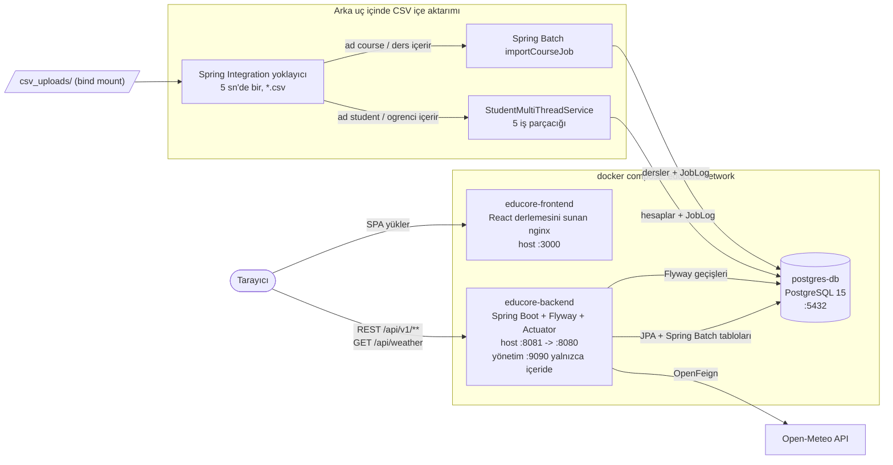

# EduCore

[English](./README.md) | **Türkçe**

EduCore, **Spring Boot** arka ucu ve **React (Vite)** ön yüzüyle geliştirilmiş bir eğitim yönetim sistemidir. Öğrencileri, dersleri ve ders kayıtlarını yönetir; izlenen klasördeki CSV dosyalarını içe aktarır ve yöneticilerin öğrencilere atanabilecek IPv4 adres aralıklarını tanımlamasını sağlar.

> **Proje durumu:** bir sağlamlaştırma (hardening) ve yükseltme programı sürmektedir. Yapılandırma ortam değişkenlerine taşınmıştır; diğer güvenlik aşamaları devam etmektedir. Uygulamayı yerel makine dışında bir yere kurmadan önce [Güvenlik durumu](#güvenlik-durumu) bölümünü okuyun.

## Ekran görüntüleri

| Giriş | Ana Sayfa |
|:-------------------------:|:------------------------:|
|  |  |

| Öğrenciler | Dersler |
|:-------------------------:|:------------------------:|
|  |  |

| İş Günlükleri | |
|:-------------------------:|:------------------------:|
|  | |

## Özellikler

## Kimlik doğrulama

`AuthController` şu uç noktaları sunar:

| Yöntem ve yol | İşlev |
|---|---|
| `POST /api/v1/auth/login` | Kullanıcı adı ve parolayla giriş; erişim belirteci döndürür ve yenileme çerezi ayarlar. |
| `POST /api/v1/auth/refresh` | Çerezdeki yenileme belirtecini döndürür, yeniler ve yeni erişim belirteci verir. |
| `POST /api/v1/auth/logout` | Yenileme belirteci ailesini iptal eder ve çerezi temizler. |
| `GET /api/v1/auth/me` | Oturum açmış kullanıcıyı döndürür. |
| `POST /api/v1/auth/password` | Oturum açmış kullanıcının parolasını değiştirir ve yenileme oturumlarını iptal eder. |

Erişim JWT'si 15 dakika geçerlidir. Yenileme belirteci, her kullanımdan sonra döndürülen, veritabanında özeti tutulan 14 günlük `HttpOnly` çerezdir; yeniden kullanım algılanırsa ilgili belirteç ailesi iptal edilir. Çerez `SameSite=Strict` kullanır; `Secure` geliştirme profili dışındaki profillerde etkindir. Giriş denemeleri IP başına dakikada 10 ile sınırlıdır; 15 dakika içinde 5 başarısız parola denemesi hesabı 15 dakika kilitler.

Yeni parolalar 12-128 karakter olmalı, bcrypt'in 72 UTF-8 bayt sınırını aşmamalı ve yaygın parola engel listesinde bulunmamalıdır. API'den oluşturulan ve CSV'den içe aktarılan öğrenciler rastgele geçici parola alır; yalnızca özeti saklanır ve `mustChangePassword` işaretlenir. İlk parola değişikliği için arayüz şu an yalnızca bildirim gösterir. Anahtar değiştirme adımları: [JWT anahtarı rotasyonu](docs/security/KEY_ROTATION.md).


Aşağıdaki her madde bu depodaki koda dayanır.

- **Roller** – hesaplar `ADMIN` veya `USER` rolündedir (`Role`). Ön yüz, İş Günlükleri ve IP Ayarları menülerini yalnızca yöneticilere gösterir. Sunucu tarafında ders kaydı ekleme/bırakma istekleri yalnızca hesabın sahibi veya bir yönetici tarafından yapılabilir; diğer `/api/v1/**` uç noktaları şu anda yalnızca kimlik doğrulaması ister (bkz. [Güvenlik durumu](#güvenlik-durumu)).
- **Öğrenci yönetimi** – sayfalı, aranabilir ve sıralanabilir öğrenci listesi; ekleme, düzenleme ve **yumuşak silme** (`deleted` alanı) ile silinmiş kayıtları görüntüleme. Bir öğrenci numarası, kayıt silinmiş olsa bile tekrar kullanılamaz.
- **Dersler ve ders kayıtları** – ders (ad, dönem, eğitmen) ekleme, düzenleme, silme ve listeleme; öğrenci detay sayfasından öğrenciyi derse kaydetme veya dersten çıkarma.
- **Öğrenci IP izin listesi (`IpBlock`)** – yöneticiler IP Ayarları sayfasında izin verilen IPv4 aralıklarını tek adres (`STATIC`), aralık (`RANGE`, örn. `192.168.1.1-192.168.1.10`) veya alt ağ (`CIDR`, örn. `10.0.0.0/24`) olarak tanımlar. Bir öğrencinin IP adresi `PUT /api/v1/accounts/{id}` ile atanırken adresin geçerli bir IPv4 olması ve bu aralıklardan birinin içinde kalması gerekir; her IP yalnızca bir öğrenciye ait olabilir. **Bu yalnızca veri doğrulamasıdır: EduCore gelen ağ trafiğini IP adresine göre engellemez veya filtrelemez.**
- **CSV içe aktarımı** – Spring Integration tabanlı bir yoklayıcı CSV dosyalarını alır ve dosya adına göre çok iş parçacıklı öğrenci içe aktarıcısına veya Spring Batch ders işine yönlendirir (ayrıntılar [CSV içe aktarımı](#csv-içe-aktarımı) bölümünde).
- **İş günlükleri** – her içe aktarım bir `JobLog` kaydı olarak saklanır (dosya adı, varlık türü, başarılı/hatalı kayıt sayıları, satır bazlı mesajlar, zaman damgası). Yöneticiler İş Günlükleri sayfasında günlükleri görüntüleyebilir ve toplu olarak silebilir.
- **Hava durumu bileşeni** – `GET /api/weather`, OpenFeign istemcisi aracılığıyla Open-Meteo API'sinden İstanbul, Ankara ve İzmir'in anlık hava durumunu getirir; uygulamanın sağ üst köşesinde gösterilir.
- **Ortam değişkeni öncelikli yapılandırma** – ortak ayarlar `application.yml`, profile özgü ayarlar ise `application-dev.yml`, `application-test.yml` ve `application-prod.yml` dosyalarındadır. Varsayılan profil `dev`'dir; `prod` veritabanı, JWT ve ilk yönetici için ortam değişkenlerini zorunlu tutar.
- **Veritabanı geçişleri ve başlangıç verisi** – PostgreSQL şemasını Flyway, `src/main/resources/db/migration` altındaki dosyalarla yönetir. Sentetik demo verisi `src/main/resources/db/seed/dev` içindedir ve yalnızca `dev` ile `test` profillerinde yüklenir.
- **Yönetici oluşturma** – `AdminBootstrap`, sistemde ADMIN yoksa yapılandırılmış bilgilerle ilk yöneticiyi oluşturur. `ProdStartupGuard`, üretim için zorunlu ortam değişkenlerini bean'ler oluşturulmadan denetler.
- **Sağlık ve ölçümler** – Spring Boot Actuator 9090 yönetim portunda çalışır; Compose bu portu yayımlamaz. `/actuator/health` herkese açıktır, diğer yayımlanan yönetim uçları ADMIN bearer token'ı gerektirir.

## Teknoloji yığını

| Katman | Teknoloji | Sürüm (kaynak) |
|---|---|---|
| Dil | Java | 21 (`pom.xml`, arka uç Dockerfile) |
| Arka uç çatısı | Spring Boot (Web, Data JPA, Security, Validation, Batch, Integration + `spring-integration-file`, Actuator) | 3.5.16 (`pom.xml` parent) |
| Bulut | Spring Cloud (OpenFeign) | 2025.0.3 BOM |
| Token | jjwt (`jjwt-api`, `jjwt-impl`, `jjwt-jackson`) | 0.12.7 |
| Kod üretimi | Lombok | 1.18.40 |
| Veritabanı | PostgreSQL | `postgres:15` imajı |
| Veritabanı geçişleri | Flyway Core + PostgreSQL desteği | 11.7.2 (Spring Boot BOM) |
| Test veritabanı | Testcontainers (JUnit Jupiter + PostgreSQL) | 1.21.4 (Spring Boot BOM) |
| Kapsam raporu | JaCoCo Maven eklentisi | 0.8.15 |
| Derleme | Maven Wrapper | Maven 3.9.16 |
| Ön yüz | React / React DOM | ^19.2.7 |
| Yönlendirme | react-router-dom | ^7.18.1 |
| HTTP | axios | ^1.18.1 |
| Arayüz yardımcıları | lucide-react ^1.23.0, react-hot-toast ^2.6.0 | |
| Ön yüz derleme | Vite ^8.1.1, `@vitejs/plugin-react` ^6.0.3, ESLint ^10.6.0 | |
| Ön yüz çalışma ortamı | Node 22 (derleme aşaması), statik paketi sunan nginx (alpine) | `frontend/Dockerfile` |

## Mimari



React uygulaması tamamen tarayıcıda çalışır ve arka uca doğrudan `http://localhost:8081` adresinden erişir; nginx yalnızca statik dosyaları sunar (istemci tarafı yönlendirme için `index.html` yedeğiyle) ve API çağrılarını vekil olarak iletmez. Arka uç CORS ayarı `http://localhost:3000` kaynağına izin verir.

### Kaynak dizin yapısı

| Yol | İçerik |
|---|---|
| `src/main/java/com/educore/auth` | `AuthController`, `AuthService`, parola politikası, giriş sınırlama/kilitleme, yenileme belirteci ve çerez bileşenleri |
| `src/main/java/com/educore/controller` | `ApiController` (REST `/api/v1`), `WeatherController` |
| `src/main/java/com/educore/security` | `SecurityConfig`, `JwtService`, `JwtAuthenticationFilter`, `AccessTokenAuthentication`, `ClientIpResolver`, `OriginVerifier`, `RequestIdFilter` |
| `src/main/java/com/educore/config` | `BatchConfig`, `FileIntegrationConfig`, `JobTracker`, `ProdStartupGuard`, `AdminBootstrap`, `EduCoreProperties` |
| `src/main/java/com/educore/service` | `AccountCredentialService` (geçici parola atama), `CsvJobService`, `StudentMultiThreadService`, `StudentService`, `WeatherService` |
| `src/main/java/com/educore/entity` | `Account`, `Course`, `Enrollment`, `IpBlock`, `JobLog`, `Role` |
| `src/main/java/com/educore/util` | `IpAddressUtil` (IPv4 doğrulama ve dönüştürme) |
| `src/main/resources` | Ortak ayarlar için `application.yml`, profiller için `application-{dev,test,prod}.yml`; Flyway şeması için `src/main/resources/db/migration`, geliştirme/test seed verisi için `src/main/resources/db/seed/dev` |
| `frontend/src` | React sayfaları: `Login`, `Home`, `StudentList`, `StudentDetail`, `CourseManagement`, `JobLogs`, `IpManagement`, `WeatherWidget` |
| `csv_uploads/` | İzlenen CSV klasörü; `csv_uploads/sample/` örnek dosyaları içerir |

## Hızlı başlangıç (Docker Compose)

### Yapılandırma ve profiller

Ortak ayarlar `src/main/resources/application.yml` dosyasındadır; profil ayarları `application-dev.yml`, `application-test.yml` ve `application-prod.yml` dosyalarında bulunur. `SPRING_PROFILES_ACTIVE` belirtilmezse Spring `dev` profilini kullanır. `prod` profili veritabanı bağlantı değişkenlerini, `EDUCORE_JWT_SECRET` değerini ve ilk yöneticiye ait iki değişkeni zorunlu tutar; `ProdStartupGuard` eksik değerleri başlangıç sürerken bildirir. Actuator, `docker-compose.yml` tarafından yayımlanmayan 9090 yönetim portunu kullanır. `/actuator/health` herkese açıktır; diğer yayımlanan Actuator uçları ADMIN bearer token'ı gerektirir.

Gereksinimler: Compose eklentisiyle Docker ve gizli değer üretmek için `openssl`.

1. Ortam dosyanızı şablondan oluşturun:

   ```bash
   cp .env.example .env
   ```

2. Bir JWT imzalama anahtarı ve veritabanı şifresi üretip `.env` dosyasına yazın:

   ```bash
   openssl rand -base64 48   # EDUCORE_JWT_SECRET değeri
   openssl rand -base64 24   # EDUCORE_DB_PASSWORD değeri
   ```

   `.env` içindeki tüm değerleri değiştirin; örnek değerler yalnızca biçimi gösterir. `.env` sürüm kontrolünde yok sayılır ve asla commit edilmemelidir.

3. Yığını derleyip başlatın:

   ```bash
   docker compose up --build
   ```

   `EDUCORE_DB_USERNAME`, `EDUCORE_DB_PASSWORD`, `EDUCORE_DB_NAME` veya `EDUCORE_JWT_SECRET` eksikse Compose başlamayı reddeder.

   `SPRING_PROFILES_ACTIVE` başka bir değer vermedikçe arka uç `dev` profiliyle çalışır. İlk açılışta Flyway şemayı oluşturur ve `dev` profilinde sentetik demo verisini (dört ders ve `admin`, `ayberk`, `ali` demo hesapları) yükler. `SPRING_PROFILES_ACTIVE=prod` ile demo verisi yüklenmez; `EDUCORE_BOOTSTRAP_ADMIN_USERNAME` ve `EDUCORE_BOOTSTRAP_ADMIN_PASSWORD` tanımlı olmalıdır, aksi halde arka uç eksik her değişkenin adını vererek başlamayı reddeder.

4. Uygulamayı açın:

   | Servis | Adres |
   |---|---|
   | Ön yüz | http://localhost:3000 |
   | Arka uç REST API | http://localhost:8081/api/v1 |
   | PostgreSQL | `localhost:5432` |
   | Actuator (yönetim portu) | Yalnızca arka uç konteyneri içinde `9090`; ana makineye yayımlanmaz |

   Yönetim portundaki `/actuator/health` herkese açıktır; `/actuator/info`, `/actuator/metrics` ve `/actuator/prometheus` ADMIN bearer token ister. Ana makineden sağlık kontrolü: `docker compose exec educore-backend bash -c 'exec 3<>/dev/tcp/localhost/9090 && printf "GET /actuator/health HTTP/1.0\r\n\r\n" >&3 && cat <&3'`.

## Yerel geliştirme

Ön yüz arka ucu `http://localhost:8081` adresinde bekler ve `dev` profilinde arka uç CORS ayarı `http://localhost:3000` kaynağını kabul eder (`EDUCORE_CORS_ALLOWED_ORIGINS` ile değiştirilebilir); bu nedenle yerelde bu portları kullanın.

1. Veritabanını Docker'da başlatın:

   ```bash
   docker compose up -d postgres-db
   ```

2. Arka uç değişkenlerini kabuğunuzda tanımlayın (arka uç süreç ortamını okur; `.env` dosyasını kendisi yüklemez). `.env` içindeki değerlerin aynısını kullanın:

   ```bash
   export EDUCORE_DB_URL=jdbc:postgresql://localhost:5432/educore_db
   export EDUCORE_DB_USERNAME=educore_user
   export EDUCORE_DB_PASSWORD='<.env içindeki değer>'
   export EDUCORE_JWT_SECRET='<.env içindeki değer>'
   export SPRING_PROFILES_ACTIVE=dev   # isteğe bağlı: varsayılan dev
   ```

3. Arka ucu 8081 portunda çalıştırın (Java 21 gerekir):

   ```bash
   ./mvnw spring-boot:run -Dspring-boot.run.arguments=--server.port=8081
   ```

   Windows'ta aynı argümanlarla `mvnw.cmd` kullanın. Flyway açılışta veritabanını taşır ve `dev` profilinde demo verisini ekler. Actuator `9090` portunu dinler (`http://localhost:9090/actuator/health`).

   Önceki bir sürümün oluşturduğu (şeması Flyway'den önce Hibernate tarafından kurulmuş) veritabanları otomatik devralınır: `spring.flyway.baseline-on-migrate=true` bunları baseline sürüm 2 olarak kaydeder ve yalnızca sonraki taşımalar çalışır.

4. Ön yüzü 3000 portunda çalıştırın (Node 22 önerilir):

   ```bash
   cd frontend
   npm install
   npm run dev -- --port 3000
   ```

5. Arka uç testlerini çalıştırın (Docker gerekir; Testcontainers rastgele bir portta geçici bir PostgreSQL başlatır):

   ```bash
   ./mvnw verify
   ```

   Birim testleri (`*Test`) Surefire, entegrasyon testleri (`*IT`) Failsafe ile çalışır; JaCoCo kapsam raporu `target/site/jacoco/index.html` dosyasına yazılır.

## Ortam değişkenleri

Bu tablo `.env.example` ile birebir eşleşir.

| Değişken | Zorunlu | Kullanan | Açıklama |
|---|---|---|---|
| `EDUCORE_DB_URL` | Yerel çalıştırmada | Arka uç | Arka uç Docker dışında çalışırken kullanılan JDBC adresi, örn. `jdbc:postgresql://localhost:5432/educore_db`. Compose içinde `EDUCORE_DB_NAME` ve `postgres-db` sunucusundan türetilir. |
| `EDUCORE_DB_NAME` | Evet (Compose) | Postgres, arka uç | Postgres konteynerinin oluşturduğu ve arka uç konteynerinin kullandığı veritabanı. |
| `EDUCORE_DB_USERNAME` | Evet | Postgres, arka uç | Postgres konteynerinin oluşturduğu ve arka ucun bağlanırken kullandığı veritabanı kullanıcısı. |
| `EDUCORE_DB_PASSWORD` | Evet | Postgres, arka uç | `EDUCORE_DB_USERNAME` için şifre. Uzun ve rastgele bir değer kullanın, örn. `openssl rand -base64 24`. |
| `EDUCORE_JWT_SECRET` | Evet | Arka uç | Base64 kodlu HMAC imzalama anahtarı, çözüldüğünde en az 32 bayt; `openssl rand -base64 48` ile üretin. Aksi halde uygulama başlamaz. |
| `EDUCORE_JWT_SECRET_PREVIOUS` | Hayır | Arka uç | Anahtar rotasyonu sırasında önceki imzalama anahtarı; yalnızca doğrulama için kullanılır. Ayrıntı: `docs/security/KEY_ROTATION.md`. |
| `EDUCORE_LOGIN_PEPPER` | `prod` için evet | Arka uç | `login_attempt` içindeki kullanıcı adı özetlerinde kullanılan HMAC-SHA-256 pepper değeri (en az 32 karakter); `dev` içinde tanımlanmazsa süreç başına rastgele değer kullanılır. |
| `SPRING_PROFILES_ACTIVE` | Hayır (varsayılan `dev`) | Arka uç | `dev`: sentetik demo verisi, CORS varsayılanı `http://localhost:3000`. `prod`: demo verisi yok; `EDUCORE_DB_*`, `EDUCORE_JWT_SECRET` ve `EDUCORE_BOOTSTRAP_ADMIN_*` zorunludur, eksik her değişken adıyla bildirilir ve uygulama başlamaz. `test` otomatik testlere ayrılmıştır. |
| `EDUCORE_CORS_ALLOWED_ORIGINS` | Hayır | Arka uç | Tarayıcıdan API'yi çağırabilecek kaynaklar, virgülle ayrılmış. Varsayılan `dev` ve Compose'da `http://localhost:3000`; `prod`'da boş (yalnızca aynı kaynak). |
| `EDUCORE_BOOTSTRAP_ADMIN_USERNAME` | `prod`'da evet | Arka uç | İlk ADMIN'in kullanıcı adı; yalnızca hiç ADMIN yoksa açılışta oluşturulur. Şifreyle birlikte tanımlanmalı ya da hiç tanımlanmamalıdır. |
| `EDUCORE_BOOTSTRAP_ADMIN_PASSWORD` | `prod`'da evet | Arka uç | Bu ADMIN'in ilk şifresi, en az 12 karakter; BCrypt özeti olarak saklanır ve ilk kullanımda değiştirilmesi gerekir. Oluşturma şifre olmadan `ADMIN_BOOTSTRAPPED` olarak loglanır. |

Actuator yönetim portu (`management.server.port=9090`) ortam değişkeniyle ayarlanmaz ve Compose tarafından yayımlanmaz; ADMIN token olmadan yalnızca `/actuator/health` erişilebilir.

## CSV içe aktarımı

İzleyicinin şu anki davranışı (`FileIntegrationConfig`, `StudentMultiThreadService`, `CsvJobService`, `BatchConfig`):

- **İzlenen klasör:** arka ucun çalışma dizinine göre `csv_uploads/`. Compose'da sunucudaki `./csv_uploads` klasörü `/app/csv_uploads` yoluna bağlanır. Yalnızca doğrudan bu klasördeki dosyalar taranır; alt klasörler (`sample/`, `inbox/`, `processing/`, `done/` ve `failed/` dahil) mevcut izleyici tarafından okunmaz.
- **Yoklama:** 5 saniyede bir, `*.csv` ile eşleşen dosyalar. Her dosya uygulamanın her çalışmasında bir kez alınır.
- **Dosya adına göre yönlendirme (büyük/küçük harf duyarsız):**
  - `ogrenci` veya `student` içeriyorsa → **öğrenci içe aktarımı**. Beklenen sütunlar: `FirstName,LastName,StudentNumber` (başlık satırı atlanır). Satırlar 5 iş parçacıklı bir havuzda, `CyclicBarrier` ile eşgüdümlenen 5'erli gruplar halinde işlenir; her satırda 1–3 saniyelik benzetilmiş bir gecikme vardır. Öğrenci numarası kullanıcı adı olur ve rastgele geçici bir parola üretilir; yalnızca özeti saklanır ve `mustChangePassword` işaretlenir. Yinelenen öğrenci numaraları hata olarak günlüğe yazılır. İşlem bitince dosya, bazı satırlar hatalı olsa bile `<ad>.csv.done` olarak yeniden adlandırılır.
  - `course` veya `ders` içeriyorsa → **Spring Batch `importCourseJob`**. Beklenen sütunlar: `name,term,instructor` (başlık satırı atlanır), parça (chunk) boyutu 10; mevcut ders adları atlanır ve günlüğe yazılır. Tüm satırlar yazıldıysa dosya `<ad>.csv.done`, aksi halde `<ad>.csv.fail` olarak yeniden adlandırılır.
  - diğer adlar → eşleşmedi olarak günlüğe yazılır ve yerinde bırakılır.
- **Sonuçlar:** işlenen her dosya, İş Günlükleri sayfasında görünen bir `JobLog` kaydı oluşturur.

Denemek için bir örnek dosyayı izlenen klasöre kopyalayın:

```bash
cp csv_uploads/sample/courses.sample.csv csv_uploads/
cp csv_uploads/sample/students.sample.csv csv_uploads/
```

Örnek öğrenci numaralarının bir kısmı demo hesaplarla çakıştığından, öğrenci içe aktarımı iş günlüğünde hem başarılı hem hatalı satırlar gösterir.

## Güvenlik durumu

P2 kapsamında gizli değerlerin ortam değişkenlerinden alınması, kimlik doğrulamanın güçlendirilmesi ve eski servis bileşenlerinin kaldırılması tamamlandı. Yetkilendirme/RBAC denetimleri sunucu tarafında yalnızca kısmen uygulanıyor; girdi doğrulaması, ağ kenarında hız sınırlama ve IP engelleme hâlâ açık işlerdir. Bulgular için [2026-09-25 başlangıç denetimi](docs/audit/2026-09-25-baseline.md) sayfasına bakın.

- IP izin listesi yalnızca öğrenci hesabına atanan adresi doğrular; API trafiğini filtrelemez.

Ek okuma:

- [JWT anahtarı rotasyonu](docs/security/KEY_ROTATION.md): anahtar değiştirme adımları.
- [2026-09-25 başlangıç denetimi](docs/audit/2026-09-25-baseline.md): açık güvenlik bulguları.
## Geliştirici

**Ayberk Arda** – Yazılım Geliştirici, Bilgisayar Programcılığı, İstanbul Kültür Üniversitesi (İKÜ)
