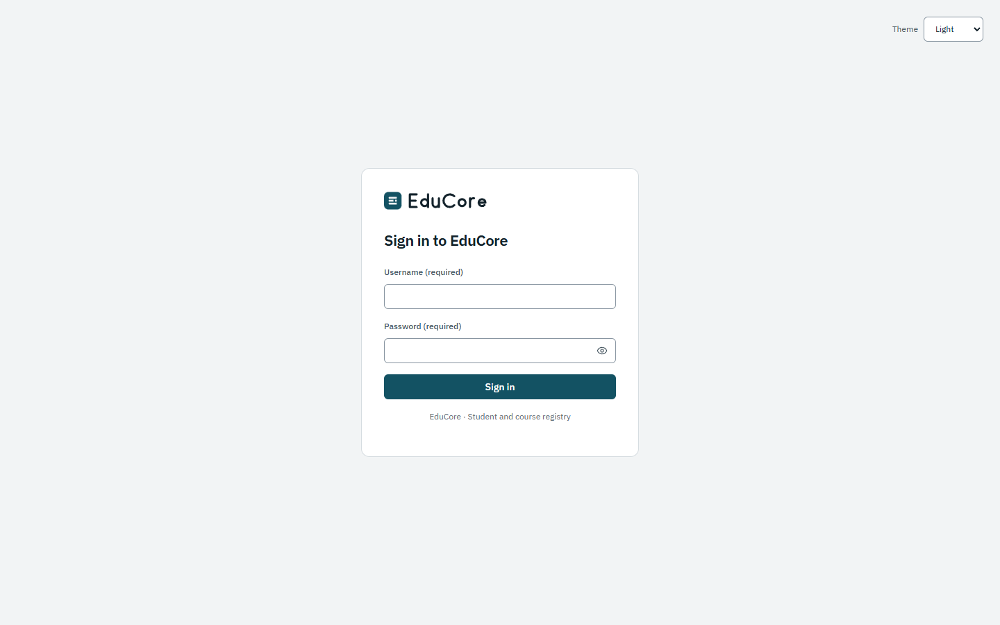
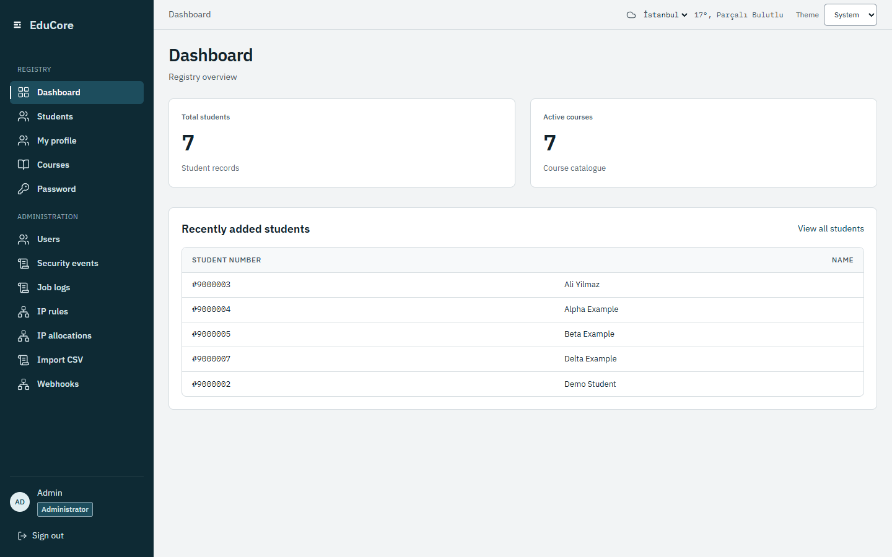
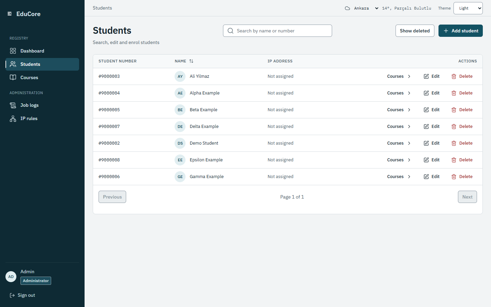
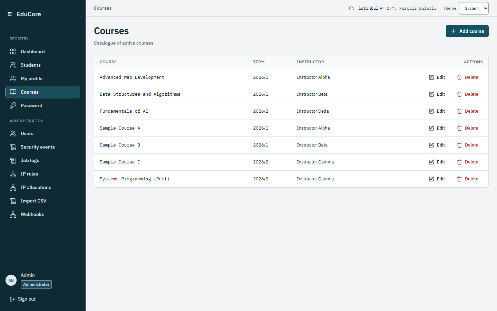
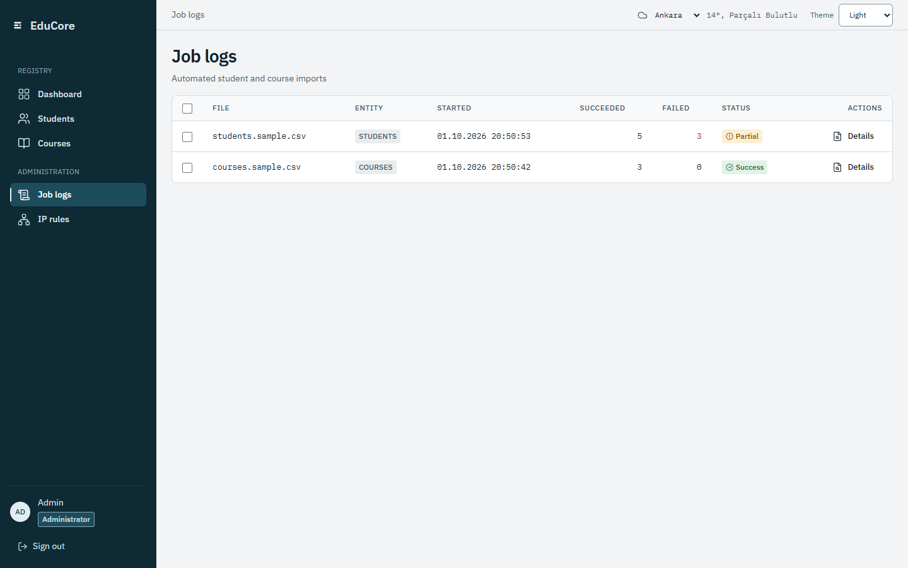
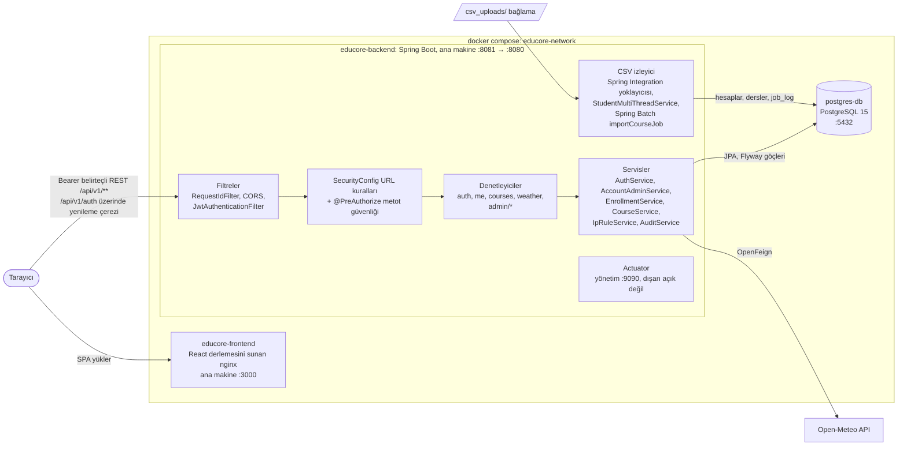
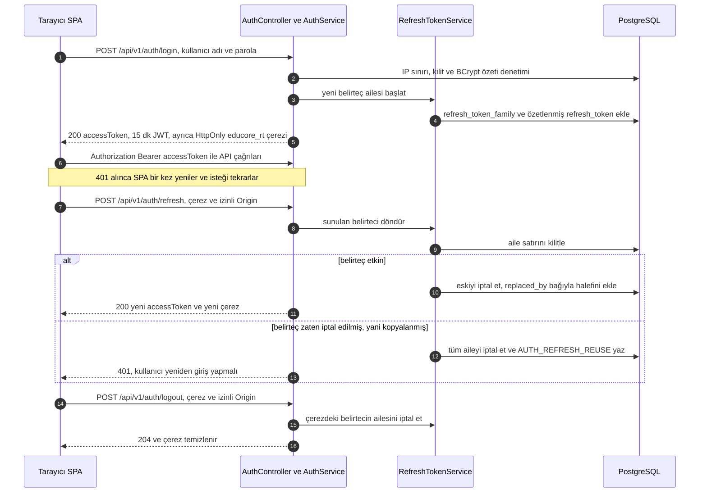
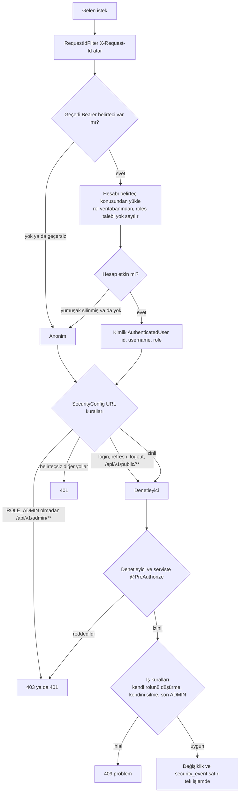
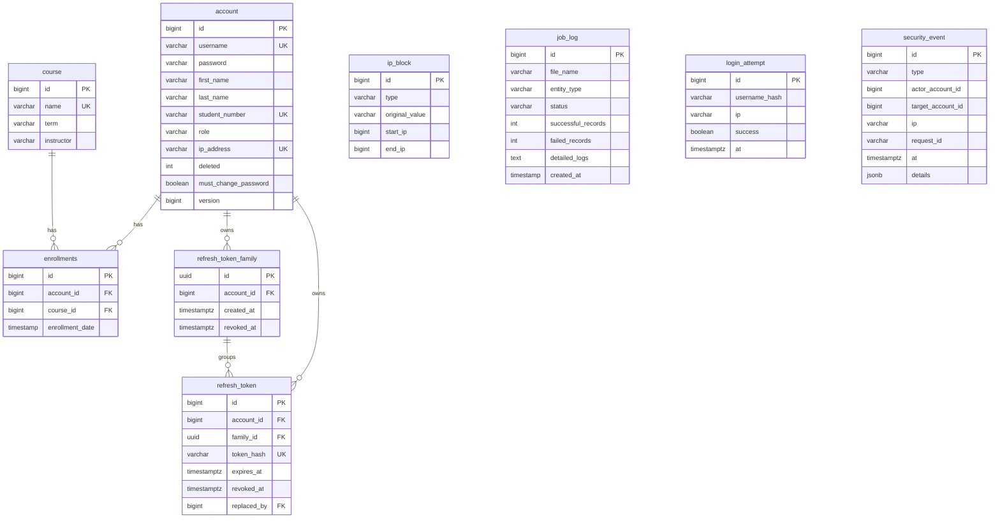

# EduCore

[English](./README.md) | **Türkçe**

EduCore, **Spring Boot** API'si ve **React (Vite)** arayüzüyle geliştirilmiş bir eğitim yönetim sistemidir. Hesapları, dersleri ve ders kayıtlarını PostgreSQL'de tutar; izlenen bir klasöre bırakılan CSV dosyalarından öğrenci ve ders içe aktarır, her içe aktarmayı bir iş kaydı olarak saklar ve yöneticilerin öğrenci hesaplarına adres verilebilecek IPv4 aralıklarını tanımlamasını sağlar.

> **Proje durumu:** aşamalı bir güçlendirme programı sürüyor. Gizli bilgiler, kimlik doğrulama ve yetkilendirme yeniden ele alındı; girdi doğrulama, uç katman güçlendirmesi ve sonraki aşamalar henüz açık. EduCore'u yerel makine dışında bir yerde çalıştırmadan önce [Güvenlik durumu](#güvenlik-durumu) bölümünü okuyun.

## Ekran görüntüleri

| | |
| --- | --- |
| <br>Giriş | <br>Panel |
| <br>Öğrenciler | <br>Dersler |
| <br>İş kayıtları | |

## Özellikler

Aşağıdaki her madde bu depodaki koda dayanır.

- **Oturum kimlik doğrulaması** (`auth`): kullanıcı adı ve parolayla giriş, 15 dakikalık bir JWT erişim belirteci döndürür ve 14 günlük, dönüşümlü bir yenileme belirtecini `HttpOnly` çereze yazar. Yenileme belirtecinin yeniden kullanılması tüm belirteç ailesini iptal eder. Girişler IP başına sınırlanır, art arda hatalı denemelerde hesap kilitlenir. Ayrıntılar: [Kimlik doğrulama](#kimlik-doğrulama).
- **Rol tabanlı erişim denetimi** (`security`): `ADMIN` ve `USER` rolleri URL kuralları ve metot güvenliğiyle uygulanır; yöneticinin kendi rolünü düşürmesi, kendi hesabını silmesi ve son etkin yöneticinin kaldırılması engellenir. Ayrıntılar: [Yetkilendirme](#yetkilendirme).
- **Denetim kaydı** (`security.audit`): kimlik doğrulama olayları ve yöneticilerin yaptığı her değişiklik `security_event` tablosuna yazılır; yöneticiler bunları `GET /api/v1/admin/security-events` üzerinden sayfa sayfa görebilir.
- **Öğrenci ve hesap yönetimi** (`account`): öğrencilerin ve tüm hesapların (etkin ya da yumuşak silinmiş) sayfalı ve aranabilir yönetici listeleri, tek seferlik 24 karakterli geçici parolayla öğrenci oluşturma, güncelleme, rol değiştirme ve **yumuşak silme**. Kullanıcı adı, öğrenci numarası ve atanmış IP adresi benzersizdir.
- **Kendi profili** (`/api/v1/me`): oturum açmış her kullanıcı profilini görebilir, adını ve soyadını değiştirebilir ve parolasını güncelleyebilir.
- **Dersler ve ders kayıtları** (`course`, `enrollment`): oturum açmış her kullanıcı için ders kataloğu, yöneticiler için ders oluşturma/güncelleme/silme, `/api/v1/me/enrollments` altında kullanıcının kendi ders kaydı ve yöneticinin herhangi bir hesap adına kayıt işlemleri.
- **Öğrenci IP atama kuralları** (`ipaccess`): yöneticiler izin verilen IPv4 aralıklarını tek adres (`STATIC`), aralık (`RANGE`, ör. `192.168.1.1-192.168.1.10`) ya da alt ağ (`CIDR`, ör. `192.168.1.0/24`) olarak tanımlar. Bir öğrenciye atanan adres geçerli bir IPv4 adresi olmalı ve bu kurallardan birinin içinde kalmalıdır. **Bu yalnızca hesap verisini doğrular; EduCore ağ trafiğini IP'ye göre engellemez ya da süzmez.**
- **CSV içe aktarma** (`FileIntegrationConfig`): bir Spring Integration yoklayıcısı CSV dosyalarını adlarına göre çok iş parçacıklı öğrenci aktarıcısına ya da Spring Batch ders işine yönlendirir. Ayrıntılar: [CSV içe aktarma](#csv-içe-aktarma).
- **İş kayıtları** (`ingestion`): her içe aktarma dosya adını, varlık türünü, durumu, başarılı/başarısız satır sayılarını ve satır bazında mesajları saklar; yöneticiler bunları listeleyip toplu olarak silebilir.
- **Hava durumu bileşeni**: `GET /api/v1/weather`, İstanbul, Ankara ve İzmir için güncel hava durumunu OpenFeign istemcisiyle Open-Meteo API'sinden alır; oturum açmış kullanıcı gerektirir.
- **Ortam değişkeni öncelikli yapılandırma**: ortak `application.yml` ile `dev`, `test` ve `prod` profilleri; `prod` eksik her değişkeni adıyla bildirip başlamayı reddeder (`ProdStartupGuard`).
- **Veritabanı göçleri**: şemayı Flyway yönetir (`src/main/resources/db/migration`); Hibernate yalnızca doğrular. Sentetik demo verisi yalnızca `dev` ve `test` profillerinde yüklenir.
- **İlk yönetici oluşturma**: hiç ADMIN yoksa `AdminBootstrap` ilk yöneticiyi ortam değişkenlerinden oluşturur; bu hesap ilk girişte parolasını değiştirmek zorundadır.
- **Sağlık ve metrikler**: Prometheus kayıt defteriyle Spring Boot Actuator, Docker Compose'un dışarı açmadığı 9090 yönetim portunda çalışır.
- **Arayüz**: panel, öğrenciler, kullanıcılar, dersler, kendi profili, iş kayıtları ve IP kuralları ekranlarından oluşan React tek sayfa uygulaması; yöneticiye özel ekranlar `USER` hesaplarından gizlenir ve bu hesaplar başka sayfaya yönlendirilir. Açık ve koyu tema [marka kimliğini](docs/brand/BRAND_IDENTITY.md) izler.

## Teknoloji yığını

| Katman | Teknoloji | Sürüm (kaynak) |
|---|---|---|
| Dil | Java | 21 (`pom.xml`, `Dockerfile`) |
| Arka uç çatısı | Spring Boot: Web, Data JPA, Security, Validation, Batch, `spring-integration-file` ile Integration, Actuator | 3.5.16 (`pom.xml` parent) |
| Kalıcılık | Hibernate ORM, Spring Batch | 6.6.53, 5.2.6 (Spring Boot BOM) |
| Cloud | Spring Cloud OpenFeign | 2025.0.3 BOM (OpenFeign 4.3.3) |
| Belirteçler | jjwt (`jjwt-api`, `jjwt-impl`, `jjwt-jackson`) | 0.12.7 |
| Giriş sınırlama | Bucket4j (`bucket4j_jdk17-core`) ve Caffeine önbelleği | 8.20.0; Caffeine Spring Boot BOM'dan |
| Metrikler | Micrometer Prometheus kayıt defteri | Spring Boot BOM |
| Kalıp kod | Lombok | 1.18.40 |
| Veritabanı | PostgreSQL | `postgres:15` imajı |
| Göçler | Flyway Core + `flyway-database-postgresql` | 11.7.2 (Spring Boot BOM) |
| Test veritabanı | Testcontainers (JUnit Jupiter, PostgreSQL) | 1.21.4 (Spring Boot BOM) |
| Kapsam | JaCoCo Maven eklentisi | 0.8.15 |
| Derleme | Maven Wrapper | Maven 3.9.16 (`.mvn/wrapper/maven-wrapper.properties`) |
| Ön yüz | React, React DOM | ^19.2.7 |
| Yönlendirme | react-router-dom | ^7.18.1 |
| HTTP | axios | ^1.18.1 |
| Arayüz yardımcıları | lucide-react ^1.23.0, react-hot-toast ^2.6.0, `@fontsource/ibm-plex-sans` ve `@fontsource/ibm-plex-mono` ^5.0.0 | `frontend/package.json` |
| Ön yüz derleme | Vite ^8.1.1, `@vitejs/plugin-react` ^6.0.3, ESLint ^10.6.0 | `frontend/package.json` |
| Konteynerler | Derleme `maven:3.9.6-eclipse-temurin-21`, çalışma `eclipse-temurin:21-jre-jammy`; derleme `node:22-alpine`, çalışma `nginx:alpine` | `Dockerfile`, `frontend/Dockerfile` |

## Mimari

### Bileşenler



React uygulaması tarayıcıda çalışır ve API'yi doğrudan `http://localhost:8081` adresinden çağırır (derleme sırasında `VITE_API_BASE_URL` ile değiştirilebilir, bkz. `frontend/src/api.js`). nginx yalnızca statik dosyaları sunar ve istemci tarafı yönlendirme için `index.html` yedeğine düşer; API çağrılarını vekil olarak iletmez. Arka uç, `EDUCORE_CORS_ALLOWED_ORIGINS` içinde listelenen tarayıcı kökenlerine izin verir.

### Kimlik doğrulama akışı



### İstek yetkilendirme yolu



### Ana tablolar



Spring Batch meta veri tabloları `V2__spring_batch_schema.sql` ile oluşturulur ve diyagramda gösterilmez.

### Kaynak düzeni

`src/main/java/com/educore` altındaki arka uç kodu özelliğe göre düzenlenmiştir; ortak paketler bunların yanındadır:

| Paket ya da yol | İçerik |
|---|---|
| `account` | Yönetici hesap/öğrenci denetleyicisi ve servisi, kendi profil denetleyicisi (`/api/v1/me`), istek ve yanıt kayıtları |
| `auth` | `AuthController`, `AuthService`, parola politikası, giriş sınırlayıcı ve hesap kilidi, yenileme belirteçleri ve aileleri, yenileme çerezi |
| `course`, `enrollment` | Ders kataloğu ve yönetici denetleyicileri, ders kaydı denetleyicisi ve servisi |
| `ipaccess` | IP kuralı yönetici denetleyicisi ve servisi, `IpAllocationPolicy` |
| `ingestion` | İş kaydı yönetici denetleyicisi ve servisi |
| `security` | `SecurityConfig`, `JwtService`, `JwtAuthenticationFilter`, `AuthenticatedUser`, `ClientIpResolver`, `OriginVerifier`, `RequestIdFilter` |
| `security.audit` | `AuditService`, `SecurityEvent`, `SecurityEventType`, güvenlik olayı yönetici denetleyicisi |
| `common.web` | `ApiExceptionHandler`, Problem Details istisnaları, sayfalama yardımcıları |
| `config` | `BatchConfig`, `FileIntegrationConfig`, `JobTracker`, `EduCoreProperties`, `ProdStartupGuard`, `AdminBootstrap` |
| `service` | CSV aktarıcıları (`StudentMultiThreadService`, `CsvJobService`), `WeatherService`, `AccountCredentialService` |
| `controller`, `WeatherClient` | `WeatherController` ve OpenFeign istemcisi |
| `entity`, `repository`, `dto`, `util`, `exception` | JPA varlıkları, depolar, CSV ve hava durumu DTO'ları, `IpAddressUtil`, eski `GlobalExceptionHandler` |
| `src/main/resources` | `application.yml`, `application-{dev,test,prod}.yml`, `db/migration` (Flyway), `db/seed/dev` (demo verisi), `security/common-passwords.txt` |
| `frontend/src` | React ekranları (`Login`, `Home`, `StudentList`, `StudentDetail`, `UserManagement`, `StudentProfile`, `CourseManagement`, `JobLogs`, `IpManagement`, `WeatherWidget`), `api.js`, `styles/` |
| `frontend/public/brand` | Logo ve favicon SVG dosyaları |
| `csv_uploads/` | İzlenen CSV klasörü; `csv_uploads/sample/` örnek dosyaları içerir |

## Kimlik doğrulama

`AuthController` oturum uç noktalarını sağlar:

| Metot ve yol | Amaç |
|---|---|
| `POST /api/v1/auth/login` | Kullanıcı adı ve parolayla giriş; `{accessToken, expiresIn, user}` döndürür ve yenileme çerezini ayarlar. |
| `POST /api/v1/auth/refresh` | Çerezdeki yenileme belirtecini döndürür ve yeni bir erişim belirteci verir. |
| `POST /api/v1/auth/logout` | Yenileme belirteci ailesini iptal eder ve çerezi temizler. |
| `GET /api/v1/auth/me` | Oturum açmış kullanıcıyı döndürür. |
| `POST /api/v1/auth/password` | Oturum açmış kullanıcının parolasını değiştirir, tüm yenileme oturumlarını iptal eder ve yeni bir oturum başlatır. |

- **Erişim belirteci:** 15 dakika geçerli, `educore` yayımcılı ve `educore-api` hedef kitleli HS256 JWT; konusu hesap kimliğidir ve `kid` başlığı imzalama anahtarını belirtir. İmzalama anahtarı `EDUCORE_JWT_SECRET` değişkeninden gelir (base64, çözüldüğünde en az 32 bayt; aksi hâlde uygulama başlamaz). `EDUCORE_JWT_SECRET_PREVIOUS`, [anahtar değişimi](docs/security/KEY_ROTATION.md) sırasında eski belirteçleri geçerli tutar.
- **Yenileme belirteci:** veritabanında `refresh_token` tablosunda yalnızca SHA-256 özeti tutulan opak, rastgele bir değerdir; `educore_rt` çereziyle gönderilir (`HttpOnly`, `SameSite=Strict`, `Path=/api/v1/auth`, 14 gün). `Secure` bayrağı `dev` dışındaki tüm profillerde açıktır. Yenileme ve çıkış ayrıca izinli bir `Origin` ister (`OriginVerifier`).
- **Döndürme ve yeniden kullanım tespiti:** her yenileme sunulan belirteci iptal eder ve aynı ailede halefini üretir. Zaten iptal edilmiş bir belirteç sunulursa tüm aile iptal edilir ve `AUTH_REFRESH_REUSE` kaydedilir.
- **Sınırlama ve kilit:** istemci IP'si başına dakikada 10 giriş denemesi (`Retry-After` ile HTTP 429); 15 dakika içinde 5 hatalı parola hesabı 15 dakika kilitler (HTTP 423). `login_attempt` tablosunda kullanıcı adları `EDUCORE_LOGIN_PEPPER` ile HMAC-SHA-256 olarak saklanır. `X-Forwarded-For` yalnızca `educore.ipaccess.trusted-proxies` içinde listelenen vekillerden gelirse dikkate alınır.
- **Parolalar:** BCrypt (güç 12). Yeni parolalar 12–128 karakter olmalı, UTF-8'de en fazla 72 bayt tutmalı ve yaygın parola listesinde bulunmamalıdır. Yöneticinin oluşturduğu öğrenciler bir kez gösterilen rastgele bir geçici parola alır; CSV'den aktarılan öğrencilerin geçici parolası yalnızca özet olarak saklanır. İkisi de `mustChangePassword` ile işaretlenir; arayüz şimdilik parola değiştirme ekranı yerine bir uyarı gösterir.
- **Olaylar:** `AUTH_LOGIN_SUCCESS`, `AUTH_LOGIN_FAILURE`, `AUTH_LOCKED`, `AUTH_REFRESH_REUSE` ve `PASSWORD_CHANGED` olayları `security_event` tablosuna yazılır.

## Yetkilendirme

Roller `ADMIN` ve `USER`'dır. Doğruluk kaynağı [RBAC matrisidir](docs/security/RBAC_MATRIX.md); `AuthorizationMatrixIT`, `src/test/resources/rbac-matrix.csv` dosyasındaki her hücreyi çalıştırır.

- **Anonim:** yalnızca `POST /api/v1/auth/login`, `/refresh`, `/logout` ve ayrılmış `/api/v1/public/**` öneki (henüz uç noktası yok).
- **USER:** `/api/v1/me` altındaki kendi profili ve ders kayıtları, ders kataloğu, hava durumu ve oturum uç noktaları. Hesap ve öğrenci listeleri yalnızca ADMIN içindir.
- **ADMIN:** `/api/v1/admin/**` altındaki her şey.

Uygulama katmanları:

1. `SecurityConfig` URL kuralları: `/api/v1/admin/**` için `ROLE_ADMIN` gerekir, herkese açık olmayan diğer tüm yollar kimlik doğrulaması ister.
2. Metot güvenliği: yönetici denetleyicileri ve servisleri `@PreAuthorize("hasRole('ADMIN')")` taşır; ders kaydı servis metotları `#accountId == principal.id or hasRole('ADMIN')` koşulunu denetler. Kimlik, türlendirilmiş `AuthenticatedUser(id, username, role)` kaydıdır; rol her istekte veritabanından yeniden okunur ve yumuşak silinmiş hesap anonim sayılır.
3. İş kuralları (409 problemleri): bir ADMIN kendi rolünü değiştiremez, kendi hesabını silemez; son etkin ADMIN'in rolü düşürülemez ve silinemez. Denetim sırasında etkin ADMIN satırları `SELECT ... FOR UPDATE` ile kilitlenir.
4. DTO sınırı: istek kayıtlarında `id`, `role`, `deleted`, `password` ya da `mustChangePassword` alanı yoktur (`ChangeRoleRequest.role` dışında); yanıtlar hiçbir zaman parola özeti ya da varlık grafiği içermez. Kullanıcının kendi işlemleri hesabı kimlikten aldığı için IDOR engellenir.
5. Eşzamanlılık: `account.version` (iyimser kilitleme) eski veriye dayanan yazmaları 409 `request/concurrent-modification` ile reddeder; `PUT /api/v1/me` yalnızca ad sütunlarını yazar.

**Denetim olayları.** Her yönetici değişikliği, değişiklikle aynı işlem içinde bir `security_event` satırı yazar: `ACCOUNT_CREATED`, `ACCOUNT_UPDATED`, `ACCOUNT_DELETED`, `ROLE_CHANGED`, `ENROLLMENT_CHANGED`, `COURSE_CHANGED`, `IP_RULE_CHANGED` ve `JOB_LOGS_DELETED`. Satırlar işlemi yapanı, hedefi, istemci IP'sini ve istek kimliğini taşır; `details` yalnızca kimlikler, enum değerleri ve alan adlarını içerir. Hiçbir şeyi değiştirmeyen istekler olay yazmaz; denetim kaydı yazılamazsa değişiklik geri alınır.

## API özeti

Sürümlü API dört rota grubuna ayrılır:

- `/api/v1/auth`: giriş, yenileme, çıkış, oturumdaki kullanıcı ve parola değiştirme.
- `/api/v1/me`: kullanıcının kendi profili (`GET`/`PUT`) ve ders kayıtları (`GET`, `POST`, `DELETE /{courseId}`).
- `/api/v1/courses` ve `/api/v1/weather`: oturum açmış her kullanıcı için ders kataloğu ve hava durumu bileşeni.
- `/api/v1/admin/...`: yalnızca ADMIN için `accounts`, `accounts/students`, hesap rolleri ve ders kayıtları, `courses`, `ip-rules`, `job-logs` ve `security-events`.

Sayfalı rotalar `{content, page, size, totalElements, totalPages}` döndürür; `size` 1–100 aralığına sıkıştırılır. Özellik rotaları hataları `application/problem+json` olarak bildirir. Her metot, gövde, durum kodu ve kaldırılan P3 öncesi rotaların karşılıkları [API rota sözleşmesinde](docs/api/ROUTES.md) yer alır.

## CSV içe aktarma

Bugünkü davranış (`FileIntegrationConfig`, `StudentMultiThreadService`, `CsvJobService`, `BatchConfig`):

- **İzlenen klasör:** `educore.ingestion.base-dir`, varsayılanı arka ucun çalışma dizinine göre `csv_uploads`. Docker Compose ana makinedeki `./csv_uploads` klasörünü `/app/csv_uploads` yoluna bağlar. Yalnızca doğrudan bu klasördeki dosyalar taranır; `sample/`, `inbox/`, `processing/`, `done/` ve `failed/` alt klasörleri mevcut izleyici tarafından okunmaz.
- **Yoklama:** 5 saniyede bir, `*.csv` ile eşleşen dosyalar; her dosya uygulama çalıştığı sürece bir kez alınır.
- **Dosya adına göre yönlendirme (büyük/küçük harf duyarsız):**
  - `ogrenci` ya da `student` içeriyorsa → **öğrenci aktarımı**. Sütunlar `FirstName,LastName,StudentNumber`, başlık satırı atlanır. 5 iş parçacıklı bir havuz satırları `CyclicBarrier` ile eşgüdümlenen 5'li gruplar hâlinde işler; her satırda 1–3 saniyelik benzetim gecikmesi vardır. Öğrenci numarası kullanıcı adı olur, rol `USER`'dır ve rastgele geçici parola yalnızca özet olarak saklanır. Yinelenen öğrenci numaraları başarısız olarak kaydedilir. Ardından dosya, hatalı satır olsa bile `<ad>.csv.done` olarak yeniden adlandırılır.
  - `course` ya da `ders` içeriyorsa → **Spring Batch `importCourseJob`**. Sütunlar `name,term,instructor`, başlık satırı atlanır, parça boyutu 10; var olan ders adları atlanır ve kaydedilir. Tüm satırlar yazıldıysa dosya `<ad>.csv.done`, aksi hâlde `<ad>.csv.fail` olarak yeniden adlandırılır.
  - diğer dosyalar → eşleşmedi olarak günlüğe yazılır ve yerinde bırakılır.
- **Sonuçlar:** işlenen her dosya bir `job_log` satırı (durum `SUCCESS` ya da `FAILED`) oluşturur; İş kayıtları sayfasında ve `GET /api/v1/admin/job-logs` üzerinden görülür.

Denemek için bir örnek dosyayı izlenen klasöre kopyalayın:

```bash
cp csv_uploads/sample/courses.sample.csv csv_uploads/
cp csv_uploads/sample/students.sample.csv csv_uploads/
```

Henüz yönetici tarafından parola sıfırlama yoktur ([BACKLOG](docs/BACKLOG.md) B-016); bu nedenle aktarılan öğrenciler bu özellik gelene kadar giriş yapamaz. inbox/processing/done/failed yaşam döngüsü P6 için planlanmıştır.

## Hızlı başlangıç

Gereksinimler: Compose eklentisiyle Docker ve gizli değer üretmek için `openssl`.

1. Şablondan ortam dosyanızı oluşturun:

   ```bash
   cp .env.example .env
   ```

2. Gizli değerleri üretip `.env` dosyasına yazın:

   ```bash
   openssl rand -base64 48   # EDUCORE_JWT_SECRET
   openssl rand -base64 48   # EDUCORE_LOGIN_PEPPER
   openssl rand -base64 24   # EDUCORE_DB_PASSWORD
   ```

   Tüm örnek değerleri değiştirin. `.env` Git tarafından yok sayılır ve asla commit edilmemelidir.

3. Yığını derleyip başlatın:

   ```bash
   docker compose up --build
   ```

   `EDUCORE_DB_USERNAME`, `EDUCORE_DB_PASSWORD`, `EDUCORE_DB_NAME`, `EDUCORE_JWT_SECRET` ya da `EDUCORE_LOGIN_PEPPER` eksikse Compose başlamayı reddeder. İlk açılışta Flyway şemayı oluşturur. Varsayılan `dev` profilinde sentetik demo verisi dört ders ile `admin` (ADMIN), `ayberk` ve `ali` hesaplarını ekler. `SPRING_PROFILES_ACTIVE=prod` ile demo verisi yüklenmez ve ilk ADMIN, `EDUCORE_BOOTSTRAP_ADMIN_USERNAME` ve `EDUCORE_BOOTSTRAP_ADMIN_PASSWORD` değerlerinden oluşturulur.

4. Uygulamayı açın:

   | Servis | Adres |
   |---|---|
   | Ön yüz | http://localhost:3000 |
   | Arka uç API | http://localhost:8081/api/v1 |
   | PostgreSQL | `localhost:5432` |
   | Actuator | yalnızca arka uç konteyneri içinde `9090` portu |

   Ana makineden sağlık durumunu denetlemek için:

   ```bash
   docker compose exec educore-backend bash -c 'exec 3<>/dev/tcp/localhost/9090 && printf "GET /actuator/health HTTP/1.0\r\n\r\n" >&3 && cat <&3'
   ```

## Yerel geliştirme

Ön yüz varsayılan olarak `http://localhost:8081` adresini çağırır (`frontend/src/api.js`) ve `dev` profili `http://localhost:3000` tarayıcı kökenine izin verir; bu yüzden arka ucu 8081'de, Vite'i 3000'de çalıştırın.

1. Yalnızca veritabanını başlatın:

   ```bash
   docker compose up -d postgres-db
   ```

2. Arka uç değişkenlerini kabuğunuzda tanımlayın (arka uç `.env` dosyasını değil, süreç ortamını okur):

   ```bash
   export SPRING_PROFILES_ACTIVE=dev
   export EDUCORE_DB_URL=jdbc:postgresql://localhost:5432/educore_db
   export EDUCORE_DB_USERNAME=educore_user
   export EDUCORE_DB_PASSWORD='.env dosyanızdaki değer'
   export EDUCORE_JWT_SECRET='.env dosyanızdaki değer'
   ```

   `EDUCORE_LOGIN_PEPPER` `dev` profilinde isteğe bağlıdır; verilmezse süreç başına rastgele bir değer kullanılır ve kilit sayaçları yeniden başlatmada sıfırlanır.

3. Arka ucu 8081 portunda çalıştırın (Java 21):

   ```bash
   ./mvnw spring-boot:run -Dspring-boot.run.arguments=--server.port=8081
   ```

   Windows'ta aynı argümanlarla `mvnw.cmd` kullanın. Actuator bu durumda `http://localhost:9090/actuator/health` adresindedir.

4. Ön yüzü 3000 portunda çalıştırın (Node 22):

   ```bash
   cd frontend
   npm install
   npm run dev -- --port 3000
   ```

   Vite'in kendi varsayılan portu 5173'tür; bu köken arka ucun varsayılan CORS listesinde yoktur.

## Yapılandırma

- **Profiller:** ortak ayarlar `application.yml` içindedir; `application-dev.yml`, `application-test.yml` ve `application-prod.yml` bunları geçersiz kılar. `SPRING_PROFILES_ACTIVE` verilmezse `dev` profili kullanılır.
  - `dev`: demo verisi yüklenir, yenileme çerezi `Secure` olmadan gönderilir, CORS varsayılanı `http://localhost:3000`.
  - `test`: yalnızca otomatik testler için; PostgreSQL'i Testcontainers sağlar ve CSV yoklayıcısı `target/test-csv-uploads` klasörünü izler.
  - `prod`: demo verisi yok, hiçbir gizli değerin varsayılanı yok, CORS listesi boş (ters vekil arkasında aynı köken). `ProdStartupGuard`, herhangi bir bean oluşturulmadan önce `EDUCORE_DB_URL`, `EDUCORE_DB_USERNAME`, `EDUCORE_DB_PASSWORD`, `EDUCORE_JWT_SECRET`, `EDUCORE_LOGIN_PEPPER` ve iki ilk yönetici değişkenini denetler.
- **Veritabanı:** Flyway açılışta çalışır; Flyway öncesinde oluşturulmuş veritabanları için `baseline-on-migrate` açıktır; `ddl-auto` değeri `validate`'tir.
- **Yönetim portu:** Actuator `management.server.port=9090` üzerinde dinler ve `health`, `info`, `metrics` ile `prometheus` uç noktalarını açar. `/actuator/health` herkese açıktır; diğerleri ADMIN bearer belirteci ister. `docker-compose.yml` bu portu dışarı açmaz.
- **Hata çıktısı:** hata yanıtlarına mesaj, yığın izi ve bağlama hataları hiçbir zaman eklenmez.
- **Diğer ayarlar:** `educore.*` özelliklerinin varsayılanları (içe aktarma klasörü, güvenilen vekiller, belirteç ömürleri, giriş sınırları) `EduCoreProperties` ve `application.yml` içindedir.

## Ortam değişkenleri

Bunlar `.env.example` ile birebir aynıdır.

| Değişken | Zorunlu | Açıklama |
|---|---|---|
| `SPRING_PROFILES_ACTIVE` | Hayır (varsayılan `dev`) | `dev` sentetik demo verisini yükler; `prod` veri yüklemez ve eksik her gizli değeri adıyla bildirerek başlamaz; `test` yalnızca otomatik testler içindir. |
| `EDUCORE_DB_URL` | Yerel çalıştırma; `prod` | Arka uç Docker dışında çalışırken JDBC adresi, ör. `jdbc:postgresql://localhost:5432/educore_db`. Compose içinde `EDUCORE_DB_NAME` ve `postgres-db` ana makinesinden türetilir. |
| `EDUCORE_DB_NAME` | Evet (Compose) | PostgreSQL konteynerinin oluşturduğu ve arka uç konteynerinin kullandığı veritabanı. |
| `EDUCORE_DB_USERNAME` | Evet | PostgreSQL konteynerinin oluşturduğu ve arka ucun bağlandığı veritabanı rolü. |
| `EDUCORE_DB_PASSWORD` | Evet | `EDUCORE_DB_USERNAME` parolası; uzun ve rastgele bir değer, ör. `openssl rand -base64 24`. |
| `EDUCORE_JWT_SECRET` | Evet | Base64 HMAC imzalama anahtarı, çözüldüğünde en az 32 bayt; `openssl rand -base64 48` ile üretin. |
| `EDUCORE_JWT_SECRET_PREVIOUS` | Hayır | Önceki imzalama anahtarı, yalnızca anahtar değişimi sırasında verilir; bkz. [KEY_ROTATION.md](docs/security/KEY_ROTATION.md). |
| `EDUCORE_LOGIN_PEPPER` | `prod` ve Compose'da evet | `login_attempt` içindeki kullanıcı adlarının HMAC-SHA-256 anahtarı, en az 32 karakter; `openssl rand -base64 48` ile üretin. Yerel `dev` çalıştırmada isteğe bağlıdır. |
| `EDUCORE_CORS_ALLOWED_ORIGINS` | Hayır | API'yi çağırabilecek tarayıcı kökenleri, virgülle ayrılmış. `dev` ve Compose'da varsayılan `http://localhost:3000`, `prod`'da boş. |
| `EDUCORE_BOOTSTRAP_ADMIN_USERNAME` | `prod`'da evet | İlk ADMIN'in kullanıcı adı; yalnızca hiç ADMIN yoksa oluşturulur. Parolayla birlikte verilmeli ya da hiç verilmemelidir. |
| `EDUCORE_BOOTSTRAP_ADMIN_PASSWORD` | `prod`'da evet | Bu ADMIN'in ilk parolası, en az 12 karakter; BCrypt özeti olarak saklanır ve ilk kullanımda değiştirilmelidir. |

## Testler

Arka uçta birim testleri (`*Test`, Surefire) ve Testcontainers'ın başlattığı geçici bir PostgreSQL'e karşı çalışan entegrasyon testleri (`*IT`, Failsafe) vardır. Docker'ın erişilebilir olması gerekir.

```bash
./mvnw verify
```

Windows'ta `mvnw.cmd verify` çalıştırın. Birleştirilmiş JaCoCo raporu `target/site/jacoco/index.html` dosyasına yazılır.

Son doğrulama raporu (P3) 60 birim testi ve 248 entegrasyon testi kaydeder: **toplam 308 test, hiç başarısızlık, hata ya da atlama yok**. Entegrasyon testleri girişi, yenileme belirteci döndürmeyi ve yeniden kullanım tespitini, hesap kilidini, forwarded-for sınırlamasını, tüm yetkilendirme matrisini (122 durum), yetki yükseltmeyi, toplu atamayı, IDOR'u, son yönetici korumasını, denetim kaydının bütünlüğünü, eşzamanlı hesap güncellemelerini, yol varyasyonuyla atlatma denemelerini, yönetim uç noktası güvenliğini, Flyway göçlerini ve üretim açılış denetimlerini kapsar. Ön yüzün henüz otomatik testi yoktur.

## Marka ve tasarım

Görsel kimlik (ad kullanımı, Ledger Mark logosu, renkler, tipografi ve arayüz kuralları) [BRAND_IDENTITY.md](docs/brand/BRAND_IDENTITY.md) içinde tanımlıdır; uygulama belirteçleri [tokens.css](docs/brand/tokens.css) dosyasında, logo dosyaları [frontend/public/brand](frontend/public/brand) klasöründedir.

## Güvenlik durumu

Güçlendirme programı [2026-09-25 temel denetimini](docs/audit/2026-09-25-baseline.md) izler.

Şimdiye kadar düzeltilenler:

- **Gizli bilgiler:** veritabanı parolası, JWT anahtarı ve demo parolaları koddan çıkarılıp ortam değişkenlerine taşındı; Config Server kaldırıldı. Sızmış değerlerin değiştirilmesi ve Git geçmişinin temizlenmesi [SECRET_ROTATION_AND_HISTORY_PURGE.md](docs/security/SECRET_ROTATION_AND_HISTORY_PURGE.md) içinde belgelenmiştir ve depo sahibinin açık onayını gerektirir.
- **Kimlik doğrulama:** anahtar değişimli kısa ömürlü JWT'ler, yeniden kullanım tespitli dönüşümlü yenileme çerezleri, giriş sınırlama ve hesap kilidi, parola politikası ve geçici parolalar.
- **Yetkilendirme:** URL kuralları ve metot güvenliğiyle RBAC, DTO sınırları, son yönetici koruması, iyimser kilitleme ve işlemsel denetim olayları.
- **SOAP'ın kaldırılması:** hesapları düz metin varsayılan parolayla oluşturan `/ws/**` uç noktası kaldırıldı.

Açık kalanlar, planlanan sırayla:

- **P4:** her girdide Bean Validation, her hata için RFC 9457 Problem Details ve temizlenmiş günlükler (bazı rotalar hâlâ eski `{"error"}` gövdesini döndürüyor).
- **P5:** uç katman güçlendirmesi (güvenlik başlıkları, nginx arkasında HTTPS, CORS), istek düzeyinde IP engelleme ve giriş dışındaki rotalar için hız sınırlama. Öğrenci IP kuralları bugün trafiği engellemez.
- **P6:** içe aktarma hattı (inbox/processing/done/failed klasörleri, idempotency, boyut ve satır sınırları, katı ayrıştırma) ve imzalı webhook'lar.
- **P7:** veri yaşam döngüsü ve yedekler (hesap silme ve dışa aktarma, `login_attempt` ve `security_event` saklama süreleri, bağımlılık taraması).
- **P8:** ön yüz platformu; SPA erişim belirtecini hâlâ `localStorage` içinde tutuyor ve parola değiştirme ekranı yok.
- **P9:** herkese açık yüzey ve SEO.
- **P10:** saldırı test paketi, CI/CD ve sürüm.

## Belgeler

| Belge | İçerik |
|---|---|
| [docs/api/ROUTES.md](docs/api/ROUTES.md) | API rota sözleşmesi, gövde şekilleri, hata kodları, eski ve yeni rota eşlemesi |
| [docs/security/RBAC_MATRIX.md](docs/security/RBAC_MATRIX.md) | Yetkilendirme matrisi, uygulama katmanları, denetim olayları |
| [docs/security/KEY_ROTATION.md](docs/security/KEY_ROTATION.md) | JWT imzalama anahtarı değişimi |
| [docs/security/SECRET_ROTATION_AND_HISTORY_PURGE.md](docs/security/SECRET_ROTATION_AND_HISTORY_PURGE.md) | Kimlik bilgisi değişimi ve Git geçmişi temizleme planı |
| [docs/audit/2026-09-25-baseline.md](docs/audit/2026-09-25-baseline.md) | Temel güvenlik denetimi bulguları |
| [docs/DECISIONS_TAKEN.md](docs/DECISIONS_TAKEN.md) | Alınan kararlar ve nasıl geri alınacakları |
| [docs/BACKLOG.md](docs/BACKLOG.md) | Sonraki aşamalara bırakılan bulgular |
| [docs/brand/BRAND_IDENTITY.md](docs/brand/BRAND_IDENTITY.md) | Marka kimliği ve arayüz yönergeleri |
| [docs/brand/tokens.css](docs/brand/tokens.css) | Tasarım belirteçleri |

## Yazar

**Ayberk Arda** – Yazılım Geliştirici, Bilgisayar Programcılığı, İstanbul Kültür Üniversitesi (İKÜ)
