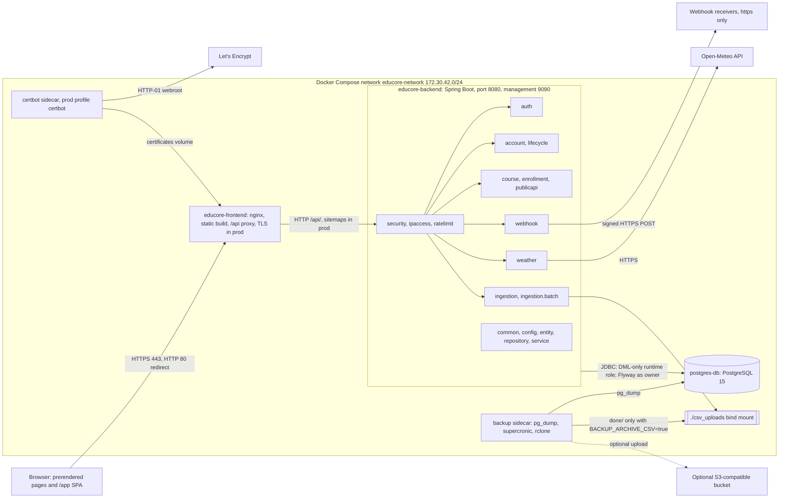
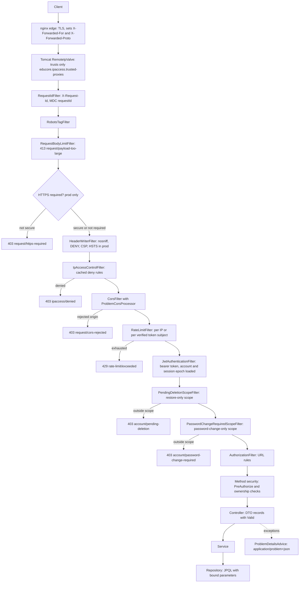
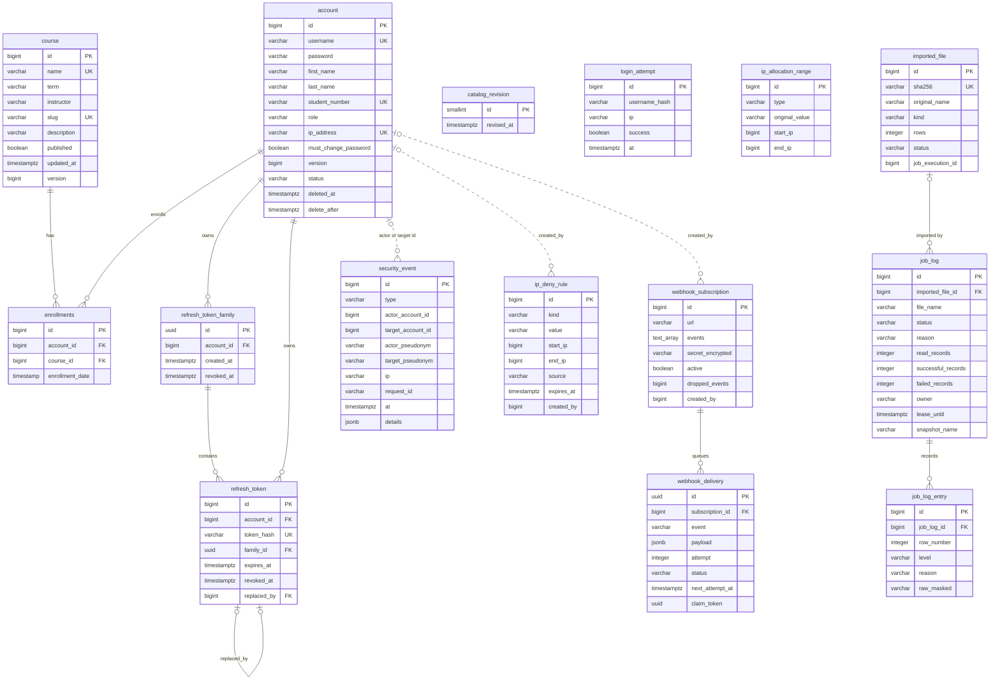
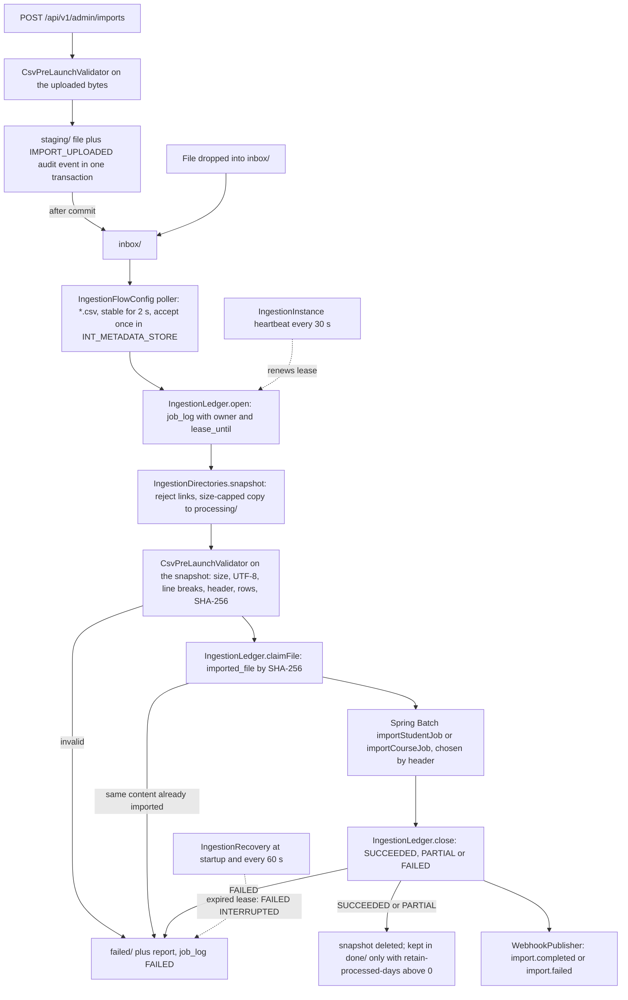
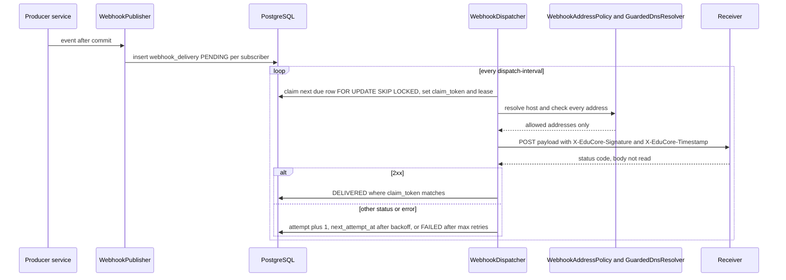
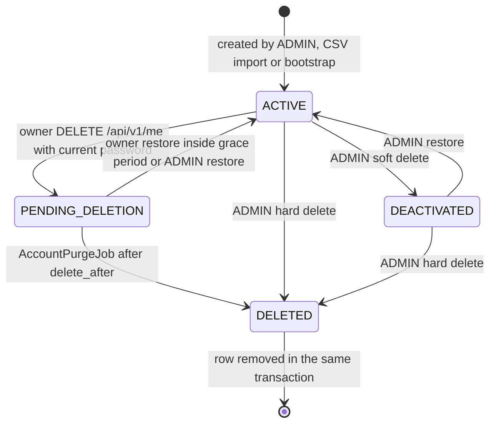
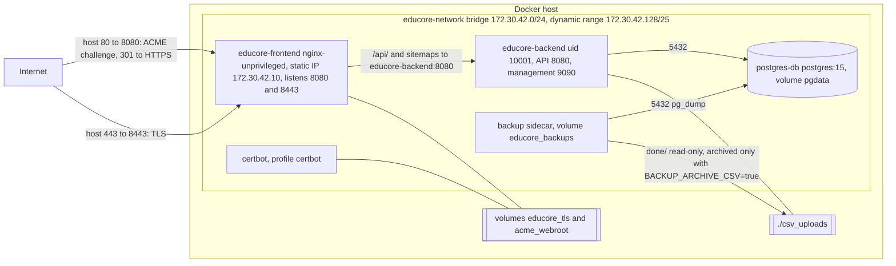

# EduCore Architecture

This document describes the system as it is implemented in this repository: a Spring Boot 3.5 / Java 21
backend (`src/main/java/com/educore`), a React Router 7 frontend (`frontend/`), PostgreSQL 15, and the Docker
Compose deployment (`docker-compose*.yml`, `infra/`). The reasons behind the main choices are recorded as
Architecture Decision Records in [`docs/adr/`](adr/README.md).

Related documents:

| Topic | Document |
|---|---|
| API routes and their history | [`docs/api/ROUTES.md`](api/ROUTES.md) |
| Authorization matrix | [`docs/security/RBAC_MATRIX.md`](security/RBAC_MATRIX.md) |
| Security headers, CORS, HTTPS | [`docs/security/HEADERS.md`](security/HEADERS.md) |
| IP access control and rate limiting | [`docs/security/IP_ACCESS.md`](security/IP_ACCESS.md) |
| Logging and masking | [`docs/security/LOGGING.md`](security/LOGGING.md) |
| Key rotation | [`docs/security/KEY_ROTATION.md`](security/KEY_ROTATION.md), [`docs/security/SECRET_ROTATION_AND_HISTORY_PURGE.md`](security/SECRET_ROTATION_AND_HISTORY_PURGE.md) |
| Webhook receivers | [`docs/integrations/WEBHOOKS.md`](integrations/WEBHOOKS.md) |
| Data retention and erasure | [`docs/ops/DATA_RETENTION.md`](ops/DATA_RETENTION.md) |
| TLS edge | [`docs/ops/TLS.md`](ops/TLS.md) |
| Backup and restore | [`docs/ops/BACKUP_RESTORE.md`](ops/BACKUP_RESTORE.md) |
| Upgrades and migrations | [`docs/ops/UPGRADE.md`](ops/UPGRADE.md) |
| CI | [`docs/ops/CI.md`](ops/CI.md) |
| Resource limits | [`docs/ops/COST_GUARDRAILS.md`](ops/COST_GUARDRAILS.md) |

## 1. Component overview

The browser loads a static build from nginx. Public pages are prerendered HTML; everything under `/app` is a
client-rendered single-page app ([ADR 0003](adr/0003-prerendered-public-site-and-spa.md)). The SPA calls the API
on the same origin under `/api` (`frontend/app/lib/api.ts`, `VITE_API_BASE_URL` defaults to `/api`); nginx proxies
`/api/` to the backend (`frontend/nginx.conf`); the production configuration (`infra/nginx/nginx.prod.conf`)
also proxies `/sitemap.xml` and `/sitemap-*.xml`. The backend is one Spring Boot application with
feature packages under `com.educore`, backed by one PostgreSQL database. A backup sidecar dumps the database, and
in production a certbot sidecar obtains TLS certificates for nginx.

Backend packages (all under `com.educore`):

| Package | Responsibility |
|---|---|
| `security` | Security filter chains (`SecurityConfig`), `JwtService`, `JwtAuthenticationFilter`, `PendingDeletionScopeFilter`, `RequestIdFilter`, security headers, CORS problem handling, trusted proxies and client IP resolution |
| `security.audit` | `AuditService`, the `security_event` trail and its admin listing |
| `ipaccess` | IP deny rules (`IpAccessControlFilter`, `IpDenyRuleCache`, automatic deny after failed logins) and the student IP allocation ranges |
| `ratelimit` | `RateLimitFilter` and the bounded in-memory bucket store (`CaffeineRateLimitStore`, `NamedRateLimits`) |
| `auth` | Login, refresh, logout, password change, login throttling and lockout, refresh token families |
| `account` | `/api/v1/me` profile and the ADMIN account API (`AccountAdminService`) |
| `lifecycle` | Deletion grace period, restore, purge job, pseudonyms, retention job, data export |
| `course`, `enrollment` | Course administration, read-only catalog, enrollments, catalog revision |
| `publicapi` | Anonymous catalog API, site facts, sitemaps, `X-Robots-Tag` filter |
| `ingestion`, `ingestion.batch` | CSV inbox and upload pipeline, Spring Batch import jobs, job logs |
| `webhook` | Subscriptions, signing, delivery queue, dispatcher, SSRF guard |
| `weather` | Open-Meteo client (OpenFeign), cache and per-account limit |
| `common` | Problem Details (`common.web`), validation patterns, logging masks, LIKE escaping, CSV and output encoding |
| `config` | `EduCoreProperties`, `ProdStartupGuard`, `ForwardedHeadersConfig`, `AdminBootstrap`, clock |
| `entity`, `repository`, `service` | Shared JPA entities (`Account`, `Course`, `Enrollment`, `JobLog`), their repositories and `AccountCredentialService` |

Controllers accept and return DTO records; JPA entities do not cross the web boundary. Every error is an RFC 9457
problem rendered by `common.web.ProblemDetailsAdvice`, `ProblemErrorController` or `ProblemSecurityHandlers`
([ADR 0019](adr/0019-problem-details-error-model.md)).

## 2. Request path through the backend

Servlet filters registered outside Spring Security run first, in this order: `RequestIdFilter`
(`HIGHEST_PRECEDENCE`, assigns `X-Request-Id` and the MDC `requestId`), `RobotsTagFilter`
(`HIGHEST_PRECEDENCE + 1`, `X-Robots-Tag: noindex, nofollow` under `/api/`) and `RequestBodyLimitFilter`
(`HIGHEST_PRECEDENCE + 10`, 413 for bodies above 64 KB). Spring Security then selects one of two chains:

- Chain 1 (`@Order(1)`, `managementSecurityFilterChain`): Actuator endpoints on the management port 9090.
  `health` is anonymous, every other exposed endpoint (`info`, `metrics`, `prometheus`) requires ADMIN. Same
  response headers, no HTTPS requirement, no IP deny rules and no rate limiting.
- Chain 2 (`@Order(2)`, `securityFilterChain`): every application request on port 8080, in the order below.

Details:

- HTTPS requirement: with `educore.security.https.required=true` (set in `application-prod.yml`) a request that
  is not secure is refused with 403 instead of being redirected; a request counts as secure when nginx, as a
  trusted proxy, sends `X-Forwarded-Proto: https` (`ForwardedHeadersConfig` narrows `RemoteIpValve`). HSTS is sent
  only in that mode and only on secure requests.
- Headers (`SecurityHeaders`): `X-Content-Type-Options: nosniff`, `X-Frame-Options: DENY`,
  `Content-Security-Policy: default-src 'none'; frame-ancestors 'none'`, `Referrer-Policy`,
  `Permissions-Policy`, `Cross-Origin-Opener-Policy`; values in [`docs/security/HEADERS.md`](security/HEADERS.md).
- `IpAccessControlFilter` runs before CORS so that preflights from denied addresses are refused as well. MANUAL
  rules refuse every request; AUTO rules refuse only `POST /api/v1/auth/login`. Without any loaded rule snapshot
  it answers 503 `ipaccess/unavailable`.
- CORS: one `CorsFilter` per chain with the allow-list `educore.cors.allowed-origins` (empty in production, where
  SPA and API share one origin); credentials are allowed only under `/api/v1/auth/**`.
- `RateLimitFilter` runs after CORS (preflights are not counted) and before token authentication: 300 requests per
  minute per verified token subject, 60 per minute per client IP without a valid token, 120 per minute per IP on
  `/api/v1/public/**`. `POST /api/v1/auth/login` has its own per-IP limit (10 per minute) and lockout.
- `JwtAuthenticationFilter` verifies the HS256 access token (issuer, audience, expiry) and loads the account on
  every request; a missing or invalid token leaves the request anonymous (401 on protected routes).
- URL rules: `OPTIONS` and `/error` open; `POST /api/v1/auth/login|refresh|logout` anonymous; `GET`/`HEAD` of
  `/api/v1/public/**`, `/sitemap.xml` and `/sitemap-courses-*.xml` anonymous; `/api/v1/admin/**` requires ADMIN;
  everything else requires authentication ([ADR 0015](adr/0015-role-based-route-layout.md)).
- CSRF tokens are disabled: API calls authenticate with the `Authorization` header; the two cookie-based endpoints
  (refresh, logout) rely on `SameSite=Strict` and the `OriginVerifier` allow-list check.

The authentication flow (login, refresh rotation, logout) is described in
[ADR 0008](adr/0008-access-and-refresh-tokens.md).

## 3. Data model

The schema is owned by Flyway (`src/main/resources/db/migration`, `ddl-auto=validate`). The diagram shows the
application tables and their key columns as of `V42`. Solid lines are foreign keys; dotted lines are references by
id kept deliberately without a foreign key so that the row outlives the account.

Notes:

- `login_attempt` stores no username: `username_hash` is an HMAC-SHA-256 keyed with `EDUCORE_LOGIN_PEPPER`.
- `refresh_token.token_hash` is the SHA-256 of the opaque token; `refresh_token_family` is the row lock for
  rotation and reuse detection (`V11`).
- `security_event` refers to an account either by id or, after a purge, by pseudonym `purged:<16 hex>`, never both
  (`V21` check constraints).
- `ip_allocation_range` (former `ip_block`, renamed in `V12`) limits addresses an ADMIN may assign to accounts; it
  does not block requests. `ip_deny_rule` does ([ADR 0009](adr/0009-split-ip-allow-list-and-deny-rules.md)).
- `catalog_revision` holds exactly one row (`id = 1`).
- Framework tables: Spring Batch metadata `BATCH_JOB_INSTANCE`, `BATCH_JOB_EXECUTION`,
  `BATCH_JOB_EXECUTION_PARAMS`, `BATCH_JOB_EXECUTION_CONTEXT`, `BATCH_STEP_EXECUTION`,
  `BATCH_STEP_EXECUTION_CONTEXT` (`V2`), and Spring Integration's `INT_METADATA_STORE` (`V30`) for the inbox
  accept-once state. `imported_file.job_execution_id` refers to a Batch job execution without a foreign key.

## 4. Ingestion pipeline

Package `com.educore.ingestion` ([ADR 0026](adr/0026-ingestion-pipeline.md)). Files reach the inbox either by
being dropped into `<base-dir>/inbox/` or through `POST /api/v1/admin/imports` (multipart, ADMIN). The base
directory is `educore.ingestion.base-dir` (default `csv_uploads`, the `./csv_uploads` bind mount in compose).

| Folder | Purpose |
|---|---|
| `inbox/` | Watched by the poller; uploads are published here after their transaction committed |
| `staging/` | Uploads waiting for their transaction to commit; never watched |
| `processing/` | `<uuid>_<name>`: the private snapshot an import reads |
| `done/` | Empty by default: SUCCEEDED and PARTIAL snapshots are deleted right after the import (`educore.ingestion.retain-processed-days` = 0); with a larger value they are kept here for that many days (PARTIAL with a `.report.json` sidecar) |
| `failed/` | FAILED imports and rejected files, with a `.report.json` sidecar, for at most `retain-failed-days` (7); deleted by the hourly `IngestionRetention` |

- Claim and lease: each run belongs to one application instance (`IngestionInstance`, id `instance-<uuid>`) and
  holds a lease (`educore.ingestion.lease`, 2 minutes) renewed by a heartbeat every 30 seconds. Recovery closes
  only runs whose lease expired, so several instances can share the folders and the database.
- Startup recovery also publishes staged uploads whose `IMPORT_UPLOADED` event committed (and deletes the
  others), and releases accept-once marks of files still in the inbox.
- Validation (`CsvPreLaunchValidator`): size within `max-bytes` (20 MB), strict UTF-8, no control characters
  except tab, CR and LF, LF or CR LF line breaks, line length within `max-record-length`, header exactly
  `FirstName,LastName,StudentNumber` or `name,term,instructor`, 1 to `max-rows` (50 000) data rows.
- Ledger: `imported_file` makes imports idempotent by content; `job_log` holds counts, status, reason and the
  lease; `job_log_entry` holds one row per skipped line with a fixed reason code and a masked raw line
  (`PiiMasker`: `Ayşe,Yılmaz,20230017` becomes `A***,Y***,2***`).
- Batch job (`ingestion.batch.ImportJobConfig`): one multi-threaded chunk step (4 threads, chunk size 10) of
  reader, blank-row filter, bean validation, de-duplication against file and database, and repository writer.
  Parse, validation and integrity errors are skipped up to `skip-limit` (1 000) and recorded by `RowSkipRecorder`;
  any other error fails the job. Imported students get their student number as username and role USER.
- Reports: `job_log` and its entries are read through `GET /api/v1/admin/job-logs` and
  `GET /api/v1/admin/job-logs/{jobLogId}/entries`; PARTIAL and FAILED files carry a `.report.json` sidecar.

## 5. Webhooks

Package `com.educore.webhook` ([ADR 0027](adr/0027-signed-outbound-webhooks.md), receiver guide in
[`docs/integrations/WEBHOOKS.md`](integrations/WEBHOOKS.md)).

- Subscriptions (`/api/v1/admin/webhooks`, ADMIN): an `https` URL validated by `WebhookUrls`, a list of events
  (`import.completed`, `import.failed`, `course.updated`, `account.deleted`) and a signing secret `whsec_` + 64
  hex characters, shown once and stored AES-256-GCM encrypted (`SecretCipher`, key `EDUCORE_ENCRYPTION_KEY`).
  At most 20 subscriptions.
- Producers: `IngestionService` (import events), `WebhookProducerAspect` around `CourseService` and
  `AccountAdminService.softDelete` (after commit), and `lifecycle.AccountDeletedWebhookRelay` for purges.
  `WebhookPublisher` writes one `webhook_delivery` row per active subscriber, unless the subscriber already has
  1 000 pending deliveries (then the event is counted in `dropped_events`).
- Signing (`WebhookSigner`): `X-EduCore-Signature: v1=<hex HMAC-SHA256(secret, timestamp + "." + rawBody)>`, with
  `X-EduCore-Timestamp`, `X-EduCore-Event` and `X-EduCore-Delivery`.
- Dispatcher (`WebhookDispatcher`, every 5 s, up to 20 deliveries per run): claims one due delivery at a time with
  `FOR UPDATE SKIP LOCKED`, a fresh `claim_token` and a lease of `request-deadline` + 30 s; result updates apply
  only while the token still matches (fencing).
- Retries: a non-2xx answer or a transport error is retried after `30 s * 2^(n-1)`, capped at 1 hour, plus up to
  20 % jitter, for at most 5 retries; then the delivery is FAILED. `WebhookRetention` deletes DELIVERED and FAILED
  rows after 14 days.
- SSRF guard: `HttpClientWebhookTransport` (Apache HttpClient 5) allows https only, follows no redirects, never
  reads the response body, and enforces connect/read timeouts (5 s) and a 10 s request deadline. The host is
  resolved and checked against `WebhookAddressPolicy` before the request, and `GuardedDnsResolver` checks the
  addresses again at connect time (private, loopback, link-local, metadata, multicast and reserved ranges, and
  names such as `localhost` and `metadata.google.internal`, are refused).

## 6. Account lifecycle

Packages `com.educore.lifecycle` and `com.educore.security` ([ADR 0029](adr/0029-account-lifecycle-and-grace-period.md),
[ADR 0030](adr/0030-audit-pseudonymisation-and-retention.md), operations guide
[`docs/ops/DATA_RETENTION.md`](ops/DATA_RETENTION.md)). `account.status` (`V21`) holds one of four states.

- Authentication (`ActiveAccount`): only `ACTIVE` accounts get their role. A `PENDING_DELETION` account inside its
  grace period may sign in, but receives an authority without any role; `PendingDeletionScopeFilter` then allows
  only `GET /api/v1/me`, `POST /api/v1/me/restore` and `POST /api/v1/auth/logout` (403
  `account/pending-deletion` otherwise). `DEACTIVATED` accounts and pending accounts past `delete_after` cannot
  authenticate.
- Grace period: `DELETE /api/v1/me` sets `deleted_at = now`, `delete_after = now + educore.lifecycle.grace-days`
  (30 days) and revokes every refresh token family of the account.
- Purge job: `AccountPurgeJob` runs on `educore.lifecycle.purge-cron` (default 03:30 UTC), claims due accounts one
  per transaction with `FOR UPDATE SKIP LOCKED`, at most `purge-batch-size` (500) per run. An ADMIN can purge at
  once with `POST /api/v1/admin/accounts/{id}/purge` and `{"confirm": "<username>"}` in the body.
- Purge (`AccountPurger`): sets `DELETED`, rewrites the account id in `security_event` to its pseudonym
  `purged:<first 16 hex of an HMAC-SHA-256 under a key derived from the pepper>` (`Pseudonyms`), removes the client IP of events
  the account caused and the `usernameHash` detail of failed logins against it, deletes its `login_attempt` rows,
  enrollments, refresh tokens and families, then the account row; writes one `ACCOUNT_PURGED` event and queues
  `account.deleted` with `mode: HARD` after commit. The same transaction deletes the account's `webhook_delivery`
  history and writes the erasure ledger (table `erasure_ledger` and an fsynced line in `EDUCORE_ERASURE_LEDGER_FILE`);
  after commit the student's lines are removed from CSV files still kept in `done/` or `failed/`. Restores replay the
  ledger before the backend serves traffic ([`docs/ops/BACKUP_RESTORE.md`](ops/BACKUP_RESTORE.md)).
- Retention: `RetentionJob` (default 04:00 UTC) deletes `login_attempt` rows older than 90 days and
  `security_event` rows older than 365 days.
- Export: `GET /api/v1/me/export` returns the caller's profile, enrollments and own security events as one JSON
  attachment, once per account and minute ([ADR 0031](adr/0031-personal-data-export.md)).

## 7. Deployment

Compose files ([ADR 0001](adr/0001-remove-config-server.md) for configuration, [`docs/ops/TLS.md`](ops/TLS.md),
[`docs/ops/BACKUP_RESTORE.md`](ops/BACKUP_RESTORE.md)):

| File | Role |
|---|---|
| `docker-compose.yml` | Base stack: `postgres-db`, `educore-backend`, `educore-frontend`; network, limits, log rotation |
| `docker-compose.dev.yml` | Local override: publishes PostgreSQL on `127.0.0.1:5432` and the API on `127.0.0.1:8081` |
| `infra/backup/docker-compose.backup.yml` | Adds the `backup` sidecar and the `educore_backups` volume |
| `docker-compose.prod.yml` | Production override: `prod` profile, TLS edge on 80/443, optional `certbot` profile |

Production start: `docker compose -f docker-compose.yml -f infra/backup/docker-compose.backup.yml -f docker-compose.prod.yml up -d`
(add `--profile certbot` for Let's Encrypt).

- Network: `educore-network` is a bridge network with subnet `172.30.42.0/24`; dynamic addresses come from
  `172.30.42.128/25`, and nginx has the static address `172.30.42.10`. The backend sets
  `EDUCORE_IPACCESS_TRUSTED_PROXIES=172.30.42.10`, so `X-Forwarded-For` and `X-Forwarded-Proto` are honoured only
  from nginx ([ADR 0025](adr/0025-perimeter-https-proxies-and-rate-limiting.md)). The production nginx overwrites
  `X-Forwarded-For` with the connecting address and sets `X-Forwarded-Proto` from its own scheme.
- Published ports: in production only the edge publishes ports, `${EDUCORE_HTTP_PORT:-80}:8080` and
  `${EDUCORE_HTTPS_PORT:-443}:8443`. PostgreSQL, the backend API port and the management port 9090 are reachable
  only inside `educore-network`. In the base file (development) the frontend publishes `3000:8080` only.
- Management port: Actuator (`health`, `info`, `metrics`, `prometheus`) is served on 9090 and never published;
  the backend container's healthcheck calls `http://127.0.0.1:9090/actuator/health`.
- Edge (`educore-frontend` in production): the same image as development with `infra/nginx/nginx.prod.conf` and
  `infra/nginx/snippets/` mounted; `edge-start.sh` waits for a certificate and reloads nginx periodically. Port
  8080 serves the ACME challenge, `/healthz` and a 301 redirect to HTTPS; port 8443 serves the static site with
  the SPA security headers and proxies `/api/` and the sitemaps to the backend.
- Certbot (`--profile certbot`): obtains and renews a Let's Encrypt certificate with the HTTP-01 webroot challenge
  (shared `acme_webroot` volume) and installs it into the `educore_tls` volume read by nginx. Alternatively
  `EDUCORE_TLS_SOURCE` points nginx at a host directory with the certificate files.
- Backup sidecar: `pg_dump` in custom format through gzip on `BACKUP_SCHEDULE` (default 02:00, supercronic), 14
  daily and 8 weekly dumps in the `educore_backups` volume, dated copies of the erasure ledger, an archive of
  `csv_uploads/done` only with `BACKUP_ARCHIVE_CSV=true`, and an optional upload to an S3-compatible bucket with
  rclone. It dumps as the owner role (a read-only dump role is BACKLOG B-091); the password arrives as a Docker
  secret file, not as `PGPASSWORD`. Restore, post-restore and verification scripts are in `scripts/backup/`.
- Database roles: the owner role (`EDUCORE_DB_USERNAME`) is used only by Flyway (`EDUCORE_DB_MIGRATION_*`) and the
  backup sidecar; the backend's pool connects as the DML-only runtime role `EDUCORE_DB_APP_USERNAME`, created by
  `infra/postgres/init/01-roles.sh` on first initialisation.
- Resource limits and log rotation (3 x 10 MB json-file logs) are set per service
  ([`docs/ops/COST_GUARDRAILS.md`](ops/COST_GUARDRAILS.md)). All secrets come from `.env` (documented in
  `.env.example`); in `prod`, `ProdStartupGuard` refuses to start when a required variable is missing
  ([ADR 0014](adr/0014-prod-startup-guard.md)).
