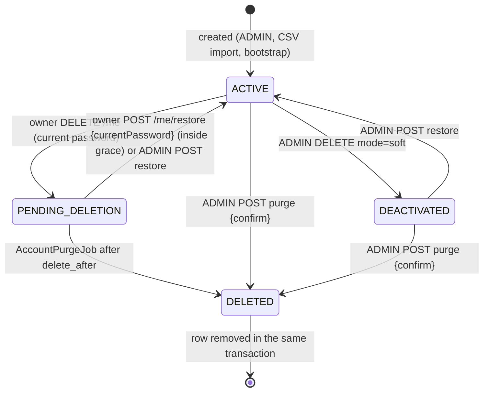

# Data Retention, Erasure and Data Subject Rights

Security checklist item 21 ("hesabı gerçekten sil"): accounts are really deleted after a grace period, the
audit trail keeps only pseudonyms of deleted accounts, and every personal-data table has a retention limit.
This document maps the rights of data subjects under KVKK (Law No. 6698, Article 11) and the GDPR
(Articles 15–21) to the API, and lists what is kept, for how long and why. Route shapes are in
[`docs/api/ROUTES.md`](../api/ROUTES.md) › "Account lifecycle and data export (since P7)"; authorization in
[`docs/security/RBAC_MATRIX.md`](../security/RBAC_MATRIX.md).

## Rights → endpoints

| Right | KVKK Art. 11 | GDPR | How it is served |
|---|---|---|---|
| Access (what is stored about me) | (a), (b), (c) | Art. 15 | `GET /api/v1/me` (profile), `GET /api/v1/me/enrollments`, and the complete copy `GET /api/v1/me/export` (profile, assigned IP address, enrollments, own security events). |
| Rectification | (d) | Art. 16 | `PUT /api/v1/me` (first and last name). Student number and assigned IP address are set by an ADMIN (`PUT /api/v1/admin/accounts/{accountId}`); the owner asks the administration. |
| Erasure | (e), (f) | Art. 17 | `DELETE /api/v1/me` with the current password: `PENDING_DELETION`, every session revoked, purge after 30 days. An ADMIN can purge at once: `POST /api/v1/admin/accounts/{accountId}/purge` with `{confirm: <username>}`. |
| Restriction of processing | — | Art. 18 | An ADMIN deactivates the account (`DELETE /api/v1/admin/accounts/{accountId}`, `mode=soft`): the data stays, the account cannot sign in and is not listed among active accounts; `POST /api/v1/admin/accounts/{accountId}/restore` lifts it. During the deletion grace period the account is restricted in the same way (restore-only scope). |
| Data portability | — | Art. 20 | `GET /api/v1/me/export`: one JSON document (`format: educore.account-export.v1`), `Content-Disposition: attachment`, `Cache-Control: no-store`, at most 1 per account and minute. |
| Objection, automated decisions | (g) | Art. 21, 22 | No profiling or automated decision with legal effect is made. Automated security measures (login lockout, IP deny rules) are documented in `docs/security/IP_ACCESS.md` and can be lifted by an ADMIN. |
| Information about transfers, compensation | (ç), (ğ) | Art. 13, 14, 82 | Organisational; outside the API. Webhook recipients receive no personal data (ids, enum values and counts only; `docs/integrations/WEBHOOKS.md`). |

## Account lifecycle

Columns (`V21__account_lifecycle.sql`): `status`, `deleted_at` (when the account left `ACTIVE`), `delete_after`
(end of the grace period). Rows soft-deleted before V21 were migrated `deleted = 1 → DEACTIVATED` with
`deleted_at = NULL`; `deleted = 0 → ACTIVE`.

### Grace period flow

1. The owner sends `DELETE /api/v1/me` `{currentPassword}`. A wrong password is 400
   `auth/invalid-current-password` and counts towards the login lockout (5 failures → 423 for 15 minutes).
   The last active ADMIN gets 409 `account/last-admin`.
2. On success (202 `{status: PENDING_DELETION, deleteAfter}`): `delete_after = now + educore.lifecycle.grace-days`
   (30), every refresh token family and token of the account is revoked, the session epoch is incremented (every
   access token issued before, the calling one included, stops working at once), the refresh cookie is cleared,
   and `ACCOUNT_DELETION_REQUESTED` is recorded.
3. Until `delete_after` the owner can still sign in. The session has the restore-only scope: `GET /api/v1/me`,
   `POST /api/v1/me/restore` and `POST /api/v1/auth/logout`; everything else is 403
   `account/pending-deletion` (`PendingDeletionScopeFilter`). The data is not processed further (restriction).
4. `POST /api/v1/me/restore` `{currentPassword}` inside the grace period returns the account to `ACTIVE`
   (`ACCOUNT_RESTORED`). The current password is required (a token stolen before the request cannot restore,
   R-16) and wrong passwords count towards the lockout; the restore revokes every refresh family, increments the
   session epoch and answers a new session. An ADMIN can also restore it, even after `delete_after` as long as
   the purge has not run; no earlier session comes back (the owner signs in again). An ADMIN soft delete revokes
   every session the same way (R-20).
5. After `delete_after` the account cannot authenticate (401) and `AccountPurgeJob` purges it at its next run.

### Purge (`AccountPurger`)

Triggered by `AccountPurgeJob` (`educore.lifecycle.purge-cron`, default `0 30 3 * * *` UTC, at most
`purge-batch-size` = 500 accounts per run) or by an ADMIN hard delete. One transaction per account:

| Data | Action |
|---|---|
| `account` row (username, names, student number, assigned IP, password hash) | deleted |
| `enrollments` | deleted |
| `refresh_token`, `refresh_token_family` | deleted |
| `login_attempt` | rows whose `username_hash` (HMAC of the username) matches the account's username are deleted |
| `security_event.actor_account_id` / `target_account_id` | replaced by `actor_pseudonym` / `target_pseudonym` = `purged:<first 16 hex of HMAC-SHA-256(K, "account:" + id)>` with `K = HMAC-SHA-256(key = "educore/audit-pseudonym/v1", message = EDUCORE_LOGIN_PEPPER)` (before the security fixes `K` was the pepper itself) |
| `security_event.ip` of events the account itself caused | set to `NULL` |
| `security_event.details.usernameHash` of failed logins against the username | removed |
| `ip_deny_rule.created_by`, `webhook_subscription.created_by` (ADMIN accounts only) | kept as a bare id that no longer resolves to a person |
| `webhook_delivery` rows whose payload names the account id (`data.accountId`) | deleted (delivery history of the person); the `account.deleted` notice queued after the purge is the only one left |
| `job_log_entry.raw_masked` | masked rows keep only the first character of each value (`A***,Y***,2***`), so they do not single out a person; rows whose mask equals the account's own CSV line (plain or quoted) are cleared anyway (row number and reason stay) |
| CSV files still kept in `csv_uploads/done/` and `failed/` | after the commit, every line carrying the student number as a field is removed (the rest of each file stays byte for byte; course files are not touched; a rejected original larger than `max-bytes` is deleted) |
| erasure ledger | one entry of keyed digests (account id, username, student number) in `erasure_ledger` and in the append-only ledger file outside the database dump, so a restored backup cannot bring the account back (`docs/ops/BACKUP_RESTORE.md`, "Erasure ledger") |

Then `ACCOUNT_PURGED` is recorded (target = pseudonym; details = trigger and counts) and, after commit, the
webhook event `account.deleted` is queued with `{accountId, mode: HARD}` through the existing
`WebhookPublisher` (soft deletes keep sending `{accountId, mode: SOFT}`).

Concurrency and idempotency: each transaction claims the next due row with `SELECT ... FOR UPDATE SKIP LOCKED`,
so several threads or instances never purge the same account, rows held by a login or restore are left for the
next run, and a purged row simply no longer exists for later runs (`AccountLifecycleIT`
`concurrentPurgeRunsPurgeEveryDueAccountExactlyOnce`).

The pseudonym is keyed: the same account always maps to the same pseudonym while `EDUCORE_LOGIN_PEPPER` is
unchanged (events stay correlatable), but nobody without the pepper can map an id to it by trying every id.

Domain separation (R-21): the key `K` is derived from the pepper for this purpose only. Before, it was the pepper
itself, the key of the login `usernameHash`, so a failed login with the username `account:<id>` wrote that
account's pseudonym (as the prefix of `details.usernameHash`) into the audit trail, linking a purged pseudonym to
its id. Migration impact: pseudonyms written by purges before the change are **not recomputed** (the purged ids
no longer exist, so they cannot be) and stay as written; purges from the change on use `K`. Events of one account
purged before the change therefore keep their old pseudonym, which is still consistent within that account.
Outside `prod` an unset pepper is random per process, so pseudonyms of one account differ across restarts.

### Re-registration after a purge

No tombstone is written: a `purged_identifier(hash, purged_at)` table does not exist, so a purged student
number or username can be used again for a new account (default "allow"). If the product must block
re-registration of a purged student number, add a migration creating
`purged_identifier (hash varchar(64) primary key, purged_at timestamptz not null)`, write
`HMAC(EDUCORE_LOGIN_PEPPER, student_number)` in `AccountPurger`, and check it in `AccountAdminService.createStudent`
and the CSV import. The stored hash is itself personal data (pseudonymised) and needs its own retention period.

## Retention periods

| Data | Retention | Mechanism |
|---|---|---|
| Account, enrollments | until erasure (owner request + 30 days, or ADMIN hard delete) | `AccountPurgeJob` |
| Deactivated accounts (`DEACTIVATED`) | until an ADMIN restores or hard-deletes them | manual |
| `refresh_token`, `refresh_token_family` | until the account is purged; tokens expire after 14 days | purge |
| `login_attempt` (username HMAC, client IP, result) | 90 days (`educore.lifecycle.retention-days.login-attempts`) | `RetentionJob`, nightly 04:00 UTC (`retention-cron`) |
| `security_event` (audit trail incl. client IPs) | 365 days (`retention-days.security-events`) | `RetentionJob` |
| `webhook_delivery` | 14 days after delivery or final failure (`educore.webhook.delivery-retention`) | `WebhookRetention` |
| Expired IP deny rules | deleted when expired | `IpDenyRuleCleanup` |
| Imported CSV file (SUCCEEDED / PARTIAL) | deleted right after the import (`educore.ingestion.retain-processed-days` = 0); with a larger value kept in `done/` (PARTIAL with its masked report) for that many days | `IngestionService`, then `IngestionRetention` hourly (`retention-cron`) |
| Rejected or FAILED CSV file and its `.report.json` (`failed/`) | 7 days (`educore.ingestion.retain-failed-days`) | `IngestionRetention` hourly |
| `imported_file` (SHA-256, file name, kind, size, row count, status) and `job_log` / `job_log_entry` (masked rows) | kept (no personal data in clear; the file name is chosen by the operator, do not put personal names into it) | none |
| Erasure ledger (keyed digests of purged accounts) | kept; needed as long as any backup older than the purge may be restored | append-only |
| Application logs | container log rotation (`docs/ops/COST_GUARDRAILS.md`); usernames only in failed-login lines | Docker `json-file` rotation |
| Database backups | 14 daily + 8 weekly dumps (`docs/ops/BACKUP_RESTORE.md`) | backup sidecar |
| Archives of `csv_uploads/done` in the backup volume | not written (`BACKUP_ARCHIVE_CSV=false`); with `true`, 14 days (`BACKUP_KEEP_CSV`) | backup sidecar |

Backups: a purged account remains in dumps taken before the purge until they rotate out: at most about 56 days locally
(8 weekly dumps) and as long as the off-site bucket's lifecycle rule keeps objects; that is the maximum
erasure-propagation window (`docs/ops/BACKUP_RESTORE.md`, "Erasure ledger"). A restore no longer brings a purged account
back into service: `restore.sh` runs `post-restore.sh`, and the backend replays the erasure ledger before it serves (purges
again every restored account the ledger lists and revokes every session). Purges made before the ledger existed are not in
it; until the dumps older than that upgrade have rotated out, also run `AccountPurgeJob` after a restore and re-apply the
hard deletes listed as `ACCOUNT_PURGED` events (`trigger = ADMIN_HARD_DELETE`) in the current audit trail.

### CSV files on disk (AC-08)

An import reads a private snapshot of the file (`processing/`). When it SUCCEEDED or was PARTIAL, the snapshot is deleted
right away by default: the database keeps what an operator needs (`imported_file`: hash, metadata, counts; `job_log_entry`:
masked rows). Retaining processed files (`educore.ingestion.retain-processed-days` > 0) moves them to `done/` instead, PARTIAL
ones with a `.report.json` of masked rows; the hourly cleanup deletes them after that many days. FAILED and rejected files stay
in `failed/` with their report for `retain-failed-days` (7) so an operator can fix and resubmit them, then the cleanup deletes
them (quarantined links are removed, never followed). A purge removes the purged student's lines from every file still kept.
The backup sidecar no longer archives `done/` unless `BACKUP_ARCHIVE_CSV=true`.

## Configuration

| Key | Default | Meaning |
|---|---|---|
| `educore.lifecycle.grace-days` | 30 | Grace period of a deletion request (1–365). |
| `educore.lifecycle.purge-cron` | `0 30 3 * * *` | `AccountPurgeJob` schedule (UTC); `-` disables it. |
| `educore.lifecycle.purge-batch-size` | 500 | Accounts purged at most per run. |
| `educore.lifecycle.retention-cron` | `0 0 4 * * *` | `RetentionJob` schedule (UTC); `-` disables it. |
| `educore.lifecycle.retention-days.login-attempts` | 90 | Age at which `login_attempt` rows are deleted. |
| `educore.lifecycle.retention-days.security-events` | 365 | Age at which `security_event` rows are deleted. |
| `educore.lifecycle.export-per-minute` | 1 | `GET /api/v1/me/export` per account and minute (429 `rate-limit/exceeded` with `Retry-After`). |
| `educore.lifecycle.export-max-security-events` | 10000 | Newest own security events in an export (`securityEventsTruncated` marks a cut). |
| `educore.lifecycle.erasure-ledger-file` | empty (compose: `/var/lib/educore/erasure-ledger.log`) | Erasure ledger file (`EDUCORE_ERASURE_LEDGER_FILE`, required in prod); empty: table only. |
| `educore.ingestion.retain-processed-days` | 0 | Days a SUCCEEDED/PARTIAL CSV file is kept in `done/`; 0 deletes it right after the import. |
| `educore.ingestion.retain-failed-days` | 7 | Days a FAILED or rejected file and its report are kept in `failed/`. |
| `educore.ingestion.retention-cron` | `0 20 * * * *` | `IngestionRetention` schedule (UTC, hourly); `-` disables it. |

## Export contents

`GET /api/v1/me/export` returns `{format, exportedAt, profile, enrollments, securityEvents,
securityEventsTruncated}`:

- `profile`: `id`, `username`, `firstName`, `lastName`, `studentNumber`, `role`, `ipAddress` (assigned student
  IP), `status`;
- `enrollments[]`: `courseId`, `courseName`, `term`, `instructor`, `enrolledAt`;
- `securityEvents[]` (newest first): `type`, `at`, `involvement` (`ACTOR`, `TARGET`, `ACTOR_AND_TARGET`) and `ip`
  only when the account itself acted.

Never included: password hash, refresh tokens or their hashes, token family ids, username hashes, request ids,
event details, the optimistic-lock version, `mustChangePassword`, and IP addresses or ids of other people
(`DataExportIT`).
