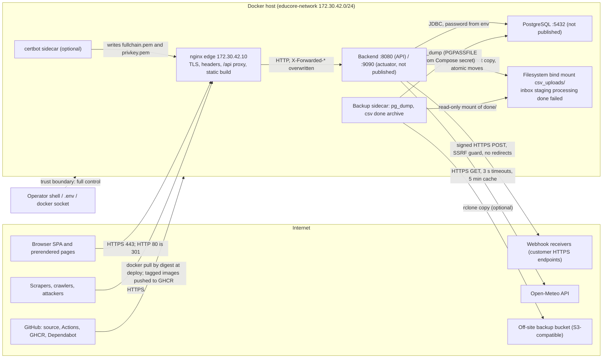

# EduCore Threat Model

Version 1.1 · 2026-10-02 · covers the tree after phases P0–P9 (backend `com.educore.**`, React Router 7
frontend, nginx edge, PostgreSQL, backup sidecar, GitHub Actions). Method: STRIDE per component, read against
the code; every mitigation names the file that implements it and every residual risk names the follow-up that
owns it. Concrete multi-step attacks are in [`ATTACK_CHAINS.md`](ATTACK_CHAINS.md), misuse stories per actor
in [`ABUSE_CASES.md`](ABUSE_CASES.md), test evidence in [`ATTACK_RESULTS.md`](ATTACK_RESULTS.md), the disclosure
policy in [`/SECURITY.md`](../../SECURITY.md).

**Status update (release 1.0.0).** Version 1.0 of this document described the tree before two security fix
waves. Sections 2–4 keep that analysis. Where a residual names a risk id, the current status of that id is the
one in the risk register (section 5), which now records the fix, its code and the tests that pin it. Open items
carry a [`BACKLOG`](../BACKLOG.md) id.

Rating scale: likelihood L/M/H × impact L/M/H. `Critical` = H×H, `High` = H×M or M×H, `Medium` = M×M, L×H or
H×L, `Low` = anything else. "Residual" is what remains after the listed mitigations.

## 1. System overview

EduCore is a course and student management platform for one institution. Two roles exist: `ADMIN`
(operators) and `USER` (students). Students are created by an administrator or by a CSV import; they sign in,
read the catalog, enrol in courses, manage their profile, export their data and can request erasure.
Administrators manage accounts, courses, enrollments, request-level IP deny rules, student IP allocations,
CSV imports, job logs, outbound webhooks and read the audit trail. An anonymous public surface (prerendered
pages, `/api/v1/public/**`, sitemaps) exposes published courses only.

Request path (application port 8080, `security/SecurityConfig.java:120-183`):
`RequestIdFilter` → `RequestBodyLimitFilter` → HTTPS requirement (prod) → `IpAccessControlFilter` → CORS →
`RateLimitFilter` → `JwtAuthenticationFilter` → `PendingDeletionScopeFilter` → URL rules → `@PreAuthorize` →
controller → service → repository. Actuator lives on port 9090 with its own chain
(`SecurityConfig.java:89-110`) and is never published.

## 2. Assets

| Asset | Where | Why it matters |
|---|---|---|
| A1 Student identity data: username, first/last name, student number, assigned IP, enrollments | `account`, `enrollments`; `csv_uploads/{inbox,processing,done,failed}`; backups | Personal data under KVKK/GDPR; the institution's register |
| A2 Credentials: bcrypt password hashes, refresh-token SHA-256 digests, token families | `account.password`, `refresh_token`, `refresh_token_family` | Account takeover if reversed or replayed |
| A3 Server secrets: JWT signing keys, login pepper, AES key for webhook secrets, DB password, S3 key, TLS private key | process environment (`.env`), Compose secret for the backup sidecar, `educore_tls` volume | Any one compromises authentication, pseudonymisation, integrations, data or transport |
| A4 Audit trail | `security_event`, `login_attempt`, container logs | Evidence; also contains client IPs |
| A5 Authorization state: `account.role`, `account.status`, `ip_deny_rule`, `ip_allocation_range` | PostgreSQL | Controls who may do what and who may connect |
| A6 Catalog integrity and public reputation: course rows, slugs, `published`, sitemaps, prerendered HTML | `course`, `catalog_revision`, frontend build | Defacement, SEO poisoning |
| A7 Webhook subscriptions and signing secrets | `webhook_subscription` (AES-256-GCM), `webhook_delivery` | Forged or leaked integration events |
| A8 Availability of login, refresh and the admin API | rate-limit and deny-rule state, PostgreSQL | Students and operators locked out |
| A9 Build and deployment integrity | `pom.xml`, lockfiles, Dockerfiles, `.github/workflows/*`, pinned digests | Malicious code reaching production |

### Data classification

| Class | Data | Handling in code |
|---|---|---|
| Secret | A2, A3 | Never logged (`common/logging/PiiMasking*`, `EduCoreProperties` `toString()` redaction), never in responses (`PublicApiLeakIT`, `ROUTES.md` shapes), refresh tokens stored hashed (`auth/RefreshTokenService.java:156-163`), webhook secrets encrypted (`webhook/SecretCipher.java`) |
| Personal (restricted) | A1, client IPs in A4, CSV files, data exports | Masked in logs (`PiiMaskingConverter`), masked in job-log entries (`ingestion/PiiMasker.java`), never in webhook payloads (`WebhookPublisher`), erased or pseudonymised by `lifecycle/AccountPurger.java`; **not** erased from `csv_uploads/done` (R-05) |
| Internal | A5, A7 metadata, job logs, audit events | ADMIN-only routes under `/api/v1/admin/**` |
| Public | Published course name/slug/term/instructor/description/updatedAt, site facts, sitemaps | `publicapi/PublicCourseRepository.java` projections only |

## 3. Trust boundaries

Boundaries, from least to most trusted:

1. **Internet → nginx.** Everything is untrusted. nginx terminates TLS, redirects HTTP, sets headers, and
   overwrites `X-Forwarded-For`/`X-Forwarded-Proto` with its own view (`infra/nginx/snippets/proxy-to-backend.conf:9-16`).
2. **nginx → backend.** The backend trusts forwarding headers only from `172.30.42.10`
   (`docker-compose.yml:84`, `security/TrustedProxies.java`, `config/ForwardedHeadersConfig.java`). Anything
   else on the Compose network is treated as a client.
3. **Backend → PostgreSQL.** Since the fix waves, the connection pool uses a DML-only runtime role and only Flyway
   connects as the owner (R-23); before them one role owned everything. The database is the authority for roles,
   status and session epoch on every request (`security/JwtAuthenticationFilter.java`).
4. **Backend → filesystem inbox.** Whoever can write into `csv_uploads/inbox` on the host can create accounts
   and courses. The import treats the inbox as untrusted input (snapshot copy, link rejection, validation) but
   not as an attacker: no authentication exists for a dropped file beyond host access.
5. **Backend → webhook receivers.** Receivers are untrusted; the backend never reads their response body and
   never follows redirects (`webhook/HttpClientWebhookTransport.java`).
6. **Backend → Open-Meteo.** Untrusted upstream; only numeric fields are consumed (`weather/WeatherService.java:67-87`).
7. **Operator / host.** Fully trusted: owns `.env`, the Docker socket, the backup volume, the TLS key and the
   database. This document does not defend against a malicious host administrator; it does consider a
   compromised **application** ADMIN and an insider with database read access.
8. **CI.** GitHub Actions runs with `contents: read`, pinned actions and digests, and pushes images only on
   `v*` tags (`.github/workflows/ci.yml`, `supply-chain.yml`).

## 4. STRIDE per component

Columns: threat · existing mitigation (file) · residual risk (likelihood × impact → rating) · follow-up owner.
The owner is the code area responsible for the follow-up: Security (`auth`, `security`, `ipaccess`), Domain
(`account`, `course`, `enrollment`, `lifecycle`), Ingestion (`ingestion`, `webhook`), Operations (`infra`, CI),
Frontend (`frontend`). Residuals describe the state before the fix waves; see section 5 for the current status.

### 4.1 Authentication and session (`auth`, `security`)

| STRIDE | Threat | Existing mitigation | Residual | Owner |
|---|---|---|---|---|
| S | Password guessing against one account | 10 attempts/min/IP (`auth/CaffeineBucketLoginRateLimiter.java`), 5 failures → 15 min lock (`auth/LoginAttemptService.java:43-56`), constant bcrypt work for unknown users (`auth/CredentialVerifier.java`), 20 failures/10 min → login-scoped AUTO deny (`ipaccess/IpAutoDenyService.java`) | Spraying across many usernames stays under every threshold; over native IPv6 the per-IP throttle is keyed by full address and auto-deny never applies (R-04). M×M → **Medium** | Security |
| S | Forged or altered access token (`alg=none`, foreign `kid`, wrong `aud`) | HS256 only, `kid` must name a known key, issuer/audience/exp required, 4096-char cap (`security/JwtService.java:86-153`); `roles` claim ignored, role read from DB (`JwtAuthenticationFilter.java:73-80`) | Secret compromise = every token forgeable until rotation (`KEY_ROTATION.md`). L×H → **Medium** | Security |
| S | Refresh-token theft and replay | Opaque 256-bit value, SHA-256 at rest, rotation per use, family revoked on reuse under a family row lock (`RefreshTokenService.java:81-113`), `HttpOnly; Secure; SameSite=Strict; Path=/api/v1/auth` (`auth/RefreshCookies.java`) | Thief who refreshes first keeps the session until the victim's next refresh triggers reuse detection (standard). L×M → **Low** | — |
| S | CSRF on cookie endpoints | `SameSite=Strict` plus `Origin`/`Referer` allow-list (`security/OriginVerifier.java`), `Origin: null` rejected | None material | — |
| T | Stale-read overwrite of role/status during login or profile edits | Account row lock `FOR NO KEY UPDATE` (`auth/AccountLocks.java`), compare-and-set hash writes, `@Version` (`entity/Account.java:49-51`), field-specific `updateOwnName` (`repository/AccountRepository.java:80-84`) | None found | — |
| R | Logout or deletion-request races recorded as `AUTH_REFRESH_REUSE` | Family lock serialises rotation and revocation | A stale tab refreshing after logout writes a reuse event because the token check precedes the family check (`RefreshTokenService.java:100-107`): alert fatigue (R-07). M×L → **Low** | Security |
| I | Username enumeration via timing or messages | Identical 401 and bcrypt padding; lock applies to unknown usernames too | A 423 for a username reveals that someone is attacking it, not that it exists. Negligible | — |
| I | Access token still valid 15 min after logout/password change | Documented and pinned (`AccessTokenResidualValidityIT`) | Accepted; emergency key rotation exists | — |
| D | **Lockout as a weapon**: 5 wrong passwords per 15 min for a known username (the bootstrap admin, or student numbers, which are the imported students' usernames) keeps that account locked from any IP; no unlock endpoint, no break-glass | Rate limits bound the *attacker's* cost, not the victim's loss | Any unauthenticated party can keep every known account locked indefinitely (R-01). H×H → **Critical** for availability | Security |
| D | Bootstrap and temporary passwords stay valid for every API call while `mustChangePassword` is set | Frontend redirect only (`frontend/app/features/auth/guards.tsx:21-23`) | Password that sits in `.env`, `docker inspect` and shell history remains a full ADMIN credential until changed (R-03). M×H → **High** | Security |
| E | USER obtains ADMIN | Role from DB per request; `/api/v1/admin/**` URL rule plus `@PreAuthorize` on controllers and services; `ChangeRoleRequest` is the only role-bearing body and is ADMIN-only; strict Jackson binding (`common/web/StrictJsonConfig.java`) | None found (`PrivilegeEscalationIT`, `MassAssignmentIT`, `AuthorizationMatrixIT`) | — |

### 4.2 Account lifecycle, export and purge (`lifecycle`, `account`)

| STRIDE | Threat | Existing mitigation | Residual | Owner |
|---|---|---|---|---|
| S | Attacker holding the victim's password requests deletion, or restores a deletion the victim wanted | `DELETE /me` re-authenticates with the current password and revokes all families (`lifecycle/AccountLifecycleService.java:102-125`); restore-only scope (`security/PendingDeletionScopeFilter.java`) | `POST /me/restore` needs no re-authentication, and a password holder can always sign in during the grace period: an erasure request cannot be made final by its owner while the password is shared (R-16). L×M → **Low** | Domain |
| T | ADMIN overrides a data-subject erasure request | Restore is audited (`ACCOUNT_RESTORED {from: PENDING_DELETION}`) | No notification to the owner, no reason recorded; also possible after `deleteAfter` until the nightly purge (`AccountLifecycleService.java:179-192`) (R-16). M×M → **Medium** (compliance) | Domain |
| I | Purged data lingering | `AccountPurger.java:79-112` deletes rows, pseudonymises events, removes own IPs and `usernameHash` details; `login_attempt` deleted via HMAC | CSV files in `csv_uploads/done` and `failed/*.report.json`, `job_log.file_name`, `imported_file.original_name` and backups keep names and student numbers with no retention (R-05); failed-login events *against* the account keep the client IP (`AccountPurger.java:90` nulls only actor IPs). M×M → **Medium** | Ingestion / Operations |
| D | Export used as a data pump | 1 per account per minute via the shared store (`lifecycle/DataExportService.java:59`), ≤10,000 events, own data only (`DataExportIT`) | None material | — |
| E | Admin removes the last admin or themselves | `lockActiveAdminIds()` `FOR UPDATE` plus guards (`account/AccountAdminService.java:171-220`, `LastAdminGuardIT`) | A single ADMIN can still hard-delete every *other* admin with `confirm=<username>` and lock everyone else out by deny rules (R-09). L×H → **Medium** | Domain / Security |

### 4.3 IP access control and rate limiting (`ipaccess`, `ratelimit`, edge)

| STRIDE | Threat | Existing mitigation | Residual | Owner |
|---|---|---|---|---|
| S | Client spoofs `X-Forwarded-For` to pick its own rate-limit key or to evade a deny rule | Header honoured only when the peer is a trusted proxy; right-most untrusted hop wins (`security/ClientIpResolver.java:48-68`); trusted blocks broader than `/8` refuse startup (`TrustedProxies.java:38-50`); nginx overwrites the header (`proxy-to-backend.conf:11`) | None when nginx is the first hop | — |
| D | Upstream load balancer or CDN in front of nginx collapses every client into one address | — | One shared 60/min bucket, one 10/min login bucket, and 20 failed logins deny login for *everyone* for an hour; audit IPs become useless (R-10). M×H → **High** for such deployments | Operations |
| D | Campus NAT: one guesser denies login for the whole campus | AUTO rules are login-scoped; refresh and sessions keep working; expiry 1 h (`IpAccessControlFilter.java:102-110`, `IP_ACCESS.md`) | Re-triggerable each hour; the administrator behind the same NAT cannot sign in to lift it (R-02). M×M → **Medium** | Security |
| D | Store saturation: 100,000 distinct keys push newcomers into one 1,000/min overflow bucket | Admission instead of eviction (`ratelimit/CaffeineRateLimitStore.java:48-57`); IPv6 keyed by /64 | A /48 holder owns 65,536 keys; the separate login limiter still *evicts* (`CaffeineBucketLoginRateLimiter.java:28-31`) and keys IPv6 by full address (R-04, R-13). M×M → **Medium** | Security |
| T | Compromised ADMIN denies everyone except themselves | Rule may not cover the caller's IP or a trusted proxy (`ipaccess/IpDenyRuleService.java:121-129`); audited | Two rules covering the two halves of the address space minus the attacker pass the guard; recovery requires SQL (R-09) | Security |
| D | Deny-rule store unavailable | Last snapshot kept; fail closed 503 when none (`ipaccess/IpDenyRuleCache.java:88-114`) | Database outage = total outage (accepted; single DB anyway) | — |

### 4.4 CSV ingestion (`ingestion`)

| STRIDE | Threat | Existing mitigation | Residual | Owner |
|---|---|---|---|---|
| S | File dropped into the inbox by anyone with host write access creates accounts | Imported accounts get a random 24-char hash-only password and `mustChangePassword` (`ingestion/batch/ImportJobConfig.java:96-108`); nobody can sign in to them until an admin reset exists (BACKLOG B-016) | Host write access is a full trust boundary (section 3). Accepted | — |
| T | Half-written, swapped or linked inbox file | Snapshot copy with `NOFOLLOW_LINKS`, link-count check, size cap, atomic moves on one file store (`ingestion/IngestionDirectories.java:125-161`); header selects the job, strict tokenizer, Bean Validation per row | TOCTOU between attribute read and open is closed by `O_NOFOLLOW`; link count unavailable on NTFS (documented) | — |
| T | Formula or control characters reaching exports | `common/text/CsvSanitizer.java`, `CsvFormulaInjectionTest`; rows validated by `InputPatterns` | No CSV export exists today; the guard is ready for one | — |
| R | Lease race: owning instance's heartbeat starves (3 scheduler threads shared with imports and the dispatcher, `application.yml:53-59`), recovery closes the live run as `INTERRUPTED` while rows keep being written | Lease 2 min / heartbeat 30 s; `close()` idempotent (`IngestionLedger.java:113-133`) | Job log says FAILED with zero counts although accounts were created; file moved; no webhook (R-11). L×M → **Low** (integrity) | Ingestion |
| I | PII in Batch metadata, logs, webhooks | Code-only exceptions, ids-only job parameters, masked raw lines (`RowSkipRecorder.java`, `PiiMasker.java`), webhook payload without file name (`IngestionService.java:239-254`) | `job_log.file_name` may carry names (documented); done/ retention (R-05) | Ingestion |
| D | Oversized or endless file | 20 MB / 50,000 rows / 10,000 chars per line, streaming validator (`CsvPreLaunchValidator.java`), multipart 5 MB (`application.yml:63-66`), nginx 6 MB | None material | — |

### 4.5 Outbound webhooks (`webhook`)

| STRIDE | Threat | Existing mitigation | Residual | Owner |
|---|---|---|---|---|
| S | Receiver cannot distinguish EduCore from a forger | HMAC-SHA256 over `timestamp.body` with a 32-byte secret, 5-minute tolerance, delivery id for de-duplication (`webhook/WebhookSigner.java`, `WEBHOOKS.md`) | Receivers that skip the timestamp check accept replays (their responsibility) | — |
| I | Secret exposure | Shown once at creation; AES-256-GCM at rest with AAD and random IV (`SecretCipher.java`); never in responses or logs | DB read + `EDUCORE_ENCRYPTION_KEY` = all secrets (operator boundary) | — |
| S/I | SSRF to loopback, RFC 1918, link-local, metadata, NAT64, mapped addresses, `*.localhost` | `WebhookAddressPolicy.java`, DNS-rebinding closed by the client's own resolver (`GuardedDnsResolver.java`), https only, no redirects, body never read, 10 s deadline | **Public-address port scanning from the server's egress IP** with a fine-grained error oracle (`http-NNN`, `tls-failure`, `connection-failure`, `timeout`) via test events and URL edits (R-08). L×M → **Low** | Ingestion |
| T | Insider with DB write re-points a subscription | URL check constraint `https://%` (`V31__webhooks.sql:15`) | Dispatcher signs whatever URL is stored; events carry ids only, so impact is low | — |
| D | Slow or hostile receiver pins the dispatcher | Connect/read 5 s, deadline 10 s, one claim at a time with fencing token (`WebhookDispatcher.java:128-215`), 1,000 pending per subscription, 20 subscriptions | None material; events lost on crash between commit and enqueue (BACKLOG B-030) | Ingestion |

### 4.6 Public API, sitemap and SEO surface (`publicapi`)

| STRIDE | Threat | Existing mitigation | Residual | Owner |
|---|---|---|---|---|
| I | Unpublished course or any account field leaks | JPQL constructor projections of six columns, `published = true` in every query (`PublicCourseRepository.java`), `PublicApiLeakIT` reflection and serialisation checks; unknown and unpublished slugs both 404 (`PublicCatalogService.java:61-66`); old ETag after unpublish → 404 | `GET /api/v1/courses` (any signed-in USER) shows unpublished courses with slug and description: by design for members | — |
| T | Slug takeover: a deleted or renamed course frees a URL that search engines indexed | Slug immutable while published (`course/CourseService.java:166-170`), unique index, generated-slug retry | Only an ADMIN can swap content under an old URL; no external path | — |
| D | Sitemap render per request (up to 45,000 URLs) outside the `/public/` bucket | `sitemap-max-urls`, anonymous 60/min bucket, 300 s `Cache-Control` | No nginx `proxy_cache`: each request hits the backend (R-17). L×L → **Low** | Operations |
| S | Host-header driven HTTP→HTTPS redirect (`nginx.prod.conf:68`) | `$host` of the default server | Open redirect only for hand-crafted requests; browsers send the real host. Low | Operations |

### 4.7 Frontend (`frontend/app`)

| STRIDE | Threat | Existing mitigation | Residual | Owner |
|---|---|---|---|---|
| S | Token theft via XSS or storage | Access token in module memory only (`frontend/app/lib/api.ts:33`), no `localStorage` for tokens, SPA CSP without `unsafe-inline` (`infra/nginx/snippets/spa-security-headers.conf`), `dangerouslySetInnerHTML` banned by lint | Theme preference in `localStorage` only (D-NEW-03) | — |
| R | Two tabs refresh at once and trip reuse detection | `navigator.locks` + `BroadcastChannel` single flight (`api.ts:38-66, 112-138`) | Browsers without Web Locks fall back to a per-tab promise chain; ordering across tabs then depends on timing (R-07) | Frontend |
| E | Client-side guard treated as authorization | Guards documented as cosmetic (`guards.tsx:10-13`); every rule enforced by the API | `mustChangePassword` is enforced **only** here (R-03) | Security |
| I | Prerender build fetches the catalog from `PUBLIC_API_URL` | `assertSameSite` and fail-loud build (`frontend/react-router.config.ts`) | Build-time dependency on a running backend (CI starts it) | — |

### 4.8 Backups and operations (`infra/backup`, `scripts/backup`, Compose)

| STRIDE | Threat | Existing mitigation | Residual | Owner |
|---|---|---|---|---|
| I | Dump files readable on the host or in the bucket | `umask 077`, uid 70, PGPASSFILE from a Compose secret, `PGPASSWORD` refused (`infra/backup/bin/backup.sh`), bucket requirements documented (`BACKUP_RESTORE.md:80-88`) | Dumps contain A1, A2 (hashes), A4; host root reads them. Operator boundary | — |
| T/S | Restore resurrects revoked sessions and security state | Restore procedure and quarterly drill (`BACKUP_RESTORE.md:101-125`) | Restored `refresh_token` rows have `revoked_at` from the dump time: a captured old cookie works again; lockouts, AUTO deny rules, `imported_file` hashes and reuse state are lost; PENDING webhooks are re-sent (R-06). L×H → **Medium** | Operations |
| D | Out-of-order Flyway flag left enabled | One-off `docker compose run -e SPRING_FLYWAY_OUT_OF_ORDER=true` with verification steps (`docs/ops/UPGRADE.md`), `FlywayOutOfOrderUpgradeIT` | Human step; `*:future` in prod lets an older build start on a newer schema (R-18). L×M → **Low** | Operations |
| I | Secrets in environment | Compose `:?required`, `.env` git-ignored, `.dockerignore` | `docker inspect` on the host shows every `EDUCORE_*` secret of the backend and the bootstrap password forever (R-03) | Operations |
| D | Resource exhaustion | CPU/memory limits, `ExitOnOutOfMemoryError`, log rotation (`docker-compose.yml`), nginx body/timeout limits | Single instance, single database: no HA by design | — |

### 4.9 CI/CD and supply chain (`.github`, `pom.xml`, Dockerfiles)

| STRIDE | Threat | Existing mitigation | Residual | Owner |
|---|---|---|---|---|
| T | Malicious dependency or base image | Trivy fs/image gates, `npm audit`, CycloneDX SBOMs, digests everywhere, Dependabot weekly (`supply-chain.yml`, `dependabot.yml`), `trivyignore.yaml` with expiry policy | `npm ci` runs lifecycle scripts; Maven wrapper has no `distributionSha256Sum` (`.mvn/wrapper/maven-wrapper.properties`); images carry provenance but no signature (R-14). L×H → **Medium** | Operations |
| T | Tampered workflow or action | Actions pinned by SHA, `permissions: contents: read`, `persist-credentials: false` (`ci.yml`) | Branch protection and required reviews live in GitHub settings, not in the repository: unverifiable here | Operations |
| I | Secrets in CI logs | gitleaks with `--redact`; ephemeral `.env` generated per e2e run and deleted (`ci.yml:121-173`) | `docker compose logs` on failure prints backend logs (masked) | — |
| E | Fork pull request obtains write | `pull_request` trigger uses a read-only token; pushes only on `v*` tags with `packages: write` | None material | — |

## 5. Risk register

Status values: **FIXED** (closed in code, pinned by the named tests), **MITIGATED** (the impact is closed, a named
remainder is open in the backlog), **OPEN** / **PARTIAL** (as analysed; follow-up in the backlog). "Rating" is the
rating before the fix. Evidence for fixes names the code and the tests; the decisions are recorded in ADRs
0032–0039 ([`docs/adr/`](../adr/README.md)).

| ID | Risk | Rating | Status | Evidence | Follow-up | Owner |
|---|---|---|---|---|---|---|
| R-01 | Username-targeted lockout denial of service; no unlock, no break-glass | Critical (H×H) | FIXED | Lock per (username hash, client key) pair (`V23__login_attempt_client_key.sql`, `auth/LoginAttemptService.java`); per-username progressive delay (5 free failures, 1 s doubling to 30 s, 429 `auth/too-many-attempts`), networks with a success in the last 30 days exempt; `POST /api/v1/admin/accounts/{id}/unlock-login` (`ACCOUNT_LOGIN_UNLOCKED`); `docs/ops/RUNBOOK_ADMIN_RECOVERY.md`. Tests: `LockoutIT` (7), `LoginUnlockIT` (2), `AuthConcurrencyIT`. ADR 0032 | Delay cost for the owner on a new network (B-086); alert on `AUTH_LOCKED` bursts | Security |
| R-02 | Dev seed accounts (`admin`, `ayberk`, `ali`) survive a dev→prod database promotion; bootstrap skipped because an ADMIN exists | High (M×H) | FIXED | `config/DevSeedAccountGuard.java` (prod) refuses seed usernames that still carry the seed hash or student number; remedy in `docs/ops/UPGRADE.md` ("Promoting a database that was used under dev"). Tests: `FlywayProfileSwitchIT`, `DevSeedAccountGuardTest`. ADR 0035 | — | Security / Operations |
| R-03 | `mustChangePassword` not enforced server-side; bootstrap and temporary passwords are full credentials | High (M×H) | FIXED | Role-less authority `ACCOUNT_PASSWORD_CHANGE_REQUIRED` and `security/PasswordChangeRequiredScopeFilter.java` in both chains: only `GET /auth/me`, `POST /auth/password`, `/auth/refresh`, `/auth/logout`; everything else 403 `account/password-change-required`. Tests: `PasswordChangeRequiredScopeIT` (3), `AdminBootstrapIT`, `ManagementEndpointSecurityIT`. ADR 0034 | The bootstrap password stays visible in `docker inspect` until the container is recreated (operator boundary, section 4.8); after the first change it is no longer a credential | Security |
| R-04 | IPv6 login throttle keyed per full address, auto-deny never applies to IPv6, login limiter evicts | Medium (M×M) | FIXED | Shared key `ipaccess/ClientAddress.clientKey` (IPv4, mapped IPv4, IPv6 /64) for the login limiter, the lockout and auto-deny; the login limiter has its own admission `CaffeineRateLimitStore` (overflow bucket, no eviction); IPv6 /64 networks reaching the threshold are denied the login in memory. Tests: `CaffeineBucketLoginRateLimiterTest` (4), `LoginIpv6ThrottlingIT` (2), `AutoDenyIT`. ADR 0032 | IPv6 denials are per instance and not listable (B-085); IPv6 deny rules (B-050) | Security |
| R-05 | Personal data retained indefinitely in `csv_uploads/done`, `failed/*.report.json`, `job_log.file_name`; purge does not reach them | Medium (M×M) | FIXED | SUCCEEDED/PARTIAL snapshots deleted after the import (`educore.ingestion.retain-processed-days` = 0), `failed/` kept at most `retain-failed-days` (7) and deleted by `ingestion/IngestionRetention.java`; the purge removes the student's lines from kept files, the account's `webhook_delivery` history and its own `job_log_entry` masks; the backup sidecar archives `done/` only with `BACKUP_ARCHIVE_CSV=true`; `DATA_RETENTION.md` retention table. Tests: `IngestionRetentionIT` (3), `IngestionDirectoryProtocolIT`, `StudentImportJobIT`. ADR 0036 | `job_log.file_name` / `imported_file.original_name` are operator-chosen and documented as "no personal names"; dumps keep data until they age out (bounded by the erasure ledger, R-06) | Ingestion |
| R-06 | Database restore resurrects revoked refresh tokens and resets lockouts, deny rules, import hashes; PENDING webhooks re-sent | Medium (L×H) | FIXED | Erasure ledger (`V33__erasure_ledger.sql`, `lifecycle/ErasureLedger.java`, file on the `educore_erasure_ledger` volume outside the dump); `scripts/backup/restore.sh` refuses without a ledger source and runs `post-restore.sh` (re-insert ledger, revoke every refresh token and family, bump every session epoch, re-grant the runtime role); `lifecycle/ErasureLedgerReplay.java` re-purges before serving and detects a ledger file ahead of the database. Tests: `ErasureLedgerRestoreIT` (2, real `pg_dump`/`pg_restore`), `ErasureLedgerTest` (3); drill `scripts/backup/tests/restore-drill.sh`. ADR 0037 | Login attempts and AUTO deny rules revert to the dump time; PENDING deliveries may be re-sent (receivers de-duplicate by `X-EduCore-Delivery`); ledger pruning (B-090); review of username-only matches (B-094) | Operations |
| R-07 | Benign logout/deletion races recorded as `AUTH_REFRESH_REUSE` | Low (M×L) | PARTIAL | `auth/RefreshTokenService.java` (the token check still precedes the family check) | Check `family.isRevoked()` before the token's `revokedAt`; `Rejected` without event (B-096) | Security |
| R-08 | Webhook deliveries as a port-scan oracle from the server's egress IP | Low (L×M) | PARTIAL | `webhook/HttpClientWebhookTransport.java`, `webhook/WebhookDeliveryResponse.java` | Collapse admin-visible errors to `unreachable`/`rejected`/`blocked`; keep detail in logs; rate-limit URL changes (B-097) | Ingestion |
| R-09 | Single compromised ADMIN can lock out other admins (deny rules, hard delete) with no second approval and no documented recovery | Medium (L×H) | OPEN (recovery documented) | `ipaccess/IpDenyRuleService.java`, `lifecycle/AccountLifecycleService.java`; break-glass SQL in `docs/ops/RUNBOOK_ADMIN_RECOVERY.md` | Two-admin confirmation for purging an ADMIN and for deny rules broader than /24; alerts on `IP_RULE_CHANGED`/`ROLE_CHANGED` bursts (B-080) | Security / Operations |
| R-10 | Upstream LB/CDN makes every client one IP (shared buckets, campus-wide login denial) | High for such deployments (M×H) | PARTIAL | `infra/nginx/snippets/proxy-to-backend.conf`, `docs/ops/TLS.md`, assumption 2 below | Warning and metric when nearly all requests share one client key; documented `set_real_ip_from` for a named LB (B-081) | Operations |
| R-11 | Ingestion lease expiry on a live run (heartbeat starvation on the 3-thread scheduler) leaves FAILED logs for successful writes | Low (L×M) | MITIGATED | Every chunk takes a shared transaction-scoped advisory lock and checks open + own + lease (`ingestion/IngestionFence.java`); closes are conditional updates under the exclusive lock; the heartbeat no longer revives an expired lease, so a closed run cannot write rows. Tests: `IngestionFencingIT` (3), `StudentImportJobIT` (12). ADR 0039 | Heartbeat on its own executor, so a long import is not interrupted needlessly (B-092) | Ingestion |
| R-12 | Audit gaps: no event for profile edits, self enrollments, 403 denials, admin PII reads; audit rows not tamper-evident | Low (M×L) | PARTIAL | `security/audit/SecurityEventType.java`, `enrollment/EnrollmentService.java` | `AUTHZ_DENIED` (rate-limited) and `ACCOUNT_LIST_VIEWED` events; ship logs to an append-only sink (B-098) | Security |
| R-13 | Rate-limit store saturation by many IPv6 /64 keys degrades newcomers to the overflow bucket | Medium (M×M) | PARTIAL | `ratelimit/CaffeineRateLimitStore.java` (admission, no eviction), login store likewise since R-04 | nginx `limit_req` as first layer; per-/48 key budget (B-082) | Operations / Security |
| R-14 | Supply chain: wrapper checksum, npm lifecycle scripts, unsigned images | Medium (L×H) | PARTIAL | `.mvn/wrapper/maven-wrapper.properties`, `.github/workflows/ci.yml` | `distributionSha256Sum`; `npm ci --ignore-scripts`; cosign keyless signing on tag push; CODEOWNERS (B-099) | Operations |
| R-15 | Client-chosen `X-Request-Id` collides with another request's id in `security_event.request_id` | Low (L×L) | PARTIAL | `security/RequestIdFilter.java` | Accept the header only from the trusted proxy, or append a server suffix (B-100) | Security |
| R-16 | ADMIN restore overrides an erasure request silently; restore needs no re-authentication | Medium (M×M, compliance) | MITIGATED | `POST /api/v1/me/restore` requires `{currentPassword}` (counts towards the lockout) and answers a new session; the deletion request ends every token at once through the session epoch (`V22__account_session_epoch.sql`, `security/JwtAuthenticationFilter.java`). Tests: `AccountLifecycleIT` (14), `AuthorizationMatrixIT` row 71. ADR 0033 | ADMIN restore of a `PENDING_DELETION` account still records no reason and does not notify the owner (B-101) | Domain |
| R-17 | Sitemap render per request without edge cache | Low (L×L) | PARTIAL | `publicapi/SitemapController.java`, `infra/nginx/nginx.prod.conf` | `proxy_cache` 300 s for `/sitemap*.xml` and `/api/v1/public/` (B-102) | Operations |
| R-18 | `ignore-migration-patterns: *:future` lets an older build run on a newer schema; out-of-order flag is a manual one-off | Low (L×M) | PARTIAL | `application-prod.yml`, `docs/ops/UPGRADE.md` | Preflight that refuses `SPRING_FLYWAY_OUT_OF_ORDER` in the persistent env; consider dropping `*:future` (B-103) | Operations |
| R-19 | `EDUCORE_SEO_BASE_URL` is passed by prod compose but never bound to `educore.seo.base-url` (relaxed-binding trap: no explicit placeholder), so prod uses the `http://localhost:3000` default: every browser refresh/logout is 403 `auth/origin-rejected`, sitemaps and prerender use the wrong origin | High (H×M) | FIXED | Did not reproduce as described: Spring Boot maps the variable through its legacy underscore form, and `EduCorePropertiesTest` pins that. Hardened anyway: explicit placeholder `educore.seo.base-url: ${EDUCORE_SEO_BASE_URL:...}` in `application.yml`; `ProdStartupGuard` requires an https origin that is not localhost. Tests: `EnvironmentVariableBindingTest` (every documented `EDUCORE_*` variable needs a placeholder), `EduCorePropertiesTest`, `ProdStartupGuardIT` (12). ADR 0035 | — | Domain / Operations |
| R-20 | Admin soft delete (and both restores) are not session boundaries: `softDelete` never revokes refresh families, `reactivate` writes status only, so a cookie held across deactivate→restore keeps working | Medium (L×M) | FIXED | `account.session_epoch` (`V22`) copied into the `sep` claim and compared on every request; the deletion request, ADMIN soft delete, ADMIN restore and own restore increment it and revoke every refresh family. Tests: `AccountLifecycleIT`, `JwtTamperingIT` (deactivated and pending-deletion accounts). ADR 0033 | Logout and password change keep the documented 15-minute residual (B-084) | Domain / Security |
| R-21 | Pseudonym HMAC shares the login-pepper key with username hashing; logging in as `account:<id>` writes `details.usernameHash` equal to that account's audit pseudonym, de-anonymising purged accounts | Medium (M×M) | FIXED | `lifecycle/Pseudonyms.java` uses a key derived from the pepper (`HMAC(label, pepper)`), separate from username hashing. Test: `PseudonymDomainSeparationTest` (3). ADR 0035 | Earlier pseudonyms are not recomputed (`DATA_RETENTION.md`); `details.usernameHash` is still returned to ADMINs (B-083) | Domain / Security |
| R-22 | Hard-delete `?confirm=<username>` is in the request line nginx logs for `/api/`, so usernames of purged people persist in edge logs after the DB forgot them | Low (L×M) | FIXED | `POST /api/v1/admin/accounts/{id}/purge` with `{confirm}` in the body; `DELETE ...?mode=hard` is 400; nginx access logs are JSON with `$request_uri` and referer cut at `?` (`frontend/nginx.conf`, `infra/nginx/nginx.prod.conf`). Tests: `AccountLifecycleIT`, `AuthorizationMatrixIT` rows 74–75; canary check with `nginx -t` and curl (0 canaries in the access log). ADR 0035, ADR 0039 | nginx's error log still writes request lines of failed upstream calls (B-093) | Domain / Operations |
| R-23 | The backend (and the backup sidecar) connect as the PostgreSQL superuser, so any SQL foothold gains `COPY ... TO PROGRAM`, `pg_authid`, silent audit edits | Medium (L×H) | MITIGATED | Backend pool uses the DML-only runtime role `EDUCORE_DB_APP_USERNAME` (`infra/postgres/app-role.sql`, `infra/postgres/init/01-roles.sh`); Flyway migrates as the owner through `config/MigrationRoleFlywayConfig.java`; `ProdStartupGuard` requires both and refuses identical roles. Tests: `DatabaseRolesIT` (9 forbidden statements through the application's own pool), `ProdStartupGuardIT`. ADR 0038 | Backup sidecar still dumps as the owner; read-only dump role (B-091) | Operations |
| R-24 | Startup recovery of one instance deletes another instance's staged upload whose `IMPORT_UPLOADED` transaction has not yet committed | Low (L×M, multi-instance) | FIXED | `V34__upload_staging.sql` (owner, lease, STAGING/COMMITTED) committed before the file is staged; recovery takes over only expired leases with a conditional delete; an empty publish is logged at WARN (`ingestion/UploadStaging.java`). Test: `ImportUploadIT` (8, two-owner cases). ADR 0039 | — | Ingestion |
| R-25 | Webhook per-attempt deadline is scheduled after the pre-check DNS resolution, so a slow authoritative resolver can hold the single dispatcher thread beyond the 10 s deadline | Low (L×M) | FIXED | Pre-check and connect-time lookups run on a bounded 4-thread executor inside the request deadline; overrun ends the attempt as `timeout` (`webhook/HttpClientWebhookTransport.java`). Test: `WebhookTransportTest` (5, blocking resolver). ADR 0039 | — | Ingestion |

## 6. Assumptions

1. The Docker host, its root user, the Docker socket, `.env`, the backup volume and the TLS private key are
   trusted. A compromise there is total and is out of scope.
2. nginx is the first hop from the Internet. If a load balancer or CDN is placed in front of it, R-10 applies
   until nginx is configured to trust that hop.
3. PostgreSQL is reachable only inside `educore-network`; `docker-compose.dev.yml` is never used on a shared
   host (its header says so).
4. `prod` is started through `docker-compose.prod.yml` with every required variable; `ProdStartupGuard`
   enforces presence, not strength, of secrets (JWT ≥ 32 bytes and pepper ≥ 32 chars are enforced by their
   classes; the bootstrap password only needs 12 characters).
5. One backend instance. Several instances would need the Redis store (BACKLOG B-051) and already share
   leases, fencing tokens and `SKIP LOCKED` correctly.
6. Clock skew between host, database and receivers is below 30 s (JWT) and 5 min (webhooks).
7. Students are identified by the institution; EduCore has no self-registration, no e-mail and no password
   reset channel. Every recovery path therefore ends at an administrator or at the database.

## 7. Out of scope

- Physical and host security, hypervisor, Docker daemon configuration, kernel.
- Denial of service by raw bandwidth or connection floods (handled upstream of nginx).
- Compromise of GitHub itself, of Maven Central or npm as registries (mitigated only by pinning and scanning).
- Browser or operating-system vulnerabilities on student devices.
- Items the program lists as backlog: IPv6 deny rules, Redis-backed limits, e-mail, SSO/MFA, multi-tenancy,
  Kubernetes.
